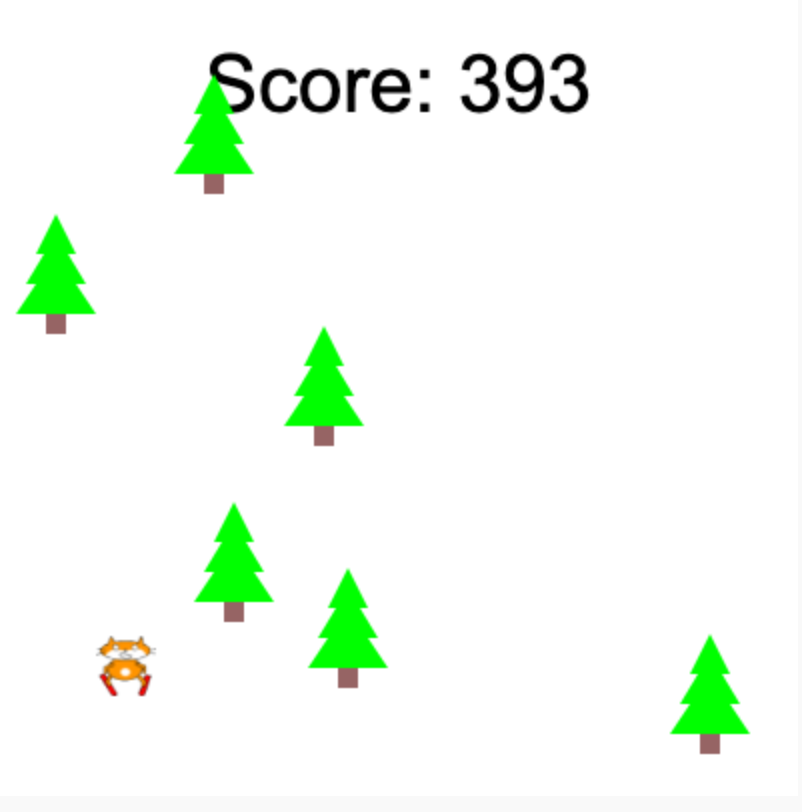

## You will make

قم ببناء لعبة ركض لا نهاية لها قابلة للتمرير حيث يتعين على شخصيتك تجنب العقبات.

 
** ركض لا نهاية له ** هي نوع من الألعاب حيث يتعين عليك تجنب العقبات ولا تنتهي اللعبة إلا عندما تصطدم بعقبة. يمكنك تسجيل نقاط من خلال البقاء على قيد الحياة لأطول فترة ممكنة.

سوف تفعلها:
+ استخدم شروط اللعبة ** ** للتحكم في ما يحدث
+ تعرف على إنشاء الإجراءات واكتشاف الاصطدام
+ قم بإضفاء الطابع الشخصي على لعبة حسب اهتماماتك

### احصل على الإلهام

سوف تتخذ بعض قرارات التصميم بشأن نوع اللعبة التي ستقوم بها وكيف ستستخدم الكود للحصول على التأثيرات التي تريدها.

--- no-print ---

--- task ---

أنظر الى هذه الأمثلة. فكر في كيفية صنع اللاعبين والعقبات.

ماذا يحدث إذا اصطدمت بعقبة؟ هل تزداد صعوبة كلما لعبت؟

  

** قطة التزلج **: [انظر في الداخل] (https://trinket.io/python/76e628bff2) {: target = "_blank"}

<iframe src="https://trinket.io/embed/python/76e628bff2?outputOnly=true" width="100%" height="600" frameborder="0" marginwidth="0" marginheight="0" allowfullscreen></iframe>

** لا تنبثق **: [ انظر في الداخل] (https://trinket.io/python/974800f4ef) {: target = "_blank"}

<iframe src="https://trinket.io/embed/python/974800f4ef?outputOnly=true" width="100%" height="600" frameborder="0" marginwidth="0" marginheight="0" allowfullscreen></iframe>

** تجنب الجراثيم **: [انظر في الداخل] (https: // trinket.io / python / 88e108c819) {: target = "_ blank"}

<iframe src="https://trinket.io/embed/python/88e108c819?outputOnly=true" width="100%" height="600" frameborder="0" marginwidth="0" marginheight="0" allowfullscreen></iframe>

** سيارة نظيفة **: [راجع الداخل] (https://trinket.io/python/70da6c454d) {: target = "_ blank"}

<iframe src="https://trinket.io/embed/python/70da6c454d?outputOnly=true" width="100%" height="600" frameborder="0" marginwidth="0" marginheight="0" allowfullscreen></iframe>

** مراوغة الكويكبات **: [راجع الداخل] (https://trinket.io/python/d156014e67) {: target = "_blank"}

<iframe src="https://trinket.io/embed/python/d156014e67?outputOnly=true" width="100%" height="600" frameborder="0" marginwidth="0" marginheight="0" allowfullscreen></iframe>

--- /task ---

--- /no-print ---

--- print-only ---

سوف تتخذ بعض قرارات التصميم بشأن نوع اللعبة التي ستقوم بها وكيف ستستخدم الكود للحصول على التأثيرات التي تريدها.

{: width = "300px"}
{: width = "300px"}
{: width = "300px"}
{: width = "300px"}
{: width = "300px"}

--- /print-only ---
