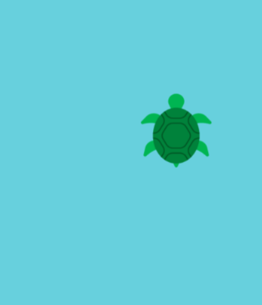
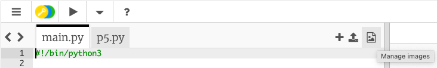

## عيّن الموضوع

<div style="display: flex; flex-wrap: wrap">
<div style="flex-basis: 200px; flex-grow: 1; margin-right: 15px;">
عيّن موضوع لعبتك وأنشئ شخصية لاعب تتبع مؤشر الماوس.

</div>
<div>

{:width="300px"}

</div>
</div>

ما هو موضوع لعبتك؟ يمكنك اختيار أي شيء تريده. إليك بعض الأفكار:
- رياضة أو هواية
- فيلم أو عرض أو لعبة
- العلم أو الطبيعة
- أي شيء آخر!

--- task ---

[افتح مشروع البدء](https://trinket.io/python/cda05e5911){:target="_blank"}. سيتم فتح Trinket في علامة تبويب متصفح أخرى.

--- /task ---

--- task ---

**اختر:** اضبط حجم اللوحة القماشية.

--- code ---
---
language: python
filename: main.py - setup()
---

إعداد def ():    
الحجم (400 ، 400)

--- /code ---

--- /task ---

--- task ---

قم بإنشاء متغير يسمى `safe` لتخزين لون الخلفية بناءً على المظهر الذي تريده للعبتك.

هذا هو اللون الذي خزن أن يكون عليه اللاعب وستستخدم هذا المتغير مرة أخرى لاحقًا.

--- code ---
---
language: python
filename: main.py - draw()
---

def draw ():    
safe = color (200، 100، 0) # أضف لون الخلفية الخاصة بك   
(خزن)

--- /code ---

[[[generic-theory-simple-colours]]]

--- /task ---

--- task ---

**اختبار:** قم بتشغيل الكود الخاص بك لمعرفة لون الخلفية. قم بتغييره حتى تصبح راضيًا عن لون وحجم الشاشة.

--- /task ---

اختر الآن الشخصية التي تلعب اللعبة وتجنب العقبات. هل هو شيء أم شخص أم حيوان أم شيء آخر؟

سيظهر المشغل في موضع ثابت `y` ونفس موضع `×` مثل مؤشر الماوس ، والذي يتم تخزينه في `p5` متغير `mouse_x`.

--- task ---

من الجيد تنظيم الكود لرسم شخصية اللاعب في دالة.

حدد دالة `()draw_player` وأنشئ موضع `player_y` للوضع `y` الثابت للاعب:

--- code ---
---
language: python
filename: main.py - draw_player()
---

def draw_player ():    
player_y = int (height * 0.8) # يتم وضعه باتجاه أسفل الشاشة

--- /code ---

أضف الكود إلى `()draw` لاستدعاء `()draw_player` لكل إطار.

--- code ---
---
language: python
filename: main.py - draw()
---

def draw ():    
safe = color (200، 100، 0) # اللون الذي اخترته    
الخلفية (خزن)    
draw_player ()

--- /code ---

--- /task ---

بعد ذلك ستضيف رمزًا إلى الوظيفة `()draw_player` لرسم الشكل الخاص بك. قد تحتاج أيضًا إلى إضافة رمز `()setup`.

--- task ---

**اختر:** كيف يبدو لاعبك؟ يمكن أن يكون لاعبك:
+ صورة مقدمة في مشروع البداية
+ رمز تعبيري 🎈 أو نص
+ مرسومة باستخدام سلسلة من الأشكال

--- collapse ---
---
title: استخدم صورة أولية
---

انقر على **إدارة الصور** أيقونة.



سيتم عرض الصور المضمنة في مشروع البداية في قائمة `Image library`.


قم بتدوين اسم الصورة التي تريد استخدامها.

قم بتحميل الصورة في دالة `()setup`

--- code ---
---
language: python
filename: main.py - setup()
---

إعداد def ():   
size (400، 400)    
player = load_image ('skiing.png') # تحميل صورتك

--- /code ---

استدع الصورة `()image` واضبطها على أنها عامة في دالة `()draw_player`.

--- code ---
---
language: python
filename: main.py - draw_player()
---

def draw_player ():    
player_y = int (height * 0.8) # يتم وضعه باتجاه أسفل الشاشة

  لاعب عالمي

  image (player، mouse_x، player_y، 30، 30)

--- /code ---

--- /collapse ---

--- collapse ---
---
title: استخدم أحرف الرموز التعبيرية
---

يمكنك استخدام أحرف الرموز التعبيرية في دالة النص p5 `()text` لاستخدام رمز تعبيري لتمثيل المشغل الخاص بك.

إليك مثالاً:

--- code ---
---
language: python
filename: main.py - setup()
---

إعداد def ():    
size (400، 400)     
text_size (40) # يتحكم في حجم الرموز التعبيرية     
text_align (CENTER، TOP) # الموضع حول المركز

--- /code ---

--- code ---
---
language: python
filename: main.py - draw_player()
---

def draw_player ():     
player_y = int (height * 0.8)    
text ('🎈'، mouse_x، player_y)

--- /code ---

--- /collapse ---

[[[processing-python-text]]]

[[[generic-theory-simple-colours]]]

[[[processing-python-ellipse]]]

[[[processing-python-rect]]]

[[[processing-python-triangle]]]

[[[processing-tint]]]

[[[processing-stroke]]]

**نصيحة:** يمكنك استخدام عدة أشكال بسيطة في نفس الدالة لإنشاء مشغل أكثر تعقيدًا.

--- collapse ---
---
title: ارسم لاعبًا باستخدام أشكال متعددة
---


--- code ---
---
language: python
filename: main.py - draw_player()
---

def draw_player ():    
player_y = int (height * 0.8)    
noStroke ()    
#Face    
ملء (0 ، 200 ، 100)    
قطع ناقص (mouse_x، player_y، 60، 60)

  # عيون    
ملء (0 ، 100 ، 200)    
القطع الناقص (mouse_x - 10، player_y - 10، 20، 20)    
القطع الناقص (mouse_x + 10، player_y - 10، 20، 20)    
ملء (0)    
القطع الناقص (mouse_x - 10، player_y - 10، 10، 10)     
القطع الناقص (mouse_x + 10، player_y - 10، 10، 10)     
ملء (255)    
القطع الناقص (mouse_x - 12، player_y - 12، 5، 5)    
القطع الناقص (mouse_x + 12، player_y - 12، 5، 5)

--- /code ---

--- /collapse ---

--- /task ---

--- task ---

**اختبار:** قم بتشغيل التعليمات البرمجية الخاصة بك وحرك الماوس للتحكم في المشغل.

هل تتحرك كما تتوقع؟

--- /task ---

**تصحيح:** قد تجد بعض الأخطاء في مشروعك والتي تحتاج إلى إصلاحها. فيما يلي بعض الأخطاء الشائعة.

--- task ---

--- collapse ---
---
title: لا أستطيع رؤية اللاعب
---

حاول التبديل إلى ملء الشاشة. تحقق أيضًا من إحداثيات `x` و `y` التي استخدمتها لرسم المشغل - تأكد من وجودهما داخل اللوحة القماشية التي أنشأتها بحجم `()size`.

--- /collapse ---

--- collapse ---
---
العنوان: الصورة لا يتم تحميلها
---

أولاً ، تحقق من وجود الصورة في `Image library`. بعد ذلك ، تحقق من اسم الملف بعناية - تذكر أن الأحرف الكبيرة تختلف عن الأحرف الصغيرة وأن علامات الترقيم مهمة.

--- /collapse ---

--- collapse ---
---
title: حجم الصورة غير صحيح
---

تحقق من المدخلات التي تتحكم في عرض الصورة وارتفاعها:

```python
image(ملف الصورة ,تنسيق x, تنسيق y, العرض ,الارتفاع)
```

--- /collapse ---

--- collapse ---
---
title: حجم الرموز التعبيرية خاطئ
---

إذا كان رمزك التعبيري كبيرًا جدًا أو صغيرًا جدًا ، فغيّر الإدخال إلى `()text_size`.

--- /collapse ---

--- /task ---

--- save ---
