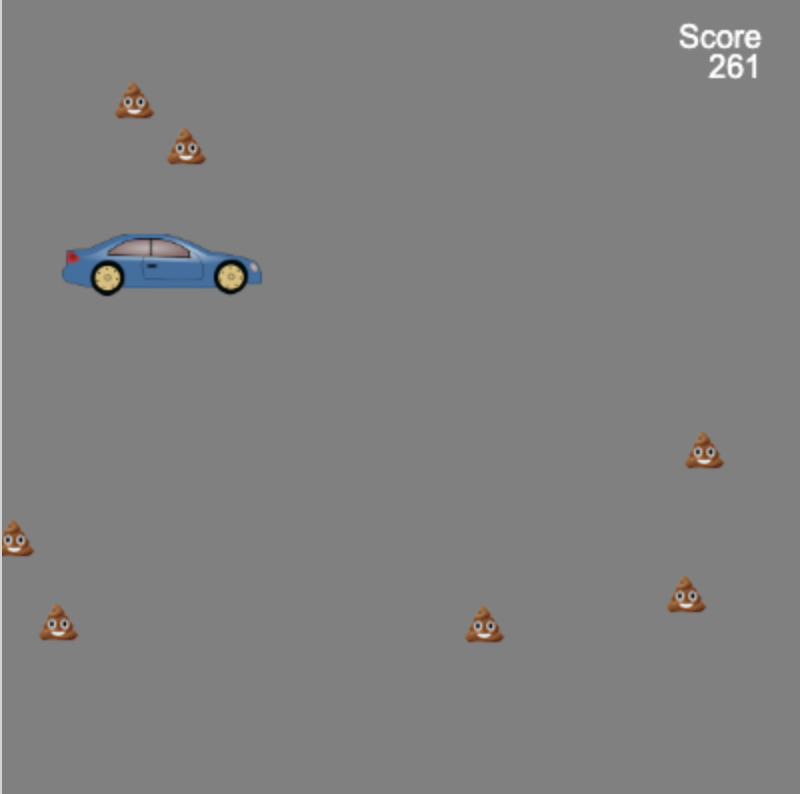

## Cyflwyniad

Adeiladwch gêm redeg ddiddiwedd lle mae'n rhaid i'ch cymeriad osgoi rhwystrau.

 
Mae **gemau rhedeg diddiwedd** yn fath o gêm lle mae'n rhaid i chi osgoi rhwystrau, a dydy'r gêm ddim yn dod i ben nes eich bod yn taro rhwystr. Rydych chi'n sgorio pwyntiau drwy aros yn fyw cyhyd â phosib.

Byddwch chi'n:
+ Defnyddio **amodau** gêm i reoli beth sy'n digwydd
+ Dysgu am gynhyrchu gweithdrefnol a chanfod gwrthdrawiadau
+ Personoli gêm yn ôl eich diddordebau chi

### Cael ysbrydoliaeth

Byddwch chi'n gwneud penderfyniadau dylunio am y math o gêm i'w gwneud, a sut byddwch chi'n defnyddio cod i gael yr effeithiau rydych chi'n eu dymuno.

--- no-print ---

--- task ---

'Drychwch ar yr enghreifftiau hyn. Meddyliwch am sut mae'r chwaraewyr a'r rhwystrau wedi cael eu gwneud.

Beth sy'n digwydd os ydych chi'n taro rhwystr? Yw'r gêm yn mynd yn anoddach wrth i chi chwarae?

  

**Cath yn sgïo**: [Gweld tu mewn](https://trinket.io/python/76e628bff2){:target="_blank"}

<iframe src="https://trinket.io/embed/python/76e628bff2?outputOnly=true" width="100%" height="600" frameborder="0" marginwidth="0" marginheight="0" allowfullscreen></iframe>

**Peidiwch â ffrwydro**: [Gweld tu mewn](https://trinket.io/python/974800f4ef){:target="_blank"}

<iframe src="https://trinket.io/embed/python/974800f4ef?outputOnly=true" width="100%" height="600" frameborder="0" marginwidth="0" marginheight="0" allowfullscreen></iframe>

**Osgoi'r germau**: [Gweld tu mewn](https://trinket.io/python/88e108c819){:target="_blank"}

<iframe src="https://trinket.io/embed/python/88e108c819?outputOnly=true" width="100%" height="600" frameborder="0" marginwidth="0" marginheight="0" allowfullscreen></iframe>

**Car glân**: [Gweld tu mewn](https://trinket.io/python/70da6c454d){:target="_blank"}

<iframe src="https://trinket.io/embed/python/70da6c454d?outputOnly=true" width="100%" height="600" frameborder="0" marginwidth="0" marginheight="0" allowfullscreen></iframe>

**Osgoi'r asteroidau**: [Gweld tu mewn](https://trinket.io/python/d156014e67){:target="_blank"}

<iframe src="https://trinket.io/embed/python/d156014e67?outputOnly=true" width="100%" height="600" frameborder="0" marginwidth="0" marginheight="0" allowfullscreen></iframe>

--- /task ---

--- /no-print ---

--- print-only ---

Byddwch chi'n gwneud penderfyniadau dylunio am y math o gêm i'w gwneud, a sut byddwch chi'n defnyddio cod i gael yr effeithiau rydych chi'n eu dymuno.

{:width="300px"}
{:width="300px"}
{:width="300px"}
{:width="300px"}
{:width="300px"}

--- /print-only ---
