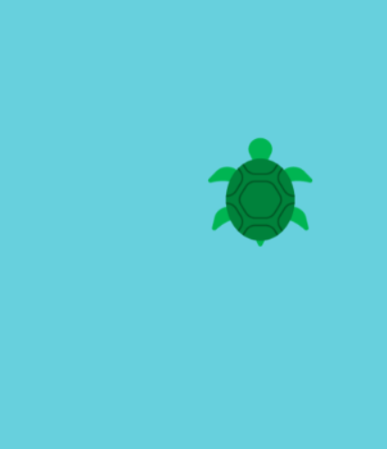

## Gosod y thema

<div style="display: flex; flex-wrap: wrap">
<div style="flex-basis: 200px; flex-grow: 1; margin-right: 15px;">
Gosodwch thema eich gêm a chreu cymeriad chwarae sy'n dilyn pwyntydd y llygoden.

</div>
<div>

{:width="300px"}

</div>
</div>

Beth yw thema eich gêm? Fe allech chi ddewis unrhyw beth. Dyma rai syniadau:
- Camp neu hobi
- Ffilm, sioe deledu neu gêm
- Gwyddoniaeth neu fyd natur
- Neu unrhyw beth arall!

--- task ---

Agorwch y [prosiect dechreuol](https://trinket.io/python/cda05e5911){:target="_blank"}. Bydd Trinket yn agor mewn tab arall yn y porwr.

--- /task ---

--- task ---

**Dewis:** Gosodwch faint eich canfas.

--- code ---
---
language: python
filename: main.py - setup()
---

def setup():    
size(400, 400)

--- /code ---

--- /task ---

--- task ---

Ewch ati i greu newidyn o'r enw `diogel` i osod y lliw cefndir ar sail thema eich gêm.

Dyma'r lliw mae'n ddiogel i'r chwaraewr fod arno a byddwch chi'n defnyddio'r newidyn hwn eto nes 'mlaen.

--- code ---
---
language: python
filename: main.py - draw()
---

def draw():    
safe = color(200, 100, 0) #Add the colour of your theme   
background(safe)

--- /code ---

[[[generic-theory-simple-colours]]]

--- /task ---

--- task ---

**Profi:** Rhedwch eich cod i weld y lliw cefndir. Fe allwch chi ei newid nes eich bod yn fodlon ar y lliw ac ar faint y sgrin.

--- /task ---

Nawr dewiswch pa gymeriad sy'n chwarae'r gêm ac yn gorfod osgoi'r rhwystrau. A fydd yn wrthrych, person, anifail, neu rywbeth arall?

Bydd y chwaraewr yn ymddangos mewn safle `y` sefydlog a'r un safle `x` â phwyntydd y llygoden, sy'n cael ei storio yn y newidyn `p5` variable `mouse_x`.

--- task ---

Mae'n syniad da rhoi trefn ar y cod ar gyfer llunio'r cymeriad chwarae mewn swyddogaeth.

Diffiniwch swyddogaeth `llunio_chwaraewr()` a chreu safle `chwaraewr_y` ar gyfer safle `y` sefydlog y chwaraewr:

--- code ---
---
language: python
filename: main.py - draw_player()
---

def draw_player():    
player_y = int(height * 0.8) #Positioned towards the screen bottom

--- /code ---

Ychwanegwch god at `draw()` i alw `llunio_chwaraewr()` bob ffrâm.

--- code ---
---
language: python
filename: main.py - draw()
---

def draw():    
safe = color(200, 100, 0) #Your chosen colour    
background(safe)    
draw_player()

--- /code ---

--- /task ---

Nesaf byddwch chi'n ychwanegu cod at y swyddogaeth `llunio_chwaraewr()` i lunio eich siâp. Mae'n bosib bydd angen i chi ychwanegu cod `setup()` hefyd.

--- task ---

**Dewis:** Sut mae eich chwaraewr yn edrych? Fe allai eich chwaraewr fod:
+ Yn ddelwedd wedi'i darparu yn y prosiect dechreuol
+ Yn emoji 🎈 neu'n destun
+ Wedi'i lunio gan ddefnyddio cyfres o siapiau

--- collapse ---
---
title: Defnyddio delwedd ddechreuol
---

Cliciwch yr eicon **manage images**.


Bydd delweddau yn y prosiect dechreuol wedi'u dangos yn y rhestr `Image library`.


Gwnewch nodyn o enw'r ddelwedd rydych chi am ei defnyddio.

Llwythwch y ddelwedd i'r swyddogaeth `setup()`

--- code ---
---
language: python
filename: main.py - setup()
---

def setup():   
size(400, 400)    
player = load_image('skiing.png') #Load your image

--- /code ---

Galwch `image()` a'i osod fel un gyffredinol (global) yn y swyddogaeth `llunio_chwaraewr()`.

--- code ---
---
language: python
filename: main.py - draw_player()
---

def draw_player():    
player_y = int(height * 0.8) #Positioned towards the screen bottom

  global player

  image(player, mouse_x, player_y, 30, 30)

--- /code ---

--- /collapse ---

--- collapse ---
---
title: Defnyddio cymeriadau emoji
---

Fe allwch chi ddefnyddio cymeriadau emoji yn y swyddogaeth p5 `text()` i ddefnyddio emoji i gynrychioli eich chwaraewr.

Dyma enghraifft:

--- code ---
---
language: python
filename: main.py - setup()
---

def setup():    
size(400, 400)     
text_size(40) #Controls the size of the emoji     
text_align(CENTER, TOP) #Position around the centre

--- /code ---

--- code ---
---
language: python
filename: main.py - draw_player()
---

def draw_player():     
player_y = int(height * 0.8)    
text('🎈', mouse_x, player_y)

--- /code ---

--- /collapse ---

[[[processing-python-text]]]

[[[generic-theory-simple-colours]]]

[[[processing-python-ellipse]]]

[[[processing-python-rect]]]

[[[processing-python-triangle]]]

[[[processing-tint]]]

[[[processing-stroke]]]

**Cyngor:** Fe allwch chi ddefnyddio nifer o siapiau syml yn yr un swyddogaeth i greu chwaraewr mwy cymhleth.

--- collapse ---
---
title: Llunio chwaraewr gan ddefnyddio nifer o siapiau
---


--- code ---
---
language: python
filename: main.py - draw_player()
---

def draw_player():    
player_y = int(height * 0.8)    
noStroke()    
#Face    
fill(0, 200, 100)    
ellipse(mouse_x, player_y, 60, 60)

  #Eyes    
fill(0, 100, 200)    
ellipse(mouse_x - 10, player_y - 10, 20, 20)    
ellipse(mouse_x + 10, player_y - 10, 20, 20)    
fill(0)    
ellipse(mouse_x - 10, player_y - 10, 10, 10)     
ellipse(mouse_x + 10, player_y - 10, 10, 10)     
fill(255)    
ellipse(mouse_x - 12, player_y - 12, 5, 5)    
ellipse(mouse_x + 12, player_y - 12, 5, 5)

--- /code ---

--- /collapse ---

--- /task ---

--- task ---

**Profi:** Rhedwch eich cod a symud y llygoden i reoli'r chwaraewr.

A yw'n symud fel oeddech chi'n ei ddisgwyl?

--- /task ---

**Difa chwilod:** Efallai bydd angen i chi drwsio chwilod yn eich prosiect. Dyma rai chwilod cyffredin.

--- task ---

--- collapse ---
---
title: Wela' i ddim y chwaraewr
---

Rhowch gynnig ar newid i sgrin lawn. Hefyd, tarwch olwg ar y cyfesurynnau `x` ac `y` rydych chi wedi'u defnyddio i lunio'r chwaraewr — gwnewch yn siŵr eu bod tu mewn i'r canfas rydych chi wedi'i greu â `size()`.

--- /collapse ---

--- collapse ---
---
title: Dyw delwedd ddim yn llwytho
---

Yn gyntaf, gwnewch yn siŵr bod y ddelwedd yn yr `Image library`. Wedyn gwnewch yn fanwl siŵr bod enw'r ffeil yn gywir — cofiwch fod priflythrennau'n wahanol i lythrennau bach a bod atalnodi'n bwysig.

--- /collapse ---

--- collapse ---
---
title: Mae yna ddelwedd o'r maint anghywir
---

Gwiriwch y mewnbynnau sy'n rheoli lled ac uchder y ddelwedd:

```python
image(image_file, x_coord, y_coord, width, height)
```

--- /collapse ---

--- collapse ---
---
title: Mae yna emoji o'r maint anghywir
---

Os yw eich emoji yn rhy fawr neu fach, newidiwch y mewnbwn i `text_size()`.

--- /collapse ---

--- /task ---

--- save ---
