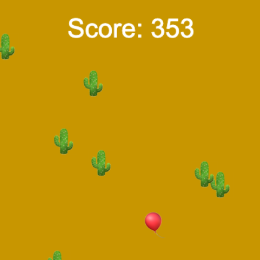

## Cyflymu pethau!

Mae'r rhan fwyaf o gemau rhedeg diddiwedd yn mynd yn anoddach wrth i'r chwaraewr fynd yn ei flaen, ac yn rhoi sgôr i'r chwaraewr.

{:width="300px"}

### Ychwanegu lefelau anhawster

Bydd creu lefelau anhawster clir yn ei gwneud hi'n haws i'ch chwaraewr ddeall beth sy'n digwydd.

--- task ---

Ewch ati i greu newidyn `level` `global` i gadw golwg ar ba lefel mae'r chwaraewr arni ar y pryd. Gosodwch hwn ar `1` er mwyn i chwaraewyr ddechrau gêm newydd ar y lefel gyntaf.

--- code ---
---
language: python filename: main.py
line_numbers: false
---

# Rhowch newidynnau cyffredinol yma
level = 1

--- /code ---

--- /task ---

--- task ---

Mae'r cod yn defnyddio `height` a `frame_count` i gynyddu'r newidyn `level` bob tro mae'r chwaraewr yn gorffen sgrin, ac yna'n printio'r lefel newydd i'r chwaraewr.

**Dewis:** Mae'r cod hwn yn cyfyngu ar nifer y lefelau i bump, felly ni fydd yn mynd yn rhy anodd. Does dim rhaid i'ch gêm gadw at bump, ond fe ddylech chi ddewis terfyn. Yn y pen draw, fydd y gêm rhy gyflym i bobl!

--- code ---
---
language: python filename: main.py — draw_obstacles()
line_numbers: false
---

def draw_obstacles():

  global level #Use the global level

  if frame_count % height == height - 1 and level < 5: level += 1 print('You have reached level', level)

--- /code ---

--- /task ---

--- task ---

Y ddau brif ddewis ar gyfer gwneud y gêm yn anoddach yw gwneud iddi symud yn gyflymach, a chynyddu nifer y rhwystrau.

--- collapse ---
---
title: Cyflymu eich gêm
---

Mae cyflymder eich gêm yn cael ei reoli gan ba mor gyflym mae rhwystrau i weld yn symud tuag at y chwaraewr. Mae'r cod yn cyflymu hyn drwy ychwanegu `frame_count * level` at y cyfesuryn `y` wrth gynhyrchu rhwystrau.

Yn lle symud eich rhwystrau un picsel bob ffrâm, mae'r cod hwn, i bob pwrpas, yn ei symud fesul y picseli `level` yn lle.

Gan edrych ar y cod, efallai byddech chi'n disgwyl i'r cyflymder gynyddu mwy na'r picseli `level`. Er enghraifft, ar y pwynt cyn i'ch `level` gynyddu, mae'r `frame_count` yn `799` — gan fod y `level` yn cynyddu un ffrâm cyn bod `frame_count` yn eil-luosrif o `height` (wedi'i osod ar `400` picsel) — ac mae `799 * 3` yn sylweddol fwy na `799 * 2`. Ond mae'r picseli ychwanegol sy'n cael eu creu drwy luosi `frame_count` yn ei gyfanrwydd â rhif uwch wedi'u cuddio gan `ob_y %= height`. Mae hyn yn gadael dim ond y picseli `level` ychwanegol ym mhob cam.

--- code ---
---
language: python filename: main.py — draw_obstacles()
line_numbers: false
---

  for i in range(6): ob_x = randint(0, height) ob_y = randint(0, height) + (frame_count * level) ob_y %= height #Wrap around text('🌵', ob_x, ob_y)

--- /code ---

--- /collapse ---

--- collapse ---
---
title: Ychwanegu mwy o rwystrau
---

Mae ychwanegu rhwystrau ychwanegol yn fater syml o gynyddu sawl gwaith mae'r ddolen `for` sy'n eu creu yn rhedeg. Fe allwch chi wneud hyn drwy gynyddu'r rhif rydych chi'n ei basio i'r swyddogaeth `range()` fesul `level`.

**Cyngor:** Wrth gwrs, fe allwch chi ddefnyddio `level * 2` neu luosrifau mwy byth os ydych chi am wneud eich gêm yn anoddach.

--- /collapse ---

--- /task ---

### Cadw sgôr

Po hiraf mae eich chwaraewr yn para heb daro rhwystr, y gorau mae'n chwarae eich gêm. Bydd ychwanegu sgôr yn gadael iddyn nhw weld pa mor dda maen nhw'n ei wneud.

--- task ---

Ewch ati i greu newidyn `sgor` cyffredinol i gadw golwg ar sgôr y chwaraewr. Gosodwch hwn ar `0` er mwyn i chwaraewyr ddechrau gêm newydd heb bwyntiau.

--- code ---
---
language: python filename: main.py
line_numbers: false
---

# Rhowch newidynnau cyffredinol yma
sgor = 0

--- /code ---

--- /task ---

--- task ---

Fe allwch chi gynyddu sgôr eich chwaraewr bob ffrâm lle nad yw wedi taro rhwystr drwy gynyddu ei sgôr pan fyddwch yn gwirio am wrthdrawiad yn `llunio_chwaraewr()`.

**Dewis:** Fe allwch chi benderfynu sawl pwynt mae bob ffrâm werth, ond mae cynyddu sgôr y chwaraewr fesul `level` yn gwobrwyo chwaraewyr sy'n gallu goroesi lefelau anoddach.

--- code ---
---
language: python
filename: main.py — draw_player()
---

global score

  if collide == safe: text('🎈', mouse_x, player_y) score += level else: text('💥', mouse_x, player_y)

--- /code ---

--- /task ---

--- task ---

Fe ddylai chwaraewyr allu gweld eu sgôr. Oherwydd ei fod yn cynyddu mor gyflym, fyddai defnyddio `print()` ddim yn gweithio cystal. Defnyddiwch y swyddogaeth p5 `text()` tu mewn i'ch swyddogaeth `draw()` i'w ddangos fel testun ar sgrin y gêm yn lle.

[[[processing-python-text]]]

Fe allwch chi ddefnyddio'r gweithredwr `+` i gyfuno dau linyn neu fwy os hoffech chi roi pennawd fel 'sgôr' neu 'pwyntiau'. Oherwydd mai rhif yw `sgor`, bydd angen i chi ei drosi'n llinyn cyn gallu ei uno â llinyn arall. Fe allwch chi wneud hyn gyda `str()`:

`message = 'Score: ' + str(score)`

**Cyngor:** Ystyr `str()` yw llinyn — 'string'. Mae rhaglenwyr yn tynnu llythrennau fel hyn yn aml er mwyn gallu teipio llai!

--- /task ---

### Gêm drosodd!

Pan fydd chwaraewr wedi taro rhwystr, dylai'r gêm roi'r gorau i symud a dylai ei sgôr aros fel y mae.

--- task ---

Fe allwch chi ddefnyddio'r newidyn `level` i ddangos bod y 'Gêm drosodd' drwy ei osod ar 0 —gwerth na fydd yn ei gyrraedd unrhyw ffordd arall. Do this in the `else` step of your collision detection code.

--- /task ---

--- task ---

Ewch ati i greu datganiad `if` yn `draw()` sy'n profi a yw `level > 0` cyn galw unrhyw swyddogaeth — fel `background()`, `llunio_rhwystrau()`, a `llunio_chwaraewr()` — sy'n diweddaru'r gêm. Oherwydd nad yw'r swyddogaethau hyn yn cael eu galw, mae'n ymddangos bod y gêm wedi dod i ben, er bod eich rhaglen yn dal yn rhedeg.

--- /task ---

--- task ---

**Difa chwilod:** Efallai bydd angen i chi drwsio chwilod yn eich prosiect. Dyma rai chwilod cyffredin.

--- collapse ---
---
title: Dydy'r sgôr ddim i'w weld
---

Gwnewch yn siŵr eich bod wedi cynnwys y swyddogaeth `text()` sy'n llunio sgôr y chwaraewr ar y pwynt priodol yn eich swyddogaeth `draw()`, a'ch bod wedi pasio'r gwerthoedd cywir iddi:

`text('Text to display', x, y)`

Fe ddylai edrych rhywbeth yn debyg i hyn:

--- code ---
---
language: python
filename: main.py — draw()
---

  if level > 0: background(safe) fill(255) text('Score: ' + str(score), width/2, 20) draw_obstacles() draw_player()

--- /code ---

--- /collapse ---

--- collapse ---
---
title: Dydy'r gêm ddim yn dod i ben ar ôl gwrthdrawiad
---

Os ydych chi'n credu nad yw eich gêm yn canfod gwrthdrawiadau'n gywir o gwbl, rhowch gynnig yn gyntaf ar y cyfarwyddiadau difa chwilod yn y cam blaenorol o dan 'Does dim gwrthdrawiad pan fydd y chwaraewr yn cyrraedd rhwystr'.

Os yw eich gêm yn canfod gwrthdrawiadau'n gywir, gwnewch yn siŵr eich bod wedi mewnoli'r cod sy'n llunio eich gêm yn y datganiad `if level > 0` yn gywir, i wneud yn siŵr ei fod ddim ond yn rhedeg os yw'r datganiad hwnnw'n wir. Er enghraifft:

--- code ---
---
language: python
filename: main.py — draw()
---

  if level > 0: background(safe) fill(255) text('Score: ' + str(score), width/2, 20) draw_obstacles() draw_player()

--- /code ---

Yn olaf, os yw'r ddau beth hynny'n gywir, efallai nad yw eich gêm yn gosod `level = 0` yn gywir pan fydd gwrthdrawiad. Er enghraifft:

--- code ---
---
language: python
filename: main.py — draw_player()
---

  if collide == safe: text('🎈', mouse_x, player_y) score += level else: text('💥', mouse_x, player_y) level = 0

--- /code ---

--- /collapse ---

--- collapse ---
---
title: Dydy'r gêm ddim yn cyflymu
---

Yn gyntaf, gwnewch yn siŵr bod `level` yn cynyddu'n gywir. Fe ddylech chi weld neges yn cael ei phrintio bob tro mae'n cynyddu. Os nad yw hyn yn digwydd, gwiriwch y cod ar gyfer printio'r neges a'r cod ar gyfer cynyddu'r lefel.

Os yw'r lefel yn cynyddu'n gywir, gwiriwch eich swyddogaeth `llunio_rhwystrau()`. Yn benodol, gwiriwch bod gennych chi `ob_y = randint(0, height) + (frame_count * level)`. Fe ddylai edrych rhywbeth yn debyg i hyn:

--- code ---
---
language: python filename: main.py — draw_obstacles()
line_numbers: false
---

  for i in range(6 + level): ob_x = randint(0, height) ob_y = randint(0, height) + (frame_count * level) ob_y %= height #Wrap around text('🌵', ob_x, ob_y)

--- /code ---

--- /collapse ---

--- collapse ---
---
title: Does dim rhwystrau newydd yn ymddangos
---

Mae ambell reswm posib am hyn. Ac mae yna resymau eraill ei fod yn edrych fel bod hynny'n digwydd, er nad yw'n digwydd go iawn. Yn gyntaf, oherwydd bod rhwystrau newydd yn cael eu hychwanegu ar sail `level`, gwnewch yn siŵr bod `level` yn cynyddu'n gywir. Fe ddylech chi weld neges yn cael ei phrintio bob tro mae'n cynyddu. Os nad yw hyn yn digwydd, gwiriwch y cod ar gyfer printio'r neges a'r cod ar gyfer cynyddu'r lefel.

Os yw'r lefel yn cynyddu'n gywir, gwiriwch eich swyddogaeth `llunio_rhwystrau()` i sicrhau bod `level` yn cael ei defnyddio yn swyddogaeth `range()` y ddolen `for` sy'n llunio'r rhwystrau. Fe ddylai edrych rhywbeth yn debyg i hyn:

--- code ---
---
language: python filename: main.py — draw_obstacles()
line_numbers: false
---

  for i in range(6 + level): ob_x = randint(0, height) ob_y = randint(0, height) + (frame_count * level) ob_y %= height #Wrap around text('🌵', ob_x, ob_y)

--- /code ---

Os ydych chi wedi gwirio hyn i gyd a bod nifer y rhwystrau'n dal ddim yn edrych fel ei fod yn cynyddu, mae'n bosib ei fod ond nad ydych chi'n gallu ei weld. Fe ddylech chi roi cynnig ar rai o'r camau hyn i brofi hyn:
  - Arafu'r gêm gan ddefnyddio `frame_rate()` yn eich swyddogaeth `setup()` i roi mwy o amser i chi gyfri
  - Newid y dosbarthiad rydych chi'n ei ddefnyddio ar gyfer eich rhifau ar hap. Mae'n annhebygol, ond efallai fod rhai rhwystrau'n ymddangos ar ben ei gilydd ar hap
  - Ychwanegu `print()` at y ddolen `for` yn `llunio_rhwystrau()` sy'n printio gwerth `i` bob tro mae'r ddolen yn troi, er mwyn i chi allu gwneud yn siŵr ei bod yn rhedeg sawl gwaith y dylai redeg
  - Dim ond er mwyn profi, newidiwch `range(6 + level)` i `range(6 * level)` — fe ddylai fod yn haws sylwi ar y cynnydd wedyn!

--- /collapse ---

--- /task ---

--- save ---
