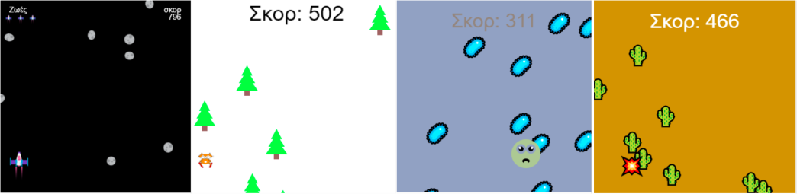
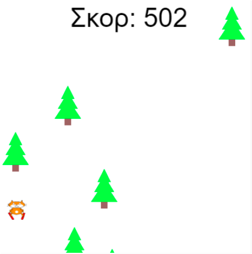
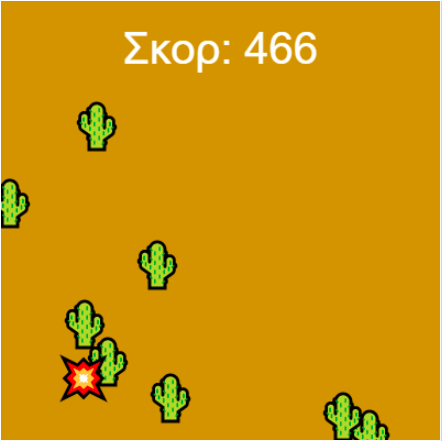
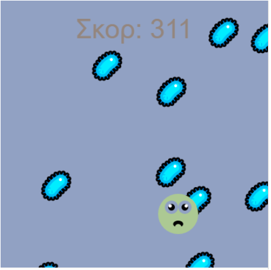
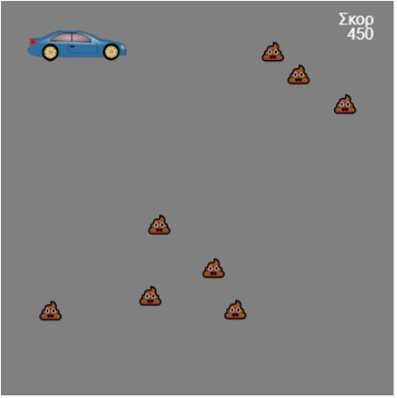

## You will make

Δημιούργησε ένα ατελείωτο παιχνίδι δρομέα όπου ο χαρακτήρας σου πρέπει να αποφεύγει εμπόδια.

 
**Ατελείωτοι δρομείς** είναι ένα είδος παιχνιδιού όπου πρέπει να αποφεύγεις τα εμπόδια και το παιχνίδι τελειώνει μόνο όταν χτυπήσεις ένα εμπόδιο. Κερδίζεις πόντους παραμένοντας ζωντανός όσο περισσότερο μπορείς.

Θα χρειαστεί να:
+ Χρησιμοποιήσεις τις **συνθήκες** του παιχνιδιού για να ελέγξεις τι συμβαίνει
+ Μάθεις για τη διαδικαστική παραγωγή και για την ανίχνευση σύγκρουσης
+ Εξατομικεύσεις ένα παιχνίδι σύμφωνα με τα ενδιαφέροντά σου

### Get ideas 💭

Θα λάβεις κάποιες σχεδιαστικές αποφάσεις σχετικά με το είδος του παιχνιδιού που θα κάνεις και πώς θα χρησιμοποιήσεις τον κώδικα για να έχεις τα εφέ που θέλεις.

--- no-print ---

--- task ---

Run these examples. Σκέψου πώς έχουν κατασκευαστεί οι παίκτες και τα εμπόδια.

Τι συμβαίνει αν χτυπήσεις σε ένα εμπόδιο; Όσο περισσότερο παίζεις γίνεται πιο δύσκολο;

**Skiing cat**:
<iframe src="https://editor.raspberrypi.org/en/embed/viewer/skiing-cat-example" width="600" height="700" frameborder="0" marginwidth="0" marginheight="0" allowfullscreen>
</iframe> You can find the Skiing cat project [here](https://editor.raspberrypi.org/en/projects/skiing-cat-example){:target="_blank"}

**Don't pop**:
<iframe src="https://editor.raspberrypi.org/en/embed/viewer/dont-pop-example" width="600" height="700" frameborder="0" marginwidth="0" marginheight="0" allowfullscreen>
</iframe> You can find the Don't pop project [here](https://editor.raspberrypi.org/en/projects/dont-pop-example){:target="_blank"}

**Avoid the germs**:
<iframe src="https://editor.raspberrypi.org/en/embed/viewer/avoid-germs-example" width="600" height="700" frameborder="0" marginwidth="0" marginheight="0" allowfullscreen>
</iframe> You can find the Avoid the germs project [here](https://editor.raspberrypi.org/en/projects/avoid-germs-example){:target="_blank"}

**Clean car**:
<iframe src="https://editor.raspberrypi.org/en/embed/viewer/clean-car-example" width="600" height="700" frameborder="0" marginwidth="0" marginheight="0" allowfullscreen>
</iframe> You can find the Clean car project [here](https://editor.raspberrypi.org/en/projects/clean-car-example){:target="_blank"}

**Dodge asteroids**:
<iframe src="https://editor.raspberrypi.org/en/embed/viewer/dodge-asteroids-example" width="600" height="700" frameborder="0" marginwidth="0" marginheight="0" allowfullscreen>
</iframe> You can find the Dodge asteroids project [here](https://editor.raspberrypi.org/en/projects/dodge-asteroids-example){:target="_blank"}

--- /task ---

--- /no-print ---

--- print-only ---

You are going to make some design decisions about the kind of game you will make and how you will use code to get the effects you want.

{:width="300px"}
You can find the Skiing cat project here https://editor.raspberrypi.org/en/projects/repeated-patterns-example {:width="300px"}
You can find the Don't pop project here https://editor.raspberrypi.org/en/projects/repeated-patterns-example {:width="300px"}
You can find the Avoid the germs project here https://editor.raspberrypi.org/en/projects/repeated-patterns-example {:width="300px"}
You can find the Clean car project here https://editor.raspberrypi.org/en/projects/clean-car-example {:width="300px"}
You can find the Dodge asteroids project here https://editor.raspberrypi.org/en/projects/dodge-asteroids-example

--- /print-only ---
