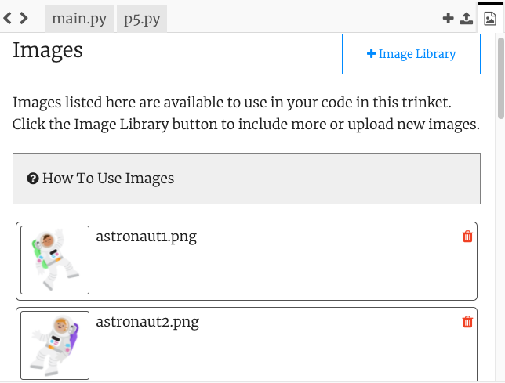

## Δημιούργησε τα εμπόδια

Δημιούργησε τα εμπόδια που θα πρέπει να αποφεύγεις για να συνεχίζεις να παίζεις το παιχνίδι.

{:width="300px"}

### Ξεκίνα με ένα εμπόδιο

Μπορείς να κάνεις τα εμπόδια με τους ίδιους τρόπους που έφτιαξες τον παίκτη σου. Ταιριάζουν τα εμπόδια με το θέμα σου;

Θα χρησιμοποιήσεις έναν βρόχο `for` για να δημιουργήσεις πολλά αντίγραφα, επομένως χρειάζεται να δημιουργήσεις ή να επιλέξεις μόνο ένα εμπόδιο.

--- task ---

Πρόσθεσε μια συνάρτηση `draw_obstacles()`:

--- code ---
---
language: python
filename: main.py - draw_obstacles()
---

def draw_obstacles(): ob_x = width/2 ob_y = height/2 text('🌵', ob_x, ob_y) #Αντικατάστησέ το με το εμπόδιό σου

--- /code ---

Πρόσθεσε κώδικα στη συνάρτηση `draw()` για να καλεί τη συνάρτηση `draw_obstacles()` σε κάθε καρέ.

--- code ---
---
language: python
filename: main.py - draw()
---

def draw(): safe = color(200, 100, 0) #Πρόσθεσε το χρώμα του θέματός σου background(safe)  
draw_obstacles() #Πριν σχεδιάσεις τον παίκτη draw_player()

--- /code ---

--- /task ---

--- task ---

**Επίλεξε:** Πώς θα είναι το εμπόδιό σου; Το εμπόδιο σου μπορεί να είναι:
+ Μια εικόνα που παρέχεται στο αρχικό έργο
+ Ένα emoji 🌵 ή ένα κείμενο
+ Σχεδιασμένο χρησιμοποιώντας μια σειρά σχημάτων

--- collapse ---
---
title: Χρησιμοποίησε την αρχική εικόνα
---

Κάνε κλικ στο εικονίδιο **View and Add Images**.

Οι εικόνες που περιλαμβάνονται στο αρχικό έργο θα εμφανίζονται στη λίστα `Image Library`.

Σημείωσε το όνομα της εικόνας που θέλεις να χρησιμοποιήσεις.

Φόρτωσε την εικόνα στη συνάρτηση `setup()`.

--- code ---
---
language: python
filename: main.py - setup()
---

def setup(): size(400, 400) player = load_image('skiing.png') #Φόρτωσε την εικόνα σου obstacle = load_image('rocket.png') #Φόρτωσε την εικόνα σου

--- /code ---

Κάλεσε τη συνάρτηση `image()` και όρισε την ως global στη συνάρτηση `draw_obstacles()`.

--- code ---
---
language: python
filename: main.py - draw_obstacles()
---

def draw_obstacles(): ob_x = width/2 ob_y = height/2

   global obstacle

   image(obstacle, ob_x, ob_y, 30, 30) #Αλλαγή μεγέθους για να ταιριάζει με το θέμα σου

--- /code ---

--- /collapse ---

--- collapse ---
---
title: Χρησιμοποίησε χαρακτήρες emoji
---

Μπορείς να χρησιμοποιήσεις χαρακτήρες emoji στη συνάρτηση p5 `text()` για να αναπαραστήσεις τα εμπόδιά σου.

Ακολουθεί ένα παράδειγμα:

--- code ---
---
language: python
filename: main.py - setup()
---

def setup(): size(400, 400) text_size(40) #Ελέγχει το μέγεθος του emoji text_align(CENTER, TOP) #Τοποθετημένο γύρω από το κέντρο

--- /code ---

--- code ---
---
language: python
filename: main.py - draw_obstacles()
---

def draw_obstacles(): ob_x = width/2 ob_y = height/2 text('🌵', ob_x, ob_y)

--- /code ---

--- /collapse ---

[[[processing-python-text]]]

[[[generic-theory-simple-colours]]]

[[[processing-python-ellipse]]]

[[[processing-python-rect]]]

[[[processing-python-triangle]]]

[[[processing-tint]]]

[[[processing-stroke]]]

**Συμβουλή:** Μπορείς να χρησιμοποιήσεις πολλά απλά σχήματα στην ίδια συνάρτηση για να δημιουργήσεις ένα πιο σύνθετο εμπόδιο.

--- collapse ---
---
title: Σχεδίασε ένα εμπόδιο χρησιμοποιώντας πολλά σχήματα
---

--- code ---
---
language: python
filename: main.py - draw_obstacles()
---

def draw_obstacles(): ob_x = width/2 ob_y = height/2 #Draw a fir tree no_stroke() fill(0,255,0) #Πράσινο για τις βελόνες triangle(ob_x + 20, ob_y + 20, ob_x + 10, ob_y + 40, ob_x + 30, ob_y + 40) triangle(ob_x + 20, ob_y + 30, ob_x + 5, ob_y + 55, ob_x + 35, ob_y + 55) triangle(ob_x + 20, ob_y + 40, ob_x + 0, ob_y + 70, ob_x + 40, ob_y + 70) fill(150,100,100) # καφέ για τον κορμό rect(ob_x + 15, ob_y + 70, 10, 10)

--- /code ---

--- /collapse ---

--- /task ---

### Κίνησε το εμπόδιό σου

--- task ---

Τώρα πρόσθεσε κώδικα για να αυξήσεις τη θέση `y` του εμποδίου σε κάθε καρέ και κάντο να επανεμφανίζεται στην αντίθετη πλευρά όταν φτάνει στο κάτω μέρος για να δημιουργήσεις το εφέ ενός άλλου εμποδίου.

Η μεταβλητή p5 `frame_count` αρχίζει να μετράει τα καρέ όταν κάνεις κλικ στην εκτέλεση.

`ob_y %= height` ορίζει τη θέση `y` ως το υπόλοιπο του ob_y όταν διαιρείται με το `height`. Με μια τιμή `height` στο '400', αυτό θα μετατρέψει το `401` σε `1`, οπότε όταν τα εμπόδια εξαφανιστούν στο κάτω μέρος της οθόνης, θα επανεμφανίζονται ξανά στην κορυφή.

--- code ---
---
language: python
filename: main.py - draw_obstacles()
---

def draw_obstacles(): ob_x = width/2 ob_y = height/2 + frame_count #Αυξάνει κάθε καρέ ob_y %= height #Ξεκίνημα από την απέναντι πλευρά text('🌵', ob_x, ob_y) #Αντικατάστησέ το με το εμπόδιό σου

--- /code ---

--- /task ---

### Πολλά εμπόδια

Θα μπορούσες να σχεδιάσεις πολλά αντίγραφα του εμποδίου σου σε διαφορετικές τοποθεσίες εκκίνησης, αλλά αυτό είναι πολλή δουλειά. Ας κάνουμε μια συντόμευση.

 
**Η διαδικαστική παραγωγή (procedural generation)** χρησιμοποιείται για τη δημιουργία κόσμων στα παιχνίδια, εμποδίων και σκηνών ταινιών με σκοπό τη δημιουργία τυχαιότητας αλλά με την εφαρμογή ορισμένων κανόνων. Το seed σημαίνει ότι μπορείς να δημιουργήσεις τα ίδια αποτελέσματα κάθε φορά που χρησιμοποιείς τον ίδιο seed (σπόρο).

--- task ---

Αυτός ο κώδικας χρησιμοποιεί έναν βρόχο `for` με `randint()` για να επιλέξει θέσεις εμποδίων για σένα. Η κλήση της συνάρτησης τυχαίων αριθμών `seed()` σημαίνει ότι θα λαμβάνεις πάντα τους ίδιους τυχαίους αριθμούς. Αυτό σημαίνει ότι τα εμπόδια δεν θα χοροπηδούν σε κάθε καρέ και μπορείς να αλλάξεις το seed μέχρι να καταλήξεις στη σωστή τοποθέτηση των εμποδίων.

--- code ---
---
language: python
filename: main.py - draw_obstacles()
---

def draw_obstacles():

  seed(12345678) #Οποιοσδήποτε αριθμός είναι εντάξει

  for i in range(6):  
ob_x = randint(0, height) ob_y = randint(0, height) + frame_count ob_y %= height text('🌵', ob_x, ob_y) #Αντικατάστησέ το με το δικό σου εμπόδιο

--- /code ---

Χρήσιμες πληροφορίες:

[[[using-seed-in-python]]]

[[[generic-python-for-loop-repeat]]]

--- /task ---

--- collapse ---
---
title: Προειδοποίηση για επιληψία
---

Η δοκιμή του προγράμματός σου πιθανόν να προκαλέσει επιληπτικές κρίσεις σε άτομα με επιληψία προκαλούμενη από φωτοευαισθησία. Εάν έχεις επιληψία προκαλούμενη από φωτοευαισθησία ή αισθάνεσαι ότι μπορεί να είσαι επιρρεπής σε επιληπτικές κρίσεις, μην εκτελέσεις το πρόγραμμά σου. Αντίθετα, μπορείς:
- Βεβαιώσου ότι έχεις προσθέσει τη γραμμή κώδικα `seed()` για να βεβαιωθείς ότι τα εμπόδιά σου δεν χοροπηδάνε
- Ζήτησε από κάποιον να το εκτελέσει για σένα
- Προχώρησε και ολοκλήρωσε το έργο, ζητώντας από κάποιον να εκτελέσει το έργο για σένα, ώστε να μπορείς να κάνεις εντοπισμό σφαλμάτων
- Άλλαξε τον ρυθμό καρέ πριν εκτελέσεις το πρόγραμμά σου προσθέτοντας `frame_rate(1)` στην αρχή της συνάρτησης `setup()` — μπορείς να το αφαιρέσεις αφού επιβεβαιώσεις ότι δεν υπάρχει σφάλμα

--- /collapse ---

--- task ---

**Δοκιμή:** Εκτέλεσε το πρόγραμμά σου και θα δεις πολλά αντικείμενα στην οθόνη, που επανεμφανίζονται στην αντίθετη πλευρά όταν φτάνουν στο κάτω μέρος.

Άλλαξε τον κώδικά σου μέχρι να είσαι ευχαριστημένος/η με τα εμπόδια που έχεις. Μπορείς:

+ Να αλλάξεις το seed για να βάλεις εμπόδια σε διαφορετικές θέσεις εκκίνησης
+ Να αλλάξεις τον αριθμό των φορών στις επαναλήψεις βρόχου για να λάβεις διαφορετικό αριθμό εμποδίων
+ Να προσαρμόσεις το μέγεθος των εμποδίων

**Συμβουλή:** Βεβαιώσου ότι είναι δυνατό να αποφύγεις τα εμπόδια σου, αλλά ότι δεν υπάρχει εύκολος δρόμος στο παιχνίδι σου.

--- /task ---

--- task ---

**Εντοπισμός σφαλμάτων:** Ενδέχεται να βρεις κάποια σφάλματα στο έργο σου που πρέπει να διορθώσεις. Εδώ είναι μερικά κοινά σφάλματα.

--- collapse ---
---
title: Μόνο ένα εμπόδιο έχει σχεδιαστεί
---

Έλεγξε τη συνάρτησή σου που σχεδιάζει πολλά εμπόδια:
 + Βεβαιώσου ότι χρησιμοποιεί έναν βρόχο `for` για να καλέσει τη συνάρτηση σχεδίασης εμποδίων περισσότερες από μία φορές
 + Βεβαιώσου ότι χρησιμοποιεί `randint()` για να αλλάξει τις συντεταγμένες (x, y) που περνά στη συνάρτηση σχεδίασης εμποδίων
 + Έλεγξε ότι έχεις χρησιμοποιήσει `ob_x` και `ob_y` ως συντεταγμένες για το εμπόδιό σου

Για παράδειγμα:

--- code ---
---
language: python
filename: main.py — draw_obstacles()
---

def draw_obstacles():

  seed(12345678)

  for i in range(6):  
ob_x = randint(0, height) ob_y = randint(0, height) + frame_count ob_y %= height text('🌵', ob_x, ob_y) #Αντικατάστησέ το με το δικό σου εμπόδιο

--- /code ---

--- /collapse ---

--- collapse ---
---
title: Τα εμπόδια αλλάζουν θέση κάθε φορά που σχεδιάζεται ένα καρέ
---

Βεβαιώσου ότι έχεις χρησιμοποιήσει `seed()` μέσα στη συνάρτηση που σχεδιάζει πολλά εμπόδια.

--- /collapse ---

--- /task ---

 
Οι προγραμματιστές/τριες χρησιμοποιούν πολλά κομψά κόλπα, όπως τη χρήση του τελεστή «%» για να κάνουν αντικείμενα να επανεμφανίζονται στην αντίθετη πλευρά της οθόνης και τη συνάρτηση «seed()» για τη δημιουργία των ίδιων τυχαίων αριθμών. Όσο περισσότερο προγραμματίζεις, τόσο πιο κομψά κόλπα θα μαθαίνεις.

--- save ---
