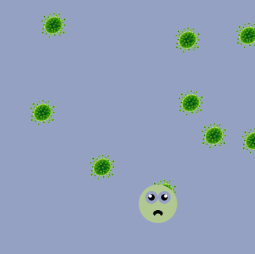

## Ανίχνευση σύγκρουσης

<div style="display: flex; flex-wrap: wrap">
<div style="flex-basis: 200px; flex-grow: 1; margin-right: 15px;">
Τα ατελείωτα παιχνίδια δρομέων συχνά τελειώνουν όταν ο παίκτης συγκρούεται με ένα εμπόδιο.
</div>
<div>

{:width="300px"}

</div>
</div>

Τώρα μπορείς να ρυθμίσεις τον παίκτη σου ώστε να αντιδρά σε μια σύγκρουση με εμπόδιο.

<p style="border-left: solid; border-width:10px; border-color: #0faeb0; background-color: aliceblue; padding: 10px;">
Η <span style="color: #0faeb0">**Ανίχνευση σύγκρουσης**</span> καθορίζει πότε αγγίζονται δύο αντικείμενα που δημιουργούνται μέσα σε μια προσομοίωση υπολογιστή — είτε πρόκειται για παιχνίδι, είτε για κινούμενα σχέδια ή κάτι άλλο. Υπάρχουν διάφοροι τρόποι για να γίνει αυτό, για παράδειγμα: 
  - έλεγχος εάν τα χρώματα που εμφανίζονται στη θέση ενός αντικειμένου είναι τα χρώματα αυτού του αντικειμένου ή κάποια διαφορετικά
  - παρακολούθηση του σχήματος κάθε αντικειμένου και έλεγχος εάν αυτά τα σχήματα επικαλύπτονται
  - δημιουργία ενός συνόλου οριακών σημείων, ή γραμμών, γύρω από ένα αντικείμενο και έλεγχος εάν έρχονται σε επαφή με άλλα «συγκρουόμενα» αντικείμενα
Όταν ανιχνευτεί μια τέτοια σύγκρουση, το πρόγραμμα μπορεί να αντιδράσει με κάποιο τρόπο. In a video game, this is usually to deal damage (if the player collides with an enemy or hazard) or to give a benefit (if the player collides with a power up).
</p>

--- task ---

Στη συνάρτηση `draw_player()`, δημιούργησε τη μεταβλητή που ονομάζεται `collide` και όρισέ την ώστε να παίρνει το χρώμα στη θέση του παίκτη.

--- code ---
---
language: python
filename: main.py - draw_player()
---

    collide = get(mouse_x, player_y).hex

--- /code ---

--- /task ---

--- task ---

Create a condition to check `if` the `collide` variable is the same as the `safe` variable — if it is, then your player is safely touching the background and has not collided with an obstacle.

Δημιούργησε μια συνθήκη για να ελέγξεις `εάν` η μεταβλητή `collide` είναι ίδια με τη μεταβλητή `safe` — εάν είναι, τότε ο παίκτης σου αγγίζει με ασφάλεια το φόντο και δεν έχει συγκρουστεί με κάποιο εμπόδιο.

**Choose:** How should your player react? You could:
+ Αλλάξεις την εικόνα με μια έκδοση `συντριβής (crashed)`
+ Χρησιμοποιήσεις ένα διαφορετικό emoji για τον παίκτη

--- collapse ---
---
title: Άλλαξε την εικόνα
---

You can use emoji characters in the p5 `text()` function to represent your collided player.

Μπορείς να χρησιμοποιήσεις μια διαφορετική εικόνα για να αναπαραστήσεις τον παίκτη σου όταν συγκρούεται με ένα εμπόδιο.

--- code ---
---
language: python
filename: main.py - setup()
---

def setup(): size(400, 400) text_size(40)  # Controls the size of the emoji text_align(CENTER, TOP)  # Position around the centre

--- /code ---

--- code ---
---
language: python
filename: main.py - draw_player()
---

def draw_player(): if collide == safe.hex:  # On background text('🎈', mouse_x, player_y) else:  # Collided text('💥', mouse_x, player_y)

--- /code ---

--- /collapse ---

[[[processing-tint]]]

[[[generic-theory-simple-colours]]]

--- /task ---

--- task ---

def setup(): size(400, 400) text_size(40) #Ελέγχει το μέγεθος του emoji text_align(CENTER, TOP) #Τοποθετημένο γύρω από το κέντρο

--- /task ---

--- task ---

**Debug:** You might find some bugs in your project that you need to fix. Here are some common bugs.

--- collapse ---
---
title: There is no collision when the player reaches an obstacle
---

If your player character touches the obstacle and nothing happens, there are a few things you should check:

 - Make sure you call `draw_obstacles()` before `draw_player()`. Εάν ελέγχεις για συγκρούσεις πριν να σχεδιάσεις τα εμπόδια σε ένα καρέ, τότε δεν θα υπάρχουν εμπόδια για σύγκρουση!
 - Βεβαιώσου ότι χρησιμοποιείς ακριβώς το ίδιο χρώμα όταν σχεδιάζεις το αντικείμενο και στην εντολή `if` που ελέγχει τη σύγκρουση. Μπορείς να βεβαιωθείς για αυτό χρησιμοποιώντας την ίδια `global` μεταβλητή και στα δύο σημεία του κώδικα.
 - Μήπως σχεδίασες τον χαρακτήρα του παίκτη πριν ελέγξεις το χρώμα στις συντεταγμένες του ποντικιού; Αν ναι, θα παίρνεις πάντα τα χρώματα μόνο από τον παίκτη. Πρέπει να ελέγξεις πρώτα το χρώμα και **μετά** να σχεδιάσεις τον παίκτη.
 - Έχεις κώδικα στο τμήμα `else` για να κάνεις κάτι διαφορετικό όταν ανιχνεύεται μια σύγκρουση, όπως το να αλλάξεις μια απόχρωση ή να χρησιμοποιήσεις μια διαφορετική εικόνα;
 - Έχεις βάλει σωστά σε εσοχή τον κώδικα για την εντολή `if` ώστε να εκτελείται όταν η συνθήκη είναι αληθής;

Printing the colour of the pixel you are checking for a collision can be useful:

```python
    print(red(collide), green(collide), blue(collide))
```

You can also print a circle around the point you are checking and adjust the point you check if you need to:

```python
    no_fill()
    ellipse(mouse_x, player_y, 10, 10)  # Draw collision point
```

--- /collapse ---

--- /task ---

--- task ---

**Optional:** At the moment, you are just detecting collisions at one pixel on your player. You could also detect collisions at other pixels at the edge of your player, such as the bottom or left- and right-most edges.

--- collapse ---
---
filename: main.py - draw_obstacles()
---

```python
def draw_player():

    player_y = int(height * 0.8)
    # Useful for debugging
    # Draw circles around the pixels to check for collisions

    no_fill()
    ellipse(mouse_x, player_y, 10, 10)  # Draw collision point
    ellipse(mouse_x, player_y + 40, 10, 10)
    ellipse(mouse_x - 12, player_y + 20, 10, 10)
    ellipse(mouse_x + 12, player_y + 20, 10, 10)

    collide = get(mouse_x, player_y).hex
    collide2 = get(mouse_x - 12, player_y + 20).hex
    collide3 = get(mouse_x + 12, player_y + 20).hex
    collide4 = get(mouse_x, player_y + 40).hex

    if mouse_x < width:  # Off the left of the screen
        collide2 = safe.hex

    if mouse_x > width:  # Off the right of the screen
        collide3 = safe.hex

    if collide == safe.hex and collide2 == safe.hex and collide3 == safe.hex and collide4 == safe.hex:
        text('🎈', mouse_x, player_y)
    else:
        text('💥', mouse_x, player_y)
```

--- /collapse ---

You could even use a loop and check lots of different pixels. This is how collision detection works in games.

--- /task ---

--- save ---
