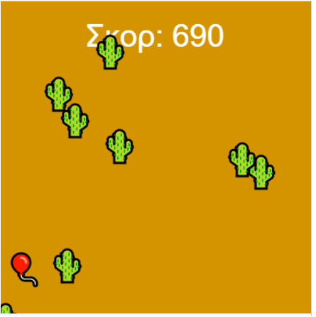

## Επιτάχυνε!

Τα περισσότερα παιχνίδια ατελείωτων δρομέων αυξάνουν τη δυσκολία του παιχνιδιού όσο προοδεύει ο παίκτης και του δίνουν βαθμολογία.

{:width="300px"}

### Πρόσθεσε επίπεδα δυσκολίας

Η δημιουργία ξεκάθαρων επιπέδων δυσκολίας θα διευκολύνει τον παίκτη σου να καταλάβει τι συμβαίνει.

--- task ---

Δημιούργησε μια `global` μεταβλητή `level` για να παρακολουθείς το επίπεδο στο οποίο βρίσκεται αυτήν τη στιγμή ο παίκτης. Όρισε ως αρχική τιμή το `1`, ώστε οι παίκτες να ξεκινούν ένα νέο παιχνίδι στο πρώτο επίπεδο.

--- code ---
---
language: python 
filename: main.py
line_numbers: false
---

#Δήλωση των καθολικών μεταβλητών εδώ
level = 1

--- /code ---

--- /task ---

--- task ---

Αυτός ο κώδικας χρησιμοποιεί το `height` και το `frame_count` για να αυξάνει τη μεταβλητή `level` κάθε φορά που ο παίκτης τελειώνει μια οθόνη και, στη συνέχεια, εμφανίζει το νέο επίπεδο για τον παίκτη.

**Επίλεξε:** Αυτός ο κώδικας περιορίζει τα επίπεδα σε πέντε, ώστε να μην είναι πολύ δύσκολο να παίξεις. Δεν υπάρχει κανένας λόγος το παιχνίδι σου να χρησιμοποιεί οπωσδήποτε πέντε, αλλά θα πρέπει να επιλέξεις ένα όριο. Οι άνθρωποι μπορούν να κινηθούν γρήγορα μόνο μέχρι ένα όριο!

--- code ---
---
language: python 
filename: main.py — draw_obstacles()
line_numbers: false
---

def draw_obstacles():

  global level #Χρησιμοποίησε την καθολική μεταβλητή level

  if frame_count % height == height - 1 and level < 5: 
    level += 1 
    print('Έφτασες στο επίπεδο', level)

--- /code ---

--- /task ---

--- task ---

Οι δύο βασικές σου επιλογές για να αυξήσεις τη δυσκολία είναι να κάνεις το παιχνίδι να κινείται πιο γρήγορα και να αυξήσεις τον αριθμό των εμποδίων.

--- collapse ---
---
title: Επιτάχυνε το παιχνίδι σου
---

Η ταχύτητα του παιχνιδιού ελέγχεται από το πόσο γρήγορα φαίνονται να κινούνται τα εμπόδια προς τον παίκτη. Αυτός ο κώδικας το επιταχύνει προσθέτοντας `frame_count * level` στη συντεταγμένη `y` κατά τη δημιουργία εμποδίου.

Αντί να μετακινείς τα εμπόδιά σου κατά ένα εικονοστοιχείο σε κάθε καρέ, αυτός ο κώδικας ουσιαστικά τα μετακινεί κατά `level` εικονοστοιχεία.

Κοιτάζοντας τον κώδικα, μπορεί να περίμενες ότι η ταχύτητα θα αυξηθεί κατά περισσότερα από `level` εικονοστοιχεία. Για παράδειγμα, στο σημείο λίγο πριν αυξηθεί το `level` το `frame_count` είναι `799` — καθώς το `level` αυξάνεται ένα καρέ πριν το `frame_count` είναι άρτιο πολλαπλάσιο του `height` (ορίζεται σε `400` εικονοστοιχεία) — και το `799 * 3` είναι σημαντικά μεγαλύτερο από `799 * 2`. Ωστόσο, τα επιπλέον εικονοστοιχεία που δημιουργούνται πολλαπλασιάζοντας το σύνολο του `frame_count` με έναν μεγαλύτερο αριθμό κρύβονται από την πράξη `ob_y %= height`. Αυτό αφήνει μόνο τα επιπλέον `level` εικονοστοιχεία σε κάθε βήμα.

--- code ---
---
language: python 
filename: main.py — draw_obstacles()
line_numbers: false
---

  for i in range(6): 
    ob_x = randint(0, height) 
    ob_y = randint(0, height) + (frame_count * level) 
    ob_y %= height #Επανεμφάνιση στην αντίθετη πλευρά 
    text('🌵', ob_x, ob_y)

--- /code ---

--- /collapse ---

--- collapse ---
---
title: Πρόσθεσε περισσότερα εμπόδια
---

Η προσθήκη επιπλέον εμποδίων είναι απλώς θέμα αύξησης του αριθμού των φορών που τρέχει ο βρόχος `if` που τα δημιουργεί. Μπορείς να το κάνεις αυτό αυξάνοντας τον αριθμό που περνάς στη συνάρτηση `range()` κατά `level`.

**Συμβουλή:**Φυσικά, μπορείς πάντα να χρησιμοποιήσεις `level* 2`, ή ακόμα μεγαλύτερα πολλαπλάσια, εάν θέλεις να κάνεις το παιχνίδι σου πιο δύσκολο.

--- /collapse ---

--- /task ---

### Κράτα το σκορ

Όσο περισσότερο αντέξει ένας παίκτης χωρίς να συγκρουστεί με κάποιο εμπόδιο, τόσο καλύτερα παίζει το παιχνίδι σου. Η προσθήκη μιας βαθμολογίας θα του επιτρέψει να δει πόσο καλά τα πάει.

--- task ---

Δημιούργησε μια καθολική μεταβλητή `score` για να παρακολουθείς το σκορ του παίκτη. Όρισε μια αρχική τιμή στο `0`, ώστε οι παίκτες να ξεκινούν ένα νέο παιχνίδι χωρίς πόντους.

--- code ---
---
language: python 
filename: main.py
line_numbers: false
---

#Δήλωση των καθολικών μεταβλητών εδώ
score = 0

--- /code ---

--- /task ---

--- task ---

Μπορείς να αυξήσεις το σκορ του παίκτη σου για κάθε καρέ στο οποίο δεν έχει συγκρουσθεί με εμπόδιο αυξάνοντας το σκορ του όταν ελέγχεις για σύγκρουση στο `draw_player()`.

**Επίλεξε:** Μπορείς να αποφασίσεις πόσους πόντους αξίζει κάθε καρέ, αλλά η αύξηση της βαθμολογίας του παίκτη κατά `level` ανταμείβει τους παίκτες που μπορούν να επιβιώσουν σε υψηλότερα επίπεδα δυσκολίας.

--- code ---
---
language: python
filename: main.py — draw_player()
---

global score

  if collide == safe: 
    text('🎈', mouse_x, player_y) 
    score += level 
  else: 
    text('💥', mouse_x, player_y)

--- /code ---

--- /task ---

--- task ---

Οι παίκτες θα πρέπει να μπορούν να δουν το σκορ τους. Επειδή αυξάνεται τόσο γρήγορα, η χρήση της εντολής `print()` δεν θα λειτουργούσε πολύ καλά. Χρησιμοποίησε τη συνάρτηση p5 `text()` μέσα στη συνάρτηση `draw()`, για να την εμφανίσεις ως κείμενο στην οθόνη του παιχνιδιού.

[[[processing-python-text]]]

Μπορείς να χρησιμοποιήσεις τον τελεστή `+` για να συνδυάσεις δύο ή περισσότερες συμβολοσειρές, εάν θέλεις να δώσεις μια επικεφαλίδα όπως 'σκορ' ή 'πόντοι'. Επειδή το `score` είναι ένας αριθμός, θα πρέπει να το μετατρέψεις σε συμβολοσειρά για να μπορέσεις να το ενώσεις με άλλη συμβολοσειρά. Μπορείς να το κάνεις αυτό με τη συνάρτηση `str()`:

`message = 'Σκορ: ' + str(score)`

**Συμβουλή:** το `str()` είναι συντομογραφία του «string» — οι προγραμματιστές συχνά αφαιρούν γράμματα όπως αυτό, έτσι μειώνουν την πληκτρολόγηση!

--- /task ---

### Τέλος παιχνιδιού!

Όταν ένας παίκτης έχει συγκρουστεί με ένα εμπόδιο, το παιχνίδι πρέπει να σταματήσει να κινείται και το σκορ του να σταματήσει να αυξάνεται.

--- task ---

Μπορείς να χρησιμοποιήσεις τη μεταβλητή `level` για να σηματοδοτήσεις το 'Τέλος παιχνιδιού' ορίζοντας την στο 0 — μια τιμή που δεν θα φτάσει ποτέ με άλλο τρόπο. Κάντο αυτό στην περίπτωση `else` του κώδικα ανίχνευσης σύγκρουσης.

--- /task ---

--- task ---

Δημιούργησε μια εντολή `if` στη σνάρτηση `draw()` που να ελέγχει εάν το `level > 0` πριν καλέσεις κάποια από τις συναρτήσεις — όπως `background()`, `draw_obstacles()` και `draw_player()` — που ενημερώνουν το παιχνίδι. Επειδή αυτές οι συναρτήσεις δεν καλούνται, ολόκληρο το παιχνίδι φαίνεται να τελειώνει, παρόλο που το πρόγραμμά σου εξακολουθεί να εκτελείται.

--- /task ---

--- task ---

**Εντοπισμός σφαλμάτων:** Ενδέχεται να βρεις κάποια σφάλματα στο έργο σου που πρέπει να διορθώσεις. Εδώ είναι μερικά κοινά σφάλματα.

--- collapse ---
---
title: Το σκορ δεν εμφανίζεται
---

Βεβαιώσου ότι έχεις συμπεριλάβει τη συνάρτηση `text()` που σχεδιάζει το σκορ του παίκτη στο κατάλληλο σημείο στη συνάρτηση `draw()` και ότι της έχεις δώσει τις σωστές τιμές:

`text('Κείμενο προς εμφάνιση', x, y)`

Θα πρέπει να μοιάζει κάπως έτσι:

--- code ---
---
language: python
filename: main.py — draw()
---

  if level > 0: 
    background(safe) 
    fill(255) 
    text('Σκορ: ' + str(score), width/2, 20) 
    draw_obstacles() 
    draw_player()

--- /code ---

--- /collapse ---

--- collapse ---
---
title: Το παιχνίδι δεν σταματά μετά από σύγκρουση
---

Εάν πιστεύεις ότι το παιχνίδι σου μπορεί να μην εντοπίζει καθόλου σωστά τις συγκρούσεις, δοκίμασε πρώτα τις οδηγίες εντοπισμού σφαλμάτων στο προηγούμενο βήμα, στην ενότητα "Δεν υπάρχει σύγκρουση όταν ο παίκτης φτάσει σε ένα εμπόδιο".

Εάν το παιχνίδι σου εντοπίζει σωστά συγκρούσεις, τότε βεβαιώσου ότι έχεις βάλει τις εσοχές σωστά στον κώδικα που σχεδιάζει το παιχνίδι σου μέσα στην εντολή `if level > 0`, για να βεβαιωθείς ότι εκτελείται μόνο εάν αυτή η συνθήκη είναι αληθής. Για παράδειγμα:

--- code ---
---
language: python
filename: main.py — draw()
---

  if level > 0: 
    background(safe) 
    fill(255) 
    text('Σκορ: ' + str(score), width/2, 20) 
    draw_obstacles() 
    draw_player()

--- /code ---

Τέλος, εάν και τα δύο λειτουργούν σωστά, το παιχνίδι σου μπορεί να μην έχει ορίσει σωστά το `level = 0` όταν συμβαίνει μια σύγκρουση. Για παράδειγμα:

--- code ---
---
language: python
filename: main.py — draw_player()
---

  if collide == safe: 
    text('🎈', mouse_x, player_y) 
    score += level 
  else: 
    text('💥', mouse_x, player_y) 
    level = 0

--- /code ---

--- /collapse ---

--- collapse ---
---
title: Το παιχνίδι δεν γίνεται πιο γρήγορο
---

Πρώτα, έλεγξε ότι το `level` αυξάνεται σωστά. Θα πρέπει να βλέπεις ένα μήνυμα να εμφανίζεται κάθε φορά που αυξάνεται. Εάν αυτό δεν συμβαίνει, έλεγξε και τον κώδικα για την εμφάνιση του μηνύματος και τον κώδικα για την αύξηση του επιπέδου.

Εάν το επίπεδο αυξάνεται σωστά, έλεγξε τη συνάρτηση `draw_obstacles()`. Ειδικότερα, έλεγξε ότι έχεις `ob_y = randint(0, height) + (frame_count * level)`. Θα πρέπει να μοιάζει κάπως έτσι:

--- code ---
---
language: python 
filename: main.py — draw_obstacles()
line_numbers: false
---

  for i in range(6 + level): 
    ob_x = randint(0, height) 
    ob_y = randint(0, height) + (frame_count * level) 
    ob_y %= height #Επανεμφάνιση στην αντίθετη πλευρά 
    text('🌵', ob_x, ob_y)

--- /code ---

--- /collapse ---

--- collapse ---
---
title: Δεν εμφανίζονται νέα εμπόδια
---

Υπάρχουν μερικοί λόγοι που μπορεί να συμβαίνει αυτό. Και υπάρχουν μερικοί ακόμη λόγοι για τους οποίους μπορεί να φαίνεται ότι συμβαίνει, ενώ δεν συμβαίνει. Πρώτον, επειδή προστίθενται νέα εμπόδια με βάση το `επίπεδο`, έλεγξε ότι το `level` αυξάνεται σωστά. Θα πρέπει να βλέπεις ένα μήνυμα να εμφανίζεται κάθε φορά που αυξάνεται. Εάν αυτό δεν συμβαίνει, έλεγξε και τον κώδικα για την εμφάνιση του μηνύματος και τον κώδικα για την αύξηση του επιπέδου.

Εάν το επίπεδο αυξάνεται σωστά, έλεγξε τη συνάρτηση `draw_obstacles()` για να βεβαιωθείς ότι έχεις χρησιμοποιήσει το `level` στη συνάρτηση `range()` του βρόχου `for` που σχεδιάζει τα εμπόδια. Θα πρέπει να μοιάζει κάπως έτσι:

--- code ---
---
language: python 
filename: main.py — draw_obstacles()
line_numbers: false
---

  for i in range(6 + level): 
    ob_x = randint(0, height) 
    ob_y = randint(0, height) + (frame_count * level) 
    ob_y %= height #Επανεμφάνιση στην αντίθετη πλευρά 
    text('🌵', ob_x, ob_y)

--- /code ---

Εάν έχεις κάνει όλους αυτούς τους ελέγχους και εξακολουθεί να μην φαίνεται ότι ο αριθμός των εμποδίων αυξάνεται, είναι πιθανό να αυξάνονται αλλά εσύ να μην τα βλέπεις. Θα πρέπει να δοκιμάσεις μερικά από αυτά τα βήματα για να το ελέγξεις:
  - Επιβράδυνε το παιχνίδι χρησιμοποιώντας `frame_rate()` στη συνάρτηση `setup()` για να σου δώσει περισσότερο χρόνο για να μετρήσεις
  - Άλλαξε το seed που χρησιμοποιείς για τους τυχαίους αριθμούς σου. Είναι απίθανο, αλλά είναι πιθανό κάποια εμπόδια να εμφανίζονται τυχαία το ένα πάνω στο άλλο
  - Πρόσθεσε ένα `print()` στον βρόχο `for` στη συνάρτηση `draw_obstacles()` που εμφανίζει την τιμή `i` σε κάθε πέρασμα του βρόχου, ώστε να μπορείς να επαληθεύσεις ότι εκτελείται όσες φορές θα έπρεπε
  - Μόνο για λόγους δοκιμής, άλλαξε το `range(6 + level)` σε `range(6 * level)` — αυτή η αύξηση θα κάνει τον εντοπισμό ευκολότερο!

--- /collapse ---

--- /task ---

--- save ---
