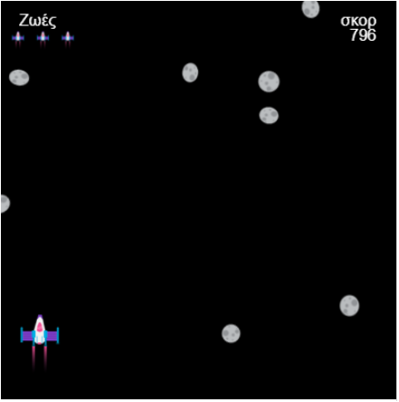

## Αναβάθμισε το έργο σου

Εάν έχεις χρόνο, μπορείς να αναβαθμίσεις το έργο σου.

{:width="300px"}

Εδώ είναι μερικές ιδέες που μπορείς να δοκιμάσεις:

### Συμπερίλαβε μια ποικιλία εμποδίων
Μπορείς να προσθέσεις ποικιλία στα εμπόδια σου με μερικούς τρόπους:
 - Επίλεξε τυχαία ανάμεσα σε διάφορες εικόνες, emoji ή σε συναρτήσεις σχεδίασης εμποδίων
 - Προσάρμοσε τυχαία το χρώμα, το σχήμα ή το μέγεθος των εμποδίων αλλάζοντας τις παραμέτρους που τα σχεδιάζουν
 - Δημιούργησε κίνηση στο εμπόδιο προσθέτοντας περιστροφή, αλλαγή χρώματος ή κάποια άλλη οπτική διαφορά που θα ελέγχεται από το `frame_count`

### Πρόσθεσε μια συνθήκη νίκης
Μπορείς να κάνεις τους παίκτες να κερδίσουν το παιχνίδι με μερικούς τρόπους:
 - Επίτευξη νικηφόρου σκορ
 - Φτάνοντας σε ένα συγκεκριμένο επίπεδο του παιχνιδιού

Μόλις κερδίσουν, θα πρέπει να τους το πεις με κάποιο τρόπο — ίσως χρησιμοποιώντας `print()` ή `text()` και μετά να σταματήσεις το παιχνίδι.

### Δώσε στους παίκτες περισσότερες από μία ζωές
Πρόσθεσε ζωές στο παιχνίδι σου, για να επιτρέψεις στους παίκτες να επιβιώσουν σε μερικές συγκρούσεις. Αυτό είναι λίγο πιο δύσκολο από το να κάνεις `lives =- 1` κάθε φορά που συγκρούονται με κάτι:
 - Ο παίκτης μπορεί να περάσει πολλά καρέ σε επαφή με ένα αντικείμενο, και έτσι να χάσει περισσότερες από μία ζωές σε μία μόνο σύγκρουση — αυτό φρόντισε να μην συμβεί
 - Θα χρειαστείς επίσης έναν τρόπο για να γνωρίζουν οι παίκτες πόσες ζωές τους έχουν απομείνει και ίσως κάποιο είδος προειδοποίησης που θα τους λέει πότε βρίσκονται στην τελευταία τους ζωή
 - Θα μπορούσες να προσθέσεις ένα αντικείμενο που, όταν ο παίκτης συγκρούεται με αυτό, του δίνει μια επιπλέον ζωή. Θυμήσου ότι θα χρειαστεί να τροποποιήσεις τον κανονικό κώδικα σύγκρουσης, ώστε να μην αφαιρεί μια ζωή ταυτόχρονα!

Κάθε παράδειγμα έργου στην [Εισαγωγή](./) έχει έναν σύνδεσμο **Δες μέσα** για να ανοίξεις το έργο και να δεις τον κώδικα για να πάρεις ιδέες και να δεις πώς λειτουργούν. Το παρακάτω έργο "Απόφυγε τους αστεροειδείς" έχει όλα αυτά τα χαρακτηριστικά:

  

**Απόφυγε τους αστεροειδείς**: [Δες μέσα](https://trinket.io/python/2d4806ebf5){:target="_blank"}

<iframe src="https://trinket.io/embed/python/2d4806ebf5?outputOnly=true" width="100%" height="600" frameborder="0" marginwidth="0" marginheight="0" allowfullscreen></iframe>

Ρίξε μια ματιά σε μερικά έργα Don't collide που δημιουργήθηκαν από μέλη της κοινότητας στο [Don't collide - Community Library](https://wke.lt/w/s/KobNfx){:target="_blank"} του Raspberry Pi Foundation.

--- save ---
