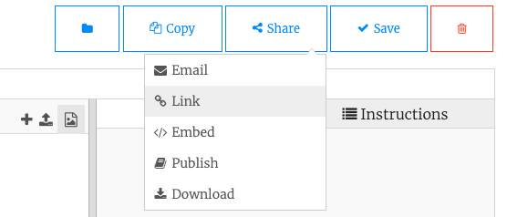

## Μοιράσου

Εάν είσαι σε μια λέσχη, γιατί να μην μοιραστείς το έργο σου με φίλους;

Θα μπορούσες επίσης να δείξεις στην οικογένειά σου πώς λειτουργεί το έργο σου, στέλνοντάς τους ένα σύνδεσμο.

Για να λάβεις έναν σύνδεσμο, πήγαινε στο κουμπί του μενού **Share** στην επάνω δεξιά γωνία της σελίδας επεξεργασίας του Trinket και επίλεξε **Link**.

**Συμβουλή:** Μπορείτε να μοιραστείς ένα σύνδεσμο προς το έργο σου ακόμα κι αν δεν έχεις λογαριασμό Trinket. Ωστόσο, χωρίς λογαριασμό, ο σύνδεσμος προς το έργο σου θα αλλάζει κάθε φορά που θα το ενημερώνεις. Εάν έχεις μοιραστεί τον σύνδεσμο με κάποιον, θα πρέπει να του στείλεις ένα νέο σύνδεσμο για να δει τις αλλαγές.

--- task ---

Δώσε έμπνευση στην κοινότητα του Raspberry Pi Foundation με το έργο σου!

Για να υποβάλεις το έργο σου στο δικό μας studio ['Don't Collide - Community'](https://wke.lt/w/s/KobNfx){:target="_ blank"} για να το δουν κι άλλα άτομα, συμπλήρωσε [αυτήν τη φόρμα](https://form.raspberrypi.org/f/community-project-submissions){:target="_ blank"}.

--- /task ---
