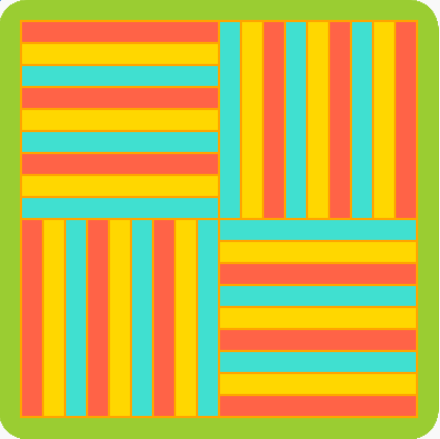

## Και τώρα;

Εάν ακολουθείς το μονοπάτι [Εισαγωγή στην Python](https://projects.raspberrypi.org/en/pathways/python-intro), μπορείς να προχωρήσεις στο έργο [Ισχυρά μοτίβα](https://projects.raspberrypi.org/en/projects/powerful-patterns). Σε αυτό το έργο, θα δημιουργήσεις εμπνευσμένη τέχνη που μπορεί να κλιμακωθεί χρησιμοποιώντας επαναλαμβανόμενα μοτίβα.

--- print-only ---

--- /print-only ---

--- no-print --- <iframe src="https://trinket.io/embed/python/81be7eb895?outputOnly=true&start=result" width="600" height="500" frameborder="0" marginwidth="0" marginheight="0" allowfullscreen mark="crwd-mark"> </iframe>

--- /no-print ---

Αν θέλεις να διασκεδάσεις περισσότερο εξερευνώντας την Python, τότε μπορείς να δοκιμάσεις οποιοδήποτε από [αυτά τα έργα](https://projects.raspberrypi.org/en/projects?software%5B%5D=python).

