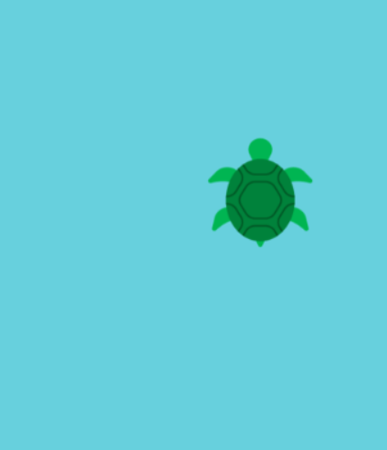
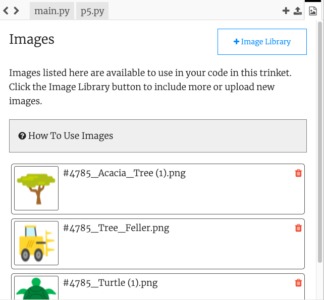

## Set the theme

Set the theme of your game and create a player character that follows the mouse pointer.

{:width="300px"}

What is the theme of your game? You could choose anything you want. Here are some ideas:
- a sport, or hobby
- a movie, show or game
- science, or nature
- anything else!

--- task ---

Open the [starter project](https://trinket.io/python/cda05e5911){:target="_blank"}. Trinket will open in another browser tab.

--- /task ---

--- task ---

**Choose:** Set the size of your canvas.

--- collapse ---

---
title: Setting the screen size when your program starts
---

--- code ---
---
language: python
filename: main.py - setup()
line_numbers: true
line_number_start: 6
line_highlights: 7
---
def setup():
    size(400, 400)

--- /code ---

--- /collapse ---

--- /task ---

--- task ---

Create a variable called `safe` to store the background colour based on the theme you want for your game. 

This is the colour that it is safe for the player to be on and you will use this variable again later.

[[[generic-theory-simple-colours]]]

--- code ---
---
language: python
filename: main.py - draw()
line_numbers: true
line_number_start: 9
line_highlights: 9-10
---
    safe = color(200, 100, 0) # Update to the colour of your theme
    background(safe)  

--- /code ---

--- /task ---

--- task ---

**Test:** Run your code to see the background colour. Change it until you are happy with the colour and the size of the screen.

--- /task ---

Now choose the character that is playing the game and avoiding the obstacles. Is it an object, person, animal, or something else?

The player will appear at a fixed y position and same x position as the mouse pointer which is stored in the p5 variable `mouse_x`. 

--- task ---
It's a good idea to organise the code for drawing the player character into a function.

Define a `draw_player()` function and create a `player_y` position for the fixed y position of the player: 

--- code ---
---
language: python
filename: main.py - draw_player()
---
def draw_player():
  player_y = int(height * 0.8) # towards the bottom of the screen

--- /code ---

And add the code to the end of `draw()` to call `draw_player()` each frame.

--- code ---
---
language: python
filename: main.py - draw()
---
    draw_player()
    
--- /code ---

--- /task ---

Next you will add code to the `draw_player()` function to draw your shape. You may also need to add `setup()` code.

--- task ---

**Choose:** What does your player look like? Your player could be:
+ An image provided in the starter project
+ An image you upload 
+ An emoji or text
+ Drawn using a series of shapes 

--- collapse ---

---
title: View the starter images
---

Click on the 'manage images' icon. 

Images included in the starter project will be shown in the **Image Library** list. 

Make a note of the name of the image you want to use.

+ load the image into the `setup()` function 

--- code ---
---
language: python
filename: main.py - setup()

---

player = load_image('skiing.png') # Load your image

--- /code ---

+ call the `image()` in the `draw_player()` function

--- code ---
---
language: python
filename: main.py - draw_player()

---

def draw_player():
  
  global player

  image(player, mouse_x, player_y, 30, 30)

--- /code ---

--- /collapse ---

[[[processing-add-image]]]

--- collapse ---

---
title: Use emoji characters
---

You can use emoji characters in the p5 `text()` function to use an emoji to represent your player. 

Here's an example:

--- code ---
---
language: python
filename: main.py - setup()
---
def setup():
  text_size(40) # controls the size of the emoji 
  text_align(CENTER, TOP) # position around the centre
--- /code ---

--- code ---
---
language: python
filename: main.py - draw_player()
---
def draw_player():
  player_y = int(height * 0.8)
  text('🎈', mouse_x, player_y)
--- /code ---

--- /collapse ---

<mark>Create and add an ingredient on the text function and its setup functions</mark>

--- collapse ---

---
title: Draw a player using shapes
---

--- code ---
---
language: python
filename: main.py - draw_player()

---

def draw_player():
  player_y = int(height * 0.8)
  noStroke()
  # Face
  fill(0, 200, 100)
  ellipse(mouse_x, player_y, 60, 60)
  
  # Eyes
  fill(0, 100, 200)
  ellipse(mouse_x-10, player_y-10, 20, 20)
  ellipse(mouse_x+10, player_y-10, 20, 20)
  fill(0)
  ellipse(mouse_x-10, player_y-10, 10, 10)
  ellipse(mouse_x+10, player_y-10, 10, 10)
  fill(255)
  ellipse(mouse_x-12, player_y-12, 5, 5)
  ellipse(mouse_x+12, player_y-12, 5, 5)

--- /code ---

--- /collapse ---

--- /task ---

--- task ---

**Test:** Run your code and move the mouse to control the player. 

--- /task ---

--- save ---