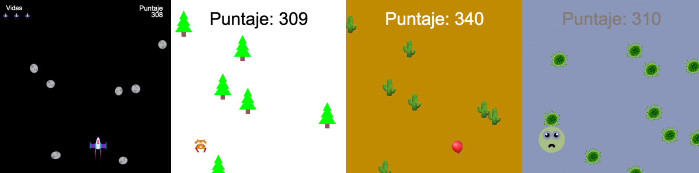
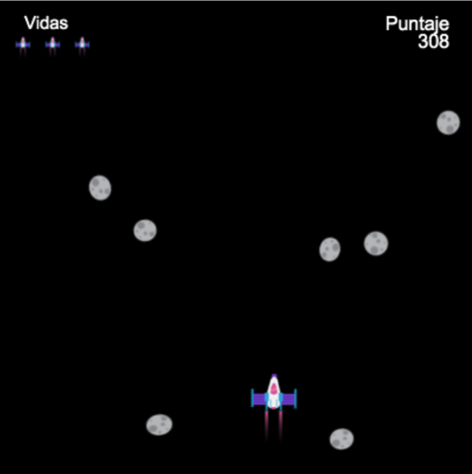
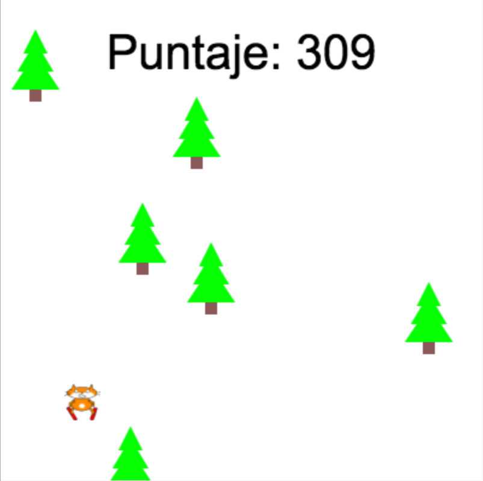
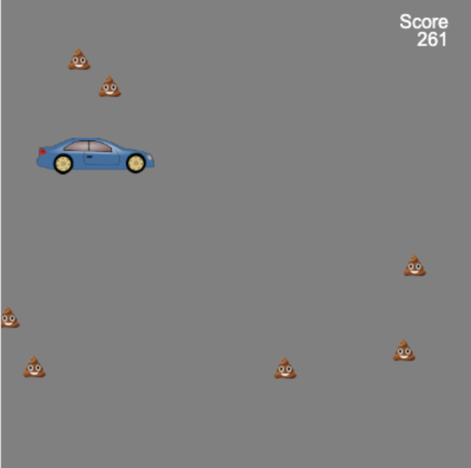

## Lo que harás

Construye un juego de desplazamiento tipo endless runner (corredor infinito) donde tu personaje tiene que evitar obstáculos.

 
Los **Endless runners** son un tipo de juego en el que tienes que evitar obstáculos y el juego solo termina cuando chocas contra un obstáculo. Ganas más puntos cuanto más tiempo te mantengas con vida.

Vas a:
+ Usar **condiciones** en el juego para controlar lo que sucede
+ Aprender sobre procedural generation (Generación por procedimientos) y collision detection (Detección de colisiones)
+ Personalizar un juego según tus intereses

### Obtén ideas 💭

Vas a tener que tomar algunas decisiones de diseño sobre el tipo de juego que quieres crear y sobre cómo vas a usar código para obtener los efectos que deseas.

--- no-print ---

--- task ---

Mira los ejemplos a continuación. Piensa en cómo se han creado los personajes y los obstáculos.

¿Qué pasa si chocas contra un obstáculo? ¿Se pone más difícil a medida que juegas?

  

**Gato esquiador**: [Ver dentro](https://trinket.io/python/76e628bff2){:target="_blank"}

<iframe src="https://trinket.io/embed/python/76e628bff2?outputOnly=true" width="100%" height="600" frameborder="0" marginwidth="0" marginheight="0" allowfullscreen></iframe>

**No estalles**: [Ver dentro](https://trinket.io/python/974800f4ef){:target="_blank"}

<iframe src="https://trinket.io/embed/python/974800f4ef?outputOnly=true" width="100%" height="600" frameborder="0" marginwidth="0" marginheight="0" allowfullscreen></iframe>

**Evita los gérmenes**: [Ver dentro](https://trinket.io/python/88e108c819){:target="_blank"}

<iframe src="https://trinket.io/embed/python/88e108c819?outputOnly=true" width="100%" height="600" frameborder="0" marginwidth="0" marginheight="0" allowfullscreen></iframe>

**Auto limpio**: [Ver dentro](https://trinket.io/python/70da6c454d){:target="_blank"}

<iframe src="https://trinket.io/embed/python/70da6c454d?outputOnly=true" width="100%" height="600" frameborder="0" marginwidth="0" marginheight="0" allowfullscreen></iframe>

**Esquiva asteroides**: [Ver dentro](https://trinket.io/python/d156014e67){:target="_blank"}

<iframe src="https://trinket.io/embed/python/d156014e67?outputOnly=true" width="100%" height="600" frameborder="0" marginwidth="0" marginheight="0" allowfullscreen></iframe>

--- /task ---

--- /no-print ---

--- print-only ---

Vas a tener que tomar algunas decisiones de diseño sobre el tipo de juego que quieres crear y sobre cómo vas a usar código para obtener los efectos que deseas.

{:width="300px"}
{:width="300px"}
{:width="300px"}
{:width="300px"}
{:width="300px"}

--- /print-only ---
