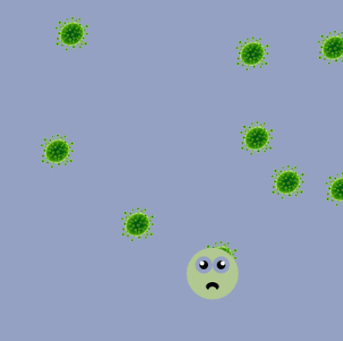

## Detección de colisiones

<div style="display: flex; flex-wrap: wrap">
<div style="flex-basis: 200px; flex-grow: 1; margin-right: 15px;">
Los juegos tipo endless runner a menudo terminan cuando el jugador choca contra un obstáculo.
</div>
<div>

{:width="300px"}

</div>
</div>

Ahora puedes configurar tu jugador para que reaccione ante la colisión contra un obstáculo.

<p style="border-left: solid; border-width:10px; border-color: #0faeb0; background-color: aliceblue; padding: 10px;">
<span style="color: #0faeb0">**Collision detection**</span> (Detección de colisiones) es determinante cuando dos objetos son creados dentro de una simulación por computadora se tocan; ya sea en un juego, una animación, o algo más. Hay varias maneras de hacer esto, por ejemplo: 
  - verificar si los colores que aparecen en la ubicación de un objeto son los colores de ese objeto, o uno diferente
  - hacer un seguimiento de la forma de cada objeto y verificar si  las formas se superponen
  - crear un conjunto de puntos límite, o líneas, alrededor de un objeto y verificar si entran en contacto con otros objetos 'colisionables'
Cuando se detecta una colisión de este tipo, el programa puede reaccionar de alguna manera. En un videojuego, esto suele ser para causar daño (si el jugador choca con un enemigo o peligro) o para dar un beneficio (si el jugador choca con un potenciador).
</p>

--- task ---

En tu función `dibujar_jugador()`, crea una variable llamada `colision` y configúrala para obtener el color en la posición del jugador.

--- code ---
---
language: python
filename: main.py - draw_player()
---

colision = get(mouse_x, jugador_y)

--- /code ---

--- /task ---

--- task ---

Crea una condición para verificar `if` (si) la variable `colision` es la misma que la variable `a_salvo`; si lo es, entonces tu jugador está tocando el fondo de manera segura y no ha chocado contra ningún obstáculo.

Mueve tu código para dibujar a tu jugador dentro de tu condicion `if colision == a_salvo` y agrega código en la sentencia `else` para que el jugador reaccione a la colisión.

**Elige:** ¿Cómo debería reaccionar tu jugador? Tú podrías:
+ Cambiar la imagen a una versión `estrellado` (Cuando ya chocó)
+ Usar un emoji diferente para el jugador
+ Usar `tint()` para cambiar la apariencia de una imagen, pero no olvides llamar a `no_tint()` después de dibujar la imagen

--- collapse ---
---
title: Cambia la imagen
---

Puedes usar una imagen diferente para representar a tu jugador cuando choca con un obstáculo.

Aquí tienes un ejemplo:

--- code ---
---
language: python
filename: main.py - draw_player()
---

def dibujar_jugador(): jugador_y = int(height * 0.8)

  colision = get(mouse_x, jugador_y)

  if colision == a_salvo: #En el fondo image(esquiador, mouse_x, jugador_y, 30, 30) else: #Colision image(estrellado, mouse_x, jugador_y, 30, 30)

--- /code ---

--- /collapse ---

--- collapse ---
---
title: Usa emojis
---

Puedes usar emojis en la función `text()` de la biblioteca p5 para representar a tu personaje cuando ya ha chocado.

Aquí tienes un ejemplo:

--- code ---
---
language: python
filename: main.py - setup()
---

def setup(): size(400, 400) text_size(40) #Controla el tamaño del emoji text_align(CENTER, TOP) #Ubicado alrededor del centro

--- /code ---

--- code ---
---
language: python
filename: main.py - draw_obstacles()
---

def dibujar_jugador(): if colision == a_salvo: #En el fondo text('🎈', mouse_x, jugador_y) else: #Estrellado text('💥', mouse_x, jugador_y)

--- /code ---

--- /collapse ---

[[[processing-tint]]]

[[[generic-theory-simple-colours]]]

--- /task ---

--- task ---

**Prueba:** Comprueba si se detecta una colisión y la reacción tiene lugar cada vez que se produce una colisión.

--- /task ---

--- task ---

**Depuración:** Es posible que encuentres algunos errores en tu proyecto que tendrás que corregir. Aquí hay algunos errores comunes.

--- collapse ---
---
title: No hay colisión cuando el jugador alcanza un obstáculo
---

Si el personaje de tu jugador toca un obstáculo y no pasa nada, hay algunas cosas que debes verificar:

 - Asegúrate de que llamaste tu función `dibujar_obstaculos()` antes de `dibujar_jugador()`. Si verificas las colisiones antes de dibujar los obstáculos en un cuadro (frame), ¡entonces no habrá obstáculos con los que chocar!
 - Asegúrate de estar usando exactamente el mismo color cuando dibujes el objeto y en la sentencia `if` cuando estés verificando la colisión. Puedes asegurarte de esto usando la misma variable `global` en ambos lugares.
 - ¿Estás dibujando el personaje del jugador antes de verificar el color en las coordenadas del ratón (mouse)? Si es así, solo obtendrás los colores del jugador. Primero deberías verificar el color y **después** dibujar al jugador.
 - ¿Tienes código en la parte `else` que haga que pase algo diferente si se detecta un choque, como aplicar tint (tinte) o cambiar de imagen?
 - ¿Has indentado (dado sangría) correctamente tu código para tu sentencia `if` para que se ejecute cuando se cumpla la condición?

Puede ser útil imprimir ('print') el color del píxel cuando estás verificando una colisión:

```python
  print(red(colision), green(colision), blue(colision))
```

También puedes imprimir ('print') un círculo alrededor del punto que estás verificando y ajustar el punto si lo necesitas:

```python
  no_fill()
  ellipse(mouse_x, jugador_y, 10, 10) #Dibuja el punto de colisión
```

--- /collapse ---

--- /task ---

--- task ---

**Opcional:** Por ahora, solo estás detectando colisiones en un píxel en tu jugador. También podrías detectar colisiones en los otros píxeles al borde de tu jugador, como la parte inferior o los bordes más a la izquierda o a la derecha.

--- collapse ---
---
title: Detección de colisiones con múltiples píxeles
---

```python
def dibujar_jugador():

  jugador_y = int(height * 0.8)
  #Útil para depurar
  #Dibuja círculos alrededor de los píxeles para verificar colisiones

  no_fill()
  ellipse(mouse_x, jugador_y, 10, 10) #Dibuja punto de colisión
  ellipse(mouse_x, jugador_y + 40, 10, 10)
  ellipse(mouse_x - 12, jugador_y + 20, 10, 10)
  ellipse(mouse_x + 12, jugador_y + 20, 10, 10)

  colision = get(mouse_x, jugador_y)
  colision2 = get(mouse_x - 12, jugador_y + 20)
  colision3 = get(mouse_x + 12, jugador_y + 20)
  colision4 = get(mouse_x, jugador_y + 40)

  if mouse_x < width: #A la izquierda de la pantalla
    colision2 = a_salvo

  if mouse_x > width: #A la derecha de la pantalla
    colision3 = a_salvo

  if colision == a_salvo and colision2 == a_salvo and colision3 == a_salvo and colision4 == a_salvo:
    text('🎈', mouse_x, jugador_y)
  else:
    text('💥', mouse_x, jugador_y)
```

--- /collapse ---

Incluso podrías usar un bucle y verificar muchos píxeles diferentes. Así es como funciona la detección de colisiones en los juegos.

--- /task ---

--- save ---
