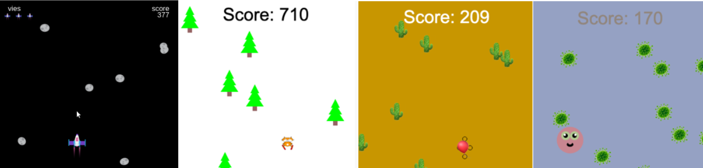
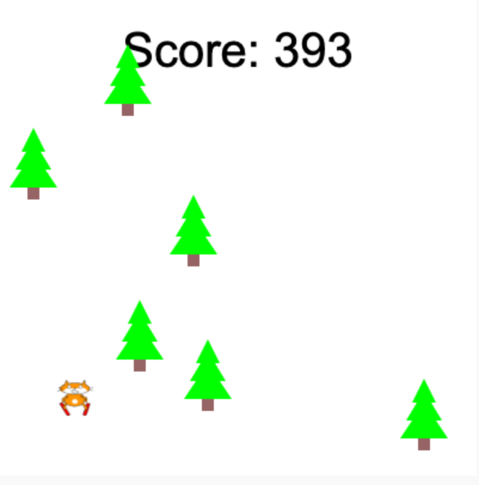
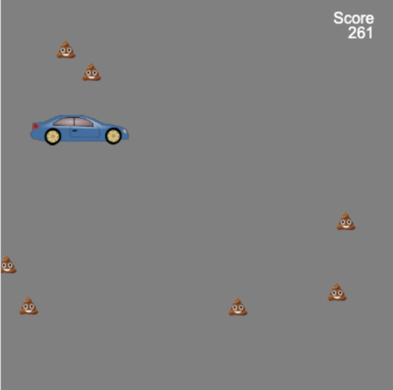

## Ce que tu vas faire

Construis un jeu de course sans fin à défilement où ton personnage doit éviter les obstacles.

 
**Coureurs sans fin** sont un type de jeu où tu dois éviter les obstacles et le jeu ne se termine que lorsque tu rencontres un obstacle. Tu marques des points en restant en vie le plus longtemps possible.

Tu vas devoir :
+ Utiliser les **conditions** de jeu pour contrôler ce qui se passe
+ En savoir plus sur la génération procédurale et la détection de collision
+ Personnaliser un jeu selon tes intérêts

### Trouve l'inspiration 💭

Tu vas prendre des décisions de conception concernant le type de jeu que tu feras et la manière dont tu utiliseras le code pour obtenir les effets souhaités.

--- no-print ---

--- task ---

Exécute ces exemples. Pense à la façon dont les joueurs et les obstacles ont été créés.

Que se passe-t-il si tu heurtes un obstacle ? Est-ce que ça devient plus difficile à mesure que tu joues ?

**Chat skieur** :
<iframe src="https://editor.raspberrypi.org/en/embed/viewer/skiing-cat-example" width="600" height="700" frameborder="0" marginwidth="0" marginheight="0" allowfullscreen>
</iframe> tu peux trouver le projet Chat skieur [ici](https://editor.raspberrypi.org/en/projects/skiing-cat-example){:target="_blank"}

**N'éclate pas** :
<iframe src="https://editor.raspberrypi.org/en/embed/viewer/dont-pop-example" width="600" height="700" frameborder="0" marginwidth="0" marginheight="0" allowfullscreen>
</iframe> tu peux trouver le projet N'éclate pas [ici](https://editor.raspberrypi.org/en/projects/dont-pop-example){:target="_blank"}

**Évite les germes** :
<iframe src="https://editor.raspberrypi.org/en/embed/viewer/avoid-germs-example" width="600" height="700" frameborder="0" marginwidth="0" marginheight="0" allowfullscreen>
</iframe> tu peux trouver le projet Évite les germes [ici](https://editor.raspberrypi.org/en/projects/avoid-germs-example){:target="_blank"}

**Voiture propre** :
<iframe src="https://editor.raspberrypi.org/en/embed/viewer/clean-car-example" width="600" height="700" frameborder="0" marginwidth="0" marginheight="0" allowfullscreen>
</iframe> tu peux trouver le projet Voiture propre [ici](https://editor.raspberrypi.org/en/projects/clean-car-example){:target="_blank"}

**Esquive les astéroïdes** :
<iframe src="https://editor.raspberrypi.org/en/embed/viewer/dodge-asteroids-example" width="600" height="700" frameborder="0" marginwidth="0" marginheight="0" allowfullscreen>
</iframe> tu peux trouver le projet Esquive les astéroïdes [ici](https://editor.raspberrypi.org/en/projects/dodge-asteroids-example){:target="_blank"}

--- /task ---

--- /no-print ---

--- print-only ---

Tu vas prendre des décisions de conception concernant le type de jeu que tu feras et la manière dont tu utiliseras le code pour obtenir les effets souhaités.

{:width="300px"}
Tu peux trouver le projet Chat skieur ici https://editor.raspberrypi.org/en/projects/repeated-patterns-example {:width="300px"}
Tu peux trouver le projet N'éclate pas ici https://editor.raspberrypi.org/en/projects/repeated-patterns-example {:width="300px"}
Tu peux trouver le projet Évite les germes ici https://editor.raspberrypi.org/en/projects/repeated-patterns-example {:width="300px"}
Tu peux trouver le projet Voiture propre ici https://editor.raspberrypi.org/en/projects/clean-car-example {:width="300px"}
Tu peux trouver le projet Esquive les astéroïdes ici https://editor.raspberrypi.org/en/projects/dodge-asteroids-example

--- /print-only ---
