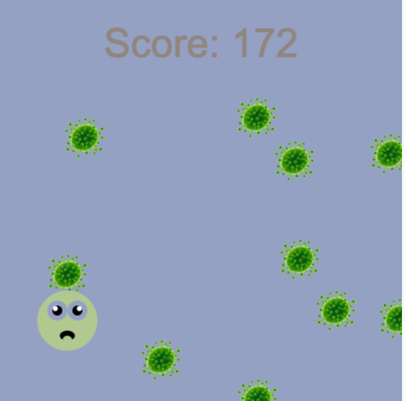

## Introduction

Construis un jeu de coureurs sans fin à défilement où ton personnage doit éviter les obstacles.

 
**Coureurs sans fin** sont un type de jeu où tu dois éviter les obstacles et le jeu ne se termine que lorsque tu rencontres un obstacle. Tu marques des points en restant en vie le plus longtemps possible.

Tu vas devoir :
+ Utiliser les **conditions** de jeu pour contrôler ce qui se passe
+ En savoir plus sur la génération procédurale et la détection de collision
+ Personnaliser un jeu selon tes intérêts

### Trouve l'inspiration

Tu vas prendre des décisions de conception concernant le type de jeu que tu feras et la manière dont tu utiliseras le code pour obtenir les effets souhaités.

--- no-print ---

--- task ---

Regarde ces exemples. Pense à la façon dont les joueurs et les obstacles ont été créés.

Que se passe-t-il si tu heurtes un obstacle ? Est-ce que ça devient plus difficile à mesure que tu joues ?

  

**Chat skieur** : [Voir à l'intérieur](https://trinket.io/python/5f10589a55){:target="_blank"}

<iframe src="https://trinket.io/embed/python/5f10589a55?outputOnly=true" width="100%" height="600" frameborder="0" marginwidth="0" marginheight="0" allowfullscreen></iframe>

**Ne pas éclater** : [Voir à l'intérieur](https://trinket.io/python/9ecc36bbb4){:target="_blank"}

<iframe src="https://trinket.io/embed/python/9ecc36bbb4?outputOnly=true" width="100%" height="600" frameborder="0" marginwidth="0" marginheight="0" allowfullscreen></iframe>

**Évite les germes** : [Voir à l'intérieur](https://trinket.io/python/cdf5e879f1){:target="_blank"}

<iframe src="https://trinket.io/embed/python/cdf5e879f1?outputOnly=true" width="100%" height="600" frameborder="0" marginwidth="0" marginheight="0" allowfullscreen></iframe>

**Voiture propre** : [Voir à l'intérieur](https://trinket.io/python/b04503d1be){:target="_blank"}

<iframe src="https://trinket.io/embed/python/b04503d1be?outputOnly=true" width="100%" height="600" frameborder="0" marginwidth="0" marginheight="0" allowfullscreen></iframe>

**Évite les astéroïdes** : [Voir à l'intérieur](https://trinket.io/python/cdc97e3201){:target="_blank"}

<iframe src="https://trinket.io/embed/python/cdc97e3201?outputOnly=true" width="100%" height="600" frameborder="0" marginwidth="0" marginheight="0" allowfullscreen></iframe>

--- /task ---

--- /no-print ---

--- print-only ---

Tu vas prendre des décisions de conception concernant le type de jeu que tu feras et la manière dont tu utiliseras le code pour obtenir les effets souhaités.

{:width="300px"}
{:width="300px"}
{:width="300px"}
{:width="300px"}
{:width="300px"}

--- /print-only ---
