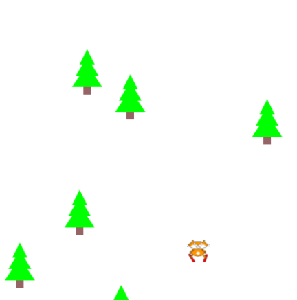

## Créer des obstacles

<div style="display: flex; flex-wrap: wrap">
<div style="flex-basis: 200px; flex-grow: 1; margin-right: 15px;">
Crée les obstacles que tu devras éviter pour continuer à jouer.
</div>
<div>

{:width="300px"}

</div>
</div>

### Commencer par un obstacle

Tu peux créer des obstacles de la même manière que tu as créé ton joueur. Comment les obstacles correspondent-ils à ton thème ?

Tu vas utiliser une boucle `for` pour faire beaucoup de copies, tu n'as donc qu'à créer ou choisir un obstacle.

--- task ---

Définis une fonction `dessine_obstacles()` :

--- code ---
---
filename: main.py - dessine_obstacles()
line_highlights: 4
---

def dessine_obstacles(): ob_x = width/2 ob_y = height/2 text('🌵', ob_x, ob_y) #Remplacer par ton obstacle

--- /code ---

Ajoute du code à `dessin()` pour appeler `dessine_obstacles()` à chaque image.

--- code ---
---
filename: main.py - draw()
line_highlights: 5
---

def dessin(): ur = color(200, 100, 0) #Ajouter la couleur de ton thème background(sur)  
dessine_obstacles() #Avant de dessiner le joueur dessine_joueur()

--- /code ---

--- /task ---

--- task ---

**Choisir :** À quoi ressemble ton obstacle ? Ton obstacle pourrait être :
+ Une image fournie dans le projet de démarrage
+ Un emoji 🌵 ou un texte
+ Un dessin utilisant une série de formes

--- collapse ---
---
title: Utiliser une image de démarrage
---

Les images incluses dans le projet de démarrage seront affichées dans la liste `Bibliothèque d'images`.


Note le nom de l'image que tu souhaites utiliser.

Charge l'image dans la fonction `setup()`.

--- code ---
---
language: python filename: main.py - setup() line_numbers: true line_number_start: 9
line_highlights: 12
---

def setup(): size(400, 400) joueur = load_image('skiing.png') #Charger ton image obstacle = load_image('rocket.png') #Charger ton image

--- /code ---

Find the line `# Keep this to run your code`. Appelle `image()` et définis-la comme global dans la fonction `dessine_obstacles()`.

--- code ---
---
language: python
filename: main.py - draw_obstacles()
---

def dessine_obstacles(): ob_x = width/2 ob_y = height/2

    image(obstacle, ob_x, ob_y, 30, 30) #Redimensionner pour s'adapter à ton thème

--- /code ---

--- /collapse ---

--- collapse ---
---
title: Utiliser les caractères emoji
---

Tu peux utiliser des caractères emoji dans la fonction p5 `text()` pour représenter tes obstacles.

Voici un exemple :

--- code ---
---
language: python
filename: main.py - setup()
---

def setup(): size(400, 400) text_size(40) #Contrôle la taille de l'emoji text_align(CENTER, TOP) #Position autour du centre

--- /code ---

Find the line `# Keep this to run your code`. Before that line, define a new `draw_obstacles()` function.

--- code ---
---
language: python
filename: main.py - draw_obstacles()
---

def dessine_obstacles(): ob_x = width/2 ob_y = height/2 text('🌵', ob_x, ob_y)

--- /code ---

--- /collapse ---

[[[processing-python-text]]]

[[[generic-theory-simple-colours]]]

[[[processing-python-ellipse]]]

[[[processing-python-rect]]]

[[[processing-python-triangle]]]

[[[processing-tint]]]

[[[processing-stroke]]]

**Astuce :** Tu peux utiliser plusieurs formes simples dans la même fonction pour créer un obstacle plus complexe.

--- collapse ---
---
title: Dessiner un obstacle à l'aide de plusieurs formes
---


--- code ---
---
language: python
filename: main.py - draw_obstacles()
---

def dessine_obstacles(): ob_x = width/2 ob_y = height/2 #Dessine un sapin no_stroke() fill(0,255,0) #vert pour les aiguilles triangle(ob_x + 20, ob_y + 20, ob_x + 10, ob_y + 40, ob_x + 30, ob_y + 40) triangle(ob_x + 20, ob_y + 30, ob_x + 5, ob_y + 55, ob_x + 35, ob_y + 55) triangle(ob_x + 20, ob_y + 40, ob_x + 0, ob_y + 70, ob_x + 40, ob_y + 70) fill(150,100,100) # brun pour le tronc rect(ob_x + 15, ob_y + 70, 10, 10)

--- /code ---

--- /collapse ---

--- /task ---

### Déplacement de l'obstacle

--- task ---

Ajoute maintenant du code pour augmenter la position `y` de l'obstacle à chaque image et fais-le s'enrouler lorsqu'il atteint le bas pour créer l'effet d'un autre obstacle.

La variable p5 `frame_count` commence à compter les images lorsque tu cliques sur exécuter.

`ob_y %= height` fixe la position `y` au reste lorsqu'elle est divisée par `height`. Avec une `height` de '400', cela transformera `401` en `1` donc lorsque les obstacles disparaissent du bas de l'écran, ils réapparaissent en haut.

--- code ---
---
language: python
filename: main.py - draw_obstacles()
---

def dessine_obstacles(): ob_x = width/2 ob_y = height/2 + frame_count #Augmente chaque image ob_y %= height #Enroule autour text('🌵', ob_x, ob_y) #Remplace par ton obstacle

--- /code ---

--- /task ---

### Beaucoup d'obstacles

Tu peux dessiner de nombreuses copies de ton obstacle à différents points de départ, mais c'est beaucoup de travail. Utilisons un raccourci.

<p style="border-left: solid; border-width:10px; border-color: #0faeb0; background-color: aliceblue; padding: 10px;"> 
<span style="color: #0faeb0">**La génération procédurale**</span> est utilisée dans la création de mondes de jeu, d'obstacles et de scènes de film pour créer un caractère aléatoire, mais avec certaines règles appliquées. Une <span style="color: #0faeb0">seed</span> signifie que tu peux générer les mêmes résultats chaque fois que vous utilisez le même seed.</p>

--- task ---

Ce code utilise une boucle `for` avec `randint()` pour choisir les positions des obstacles pour toi. Appeler d'abord la fonction random `seed()` signifie que tu obtiendras toujours les mêmes nombres aléatoires. Cela signifie que les obstacles ne sauteront pas autour de chaque image et que tu peux changer la seed jusqu'à ce que tu en obtennes une qui positionne les obstacles équitablement.

--- code ---
---
language: python
filename: main.py - draw_obstacles()
---

seed(12345678) #N'importe quel nombre convient

    for i in range(6):<br x-id="2" />
        ob_x = randint(0, height) 
        ob_y = randint(0, height) + frame_count 
        ob_y %= height 
        text('🌵', ob_x, ob_y) #Remplacer par ton obstacle

--- /code ---

Informations utiles :

[[[using-seed-in-python]]]

[[[generic-python-for-loop-repeat]]]

--- /task ---

--- collapse ---
---
title: Mise en garde contre l'épilepsie
---

Tester ton programme peut provoquer des crises chez les personnes atteintes d'épilepsie photosensible. Si tu souffres d'épilepsie photosensible ou si tu penses être susceptible de faire une crise, n'exécute pas ton programme. Au lieu de cela, tu peux :
- T'assurer d'avoir ajouté la ligne de code `seed()` pour être sûr que tes obstacles ne sautent pas
- Demander à quelqu'un de l'exécuter pour toi
- Continuer et terminer le projet, en demandant à quelqu'un d'exécuter le projet pour toi à la fin afin que tu puisses déboguer
- Slow the game down by using `frame_rate = 10` in your call to `run()` like this:

```python
run(frame_rate = 10)
```
You can alter the speed of the game by changing `10` to a higher or lower value.

--- /collapse ---

--- task ---

**Test :** Exécute ton programme et tu devrais voir plusieurs objets à l'écran, s'enroulant lorsqu'ils arrivent en bas.

Modifie ton code jusqu'à ce que tu sois satisfait des obstacles que tu rencontres. Tu peux :

+ Changer la seed pour obtenir des obstacles dans différentes positions de départ
+ Modifier le nombre de répétitions en boucle pour obtenir un nombre différent d'obstacles
+ Ajuster la taille des obstacles

**Astuce :** Assure-toi qu'il est possible d'éviter tes obstacles mais qu'il n'y a pas de chemin facile à travers ton jeu.

--- /task ---

--- task ---

**Débogage :** Il est possible que tu trouves des bogues dans ton projet que tu dois corriger. Voici quelques bogues assez courants.

--- collapse ---
---
title: Un seul obstacle est dessiné
---

Vérifie ta fonction qui dessine plusieurs obstacles :
 + Assure-toi qu'il utilise une boucle `for` pour appeler la fonction de dessin d'obstacle plus d'une fois
 + Assure-toi qu'il utilise `randint()` pour modifier les coordonnées (x, y) qu'il transmet à la fonction de dessin d'obstacle
 + Vérifie que tu as utilisé `ob_x` et `ob_y` comme coordonnées pour ton obstacle

Par exemple :

--- code ---
---
language: python
filename: main.py — draw_obstacles()
---

def dessine_obstacles():

    for i in range(6):<br x-id="2" />
        ob_x = randint(0, height) 
        ob_y = randint(0, height) + frame_count 
        ob_y %= height 
        text('🌵', ob_x, ob_y) #Remplacer par ton obstacle

--- /code ---

--- /collapse ---

--- collapse ---
---
title: Les obstacles changent de position à chaque fois qu'une image est dessinée
---

Assure-toi que tu as utilisé `seed()` dans la fonction qui dessine plusieurs obstacles.

--- /collapse ---

--- /task ---

<p style="border-left: solid; border-width:10px; border-color: #0faeb0; background-color: aliceblue; padding: 10px;"> 
Les programmeurs utilisent de nombreuses astuces intéressantes comme l'utilisation de l'opérateur "%" pour faire défiler les objets autour de l'écran et la fonction "seed()" pour générer les mêmes nombres aléatoires. Plus tu codes, plus tu apprendras d'astuces intéressantes.</p>

--- save ---
