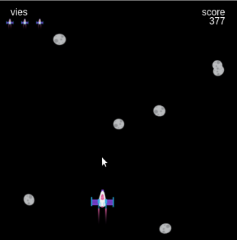

## Améliorer ton projet

Si tu as le temps, tu peux perfectionner ton projet.

{:width="300px"}

Voici quelques idées que tu pourrais essayer :

### Inclure une variété d'obstacles
Tu peux ajouter de la variété à tes obstacles de plusieurs manières :
 - Choisir au hasard entre plusieurs images, emojis ou fonctions de dessin d'obstacles
 - Ajuster aléatoirement la couleur, la forme ou la taille des obstacles en modifiant les paramètres qui les dessinent
 - Animer l'obstacle en ajoutant une rotation, un changement de couleur ou une autre différence visuelle contrôlée par `frame_count`

### Ajouter une condition de victoire
Tu peux faire gagner la partie aux joueurs de plusieurs manières :
 - Atteindre un score gagnant
 - Atteindre un certain niveau de jeu

Une fois qu'ils ont gagné, tu devrais leur dire d'une manière ou d'une autre - peut-être en utilisant `print()` ou `text()` puis arrêter le jeu.

### Donner aux joueurs plus d'une vie
Ajoute des vies à ton jeu pour permettre aux joueurs de survivre à quelques collisions. C'est un peu plus délicat que de simplement faire `vie = - 1` à chaque fois qu'ils entrent en collision avec quelque chose :
 - Le joueur peut passer plusieurs images en contact avec un objet, et ainsi perdre plus d'une vie pour une seule collision - tu devras empêcher que cela se produise
 - Tu auras également besoin d'un moyen pour les joueurs de savoir combien de vies il leur reste, et peut-être d'une sorte d'avertissement leur indiquant quand ils sont sur leur dernière vie
 - Tu peux ajouter un objet qui, lorsque le joueur entre en collision avec lui, leur donne une vie supplémentaire. N'oublie pas que tu devras modifier ton code de collision habituel afin qu'il ne soustrait pas une vie en même temps !

Chaque projet d'exemple dans l'introduction te permet de regarder le code, de trouver des idées et de voir comment ils fonctionnent.

Le projet « Esquive les astéroides » ci-dessous possède toutes ces fonctionnalités :

**Esquive les astéroïdes** :
<iframe src="https://editor.raspberrypi.org/en/embed/viewer/dodge-asteroids-example" width="600" height="700" frameborder="0" marginwidth="0" marginheight="0" allowfullscreen>
</iframe>

Tu peux trouver le projet Esquive les astéroïdes [ici](https://editor.raspberrypi.org/en/projects/dodge-asteroids-example){:target="_blank"}

Jette un œil à certains projets Pas de collision créés par des membres de la communauté dans la bibliothèque [Don't collide - Community](https://wke.lt/w/s/KobNfx){:target="_blank"} de la Raspberry Pi Foundation.

--- save ---
