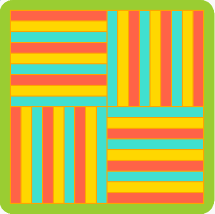

## Et ensuite ?

Si tu suis le parcours [Introduction à Python](https://projects.raspberrypi.org/en/pathways/python-intro), tu peux passer au projet [Modèles puissants](https://projects.raspberrypi.org/en/projects/powerful-patterns). Dans ce projet, tu vas créer des œuvres d'art inspirantes qui peuvent être mises à l'échelle grâce à des motifs répétés.

--- print-only ---

--- /print-only ---

--- no-print ---

<iframe src="https://editor.raspberrypi.org/en/embed/viewer/repeated-patterns-example" width="600" height="600" frameborder="0" marginwidth="0" marginheight="0" allowfullscreen>
</iframe>

--- /no-print ---

Si tu veux t'amuser davantage en explorant Python, tu peux essayer n'importe lequel de [ces projets](https://projects.raspberrypi.org/en/projects?software%5B%5D=python).

