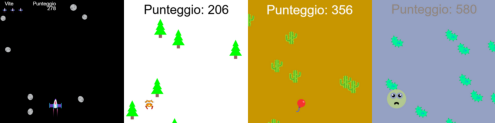
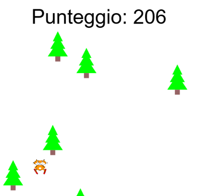
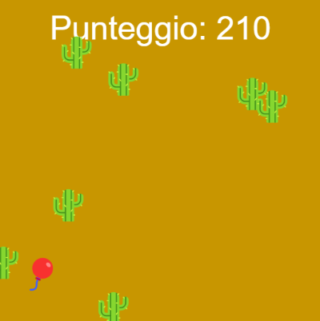
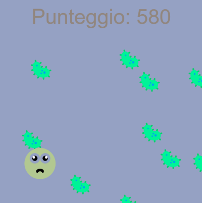
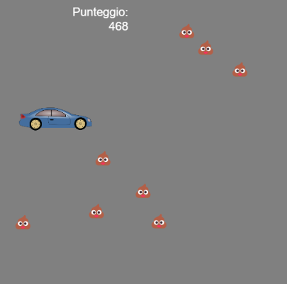
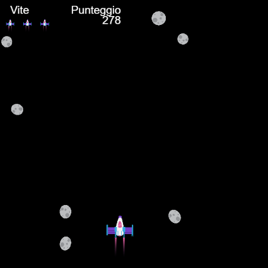

## Quello che farai

Costruisci un gioco senza fine in cui il tuo corridore deve evitare di scontrarsi.

 
**Corse senza fine** sono un tipo di gioco in cui devi evitare ostacoli e il gioco termina solo quando colpisci un ostacolo. Ottieni punti rimanendo in vita il più a lungo possibile.

Cosa farai:
+ Userai le **condizioni** del gioco per controllare cosa succede
+ Scoprirai di più sulla generazione procedurale e sul rilevamento delle collisioni
+ Personalizzerai un gioco in base ai tuoi interessi

### Lasciati ispirare 💭

Prenderai alcune decisioni di progettazione sul tipo di gioco che realizzerai e su come utilizzerai il codice per ottenere gli effetti desiderati.

--- no-print ---

--- task ---

Esegui questi esempi. Pensa a come sono stati realizzati i giocatori e gli ostacoli.

Cosa succede se colpisci un ostacolo? Diventa più difficile mentre giochi?

**Gatto che scia**:
<iframe src="https://editor.raspberrypi.org/en/embed/viewer/skiing-cat-example" width="600" height="700" frameborder="0" marginwidth="0" marginheight="0" allowfullscreen>
</iframe> Puoi trovare il progetto del gatto che scia [qui](https://editor.raspberrypi.org/en/projects/skiing-cat-example){:target="_blank"}

**Non scoppiare**:
<iframe src="https://editor.raspberrypi.org/en/embed/viewer/dont-pop-example" width="600" height="700" frameborder="0" marginwidth="0" marginheight="0" allowfullscreen>
</iframe> Puoi trovare il progetto Non scoppiare [qui](https://editor.raspberrypi.org/en/projects/dont-pop-example){:target="_blank"}

**Evita i batteri**:
<iframe src="https://editor.raspberrypi.org/en/embed/viewer/avoid-germs-example" width="600" height="700" frameborder="0" marginwidth="0" marginheight="0" allowfullscreen>
</iframe> Puoi trovare il progetto Evita i batteri [qui](https://editor.raspberrypi.org/en/projects/avoid-germs-example){:target="_blank"}

**Auto pulita**:
<iframe src="https://editor.raspberrypi.org/en/embed/viewer/clean-car-example" width="600" height="700" frameborder="0" marginwidth="0" marginheight="0" allowfullscreen>
</iframe> Puoi trovare il progetto Auto pulita [qui](https://editor.raspberrypi.org/en/projects/clean-car-example){:target="_blank"}

**Schiva gli asteroidi**:
<iframe src="https://editor.raspberrypi.org/en/embed/viewer/dodge-asteroids-example" width="600" height="700" frameborder="0" marginwidth="0" marginheight="0" allowfullscreen>
</iframe> Puoi trovare il progetto Schiva gli asteroidi [qui](https://editor.raspberrypi.org/en/projects/dodge-asteroids-example){:target="_blank"}

--- /task ---

--- /no-print ---

--- print-only ---

Prenderai alcune decisioni di progettazione sul tipo di gioco che realizzerai e su come utilizzerai il codice per ottenere gli effetti desiderati.

{:width="300px"}
Puoi trovare il progetto Gatto che scia qui https://editor.raspberrypi.org/en/projects/repeated-patterns-example {:width="300px"}
Puoi trovare il progetto Non scoppiare qui https://editor.raspberrypi.org/en/projects/repeated-patterns-example {:width="300px"}
Puoi trovare il progetto Evita i batteri qui https://editor.raspberrypi.org/en/projects/repeated-patterns-example {:width="300px"}
Puoi trovare il progetto Auto pulita qui https://editor.raspberrypi.org/en/projects/clean-car-example {:width="300px"}
Puoi trovare il progetto Schiva gli asteroidi qui https://editor.raspberrypi.org/en/projects/dodge-asteroids-example

--- /print-only ---
