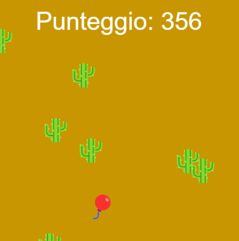

## Accelera!

<div style="display: flex; flex-wrap: wrap">
<div style="flex-basis: 200px; flex-grow: 1; margin-right: 15px;">
La maggior parte dei giochi di corridori senza fine aumentano la difficoltà del gioco man mano che il giocatore avanza e gli assegnano un punteggio.
</div>
<div>

{:width="300px"}

</div>
</div>

### Aggiungi livelli di difficoltà

Creare livelli di difficoltà chiari renderà più facile per il tuo giocatore capire cosa sta succedendo.

--- task ---

Crea una variabile `global` `livello` per tenere traccia del livello in cui si trova attualmente il giocatore. Impostalo su `1` in modo che i giocatori inizino una nuova partita al primo livello.

--- code ---
---
language: python filename: main.py line_numbers: true line_number_start: 6
line_highlights: 7
---

# Includi qui le variabili globali
level = 1

--- /code ---

--- /task ---

--- task ---

Questo codice utilizza l'altezza `height` e il `frame_count` per aumentare la variabile `livello` ogni volta che il giocatore termina una schermata, quindi stampa il nuovo livello per il giocatore.

**Scegli:** Questo codice limita i livelli a cinque, quindi non diventa troppo difficile giocare. Non c'è motivo per cui il tuo gioco debba usarne cinque, ma dovresti scegliere un limite. Gli esseri umani possono muoversi così velocemente!

--- code ---
---
language: python
filename: main.py — draw_obstacles()
---

def draw_obstacles(): global level  # Use the global level

    if frame_count % height == height - 1 and level < 5:
        level += 1
        print('You have reached level', level)

--- /code ---

--- /task ---

--- task ---

Le due opzioni principali per aumentare la difficoltà sono far muovere il gioco più velocemente e aumentare il numero di ostacoli.

--- collapse ---
---
title: Accelera il tuo gioco
---

La velocità del gioco è controllata dalla velocità con cui gli ostacoli sembrano muoversi verso il giocatore. Questo codice accelera aggiungendo `frame_count * livello` alle coordinate `y` durante la generazione degli ostacoli.

Invece di spostare gli ostacoli di un pixel in ogni fotogramma, questo codice li sposta effettivamente di `livello` pixel.

Osservando il codice, potresti aspettarti che la velocità aumenti di oltre `livello` pixel. Per esempio, al punto appena prima dell'incremento del `livello`, il `frame_count` è `799` — se il `livello` incrementa di un frame prima di `frame_count` è anche un multiplo di `height` (imposta a `400` pixels) — `799 * 3` è nettamente maggiore di `799 * 2`. Comunque, i pixel extra creati moltiplicando l'intero `frame_count` per un numero maggiore vengono nascosti da `ob_y %= height`. In questo modo rimane solo `livello` per i pixel extra in ogni passaggio.

--- code ---
---
language: python filename: main.py — draw_obstacles()
line_numbers: false
---

    for i in range(6):
        ob_x = randint(0, height)
        ob_y = randint(0, height) + (frame_count * level)
        ob_y %= height  # Wrap around
        text('🌵', ob_x, ob_y)

--- /code ---

--- /collapse ---

--- collapse ---
---
title: Aggiungi più ostacoli
---

Aggiungere ulteriori ostacoli è solo questione di aumentare il numero di volte in cui viene eseguito il ciclo `for` che li crea. Puoi farlo aumentando il numero che passi alla funzione `range()` del livello `livello`.

**Suggerimento:** Naturalmente, puoi sempre utilizzare `livello * 2`o anche multipli più grandi, se vuoi rendere il gioco più difficile.

--- /collapse ---

--- /task ---

### Tenere il punteggio

Più a lungo un giocatore resiste senza scontrarsi con un ostacolo, migliore sarà il tuo gioco. L'aggiunta di un punteggio consentirà loro di vedere quanto stanno andando bene.

--- task ---

Crea una variabile global `punteggio` per tenere traccia del punteggio del giocatore. Impostalo su `0` in modo che i giocatori inizino una nuova partita senza punti.

--- code ---
---
language: python filename: main.py
line_numbers: false
---

# Includi qui le variabili globali
score = 0

--- /code ---

--- /task ---

--- task ---

Puoi aumentare il punteggio del tuo giocatore per ogni frame in cui non si è scontrato con un ostacolo aumentando il suo punteggio quando controlli la collisione in `disegna_giocatore()`.

**Scegli:** Puoi decidere quanti punti vale ogni fotogramma, ma aumentare il punteggio del giocatore di `livello` premia i giocatori che riescono a sopravvivere a livelli di difficoltà più elevati.

--- code ---
---
language: python
filename: main.py — draw_player()
---

    global score
    
    if collide == safe.hex:
        text('🎈', mouse_x, player_y)
        score += level
    else:
        text('💥', mouse_x, player_y)

--- /code ---

--- /task ---

--- task ---

I giocatori dovrebbero essere in grado di vedere il loro punteggio. Poiché aumenta così rapidamente, utilizzare `print()` non funzionerebbe molto bene. Utilizza la funzione p5 `text()` all'interno della funzione `draw()`, per visualizzarla invece come testo sulla schermata di gioco.

[[[processing-python-text]]]

Puoi usare l'operatore `+` per combinare due o più stringhe se vuoi dare un'intestazione come 'punteggio' o 'punti'. Poiché il punteggio `punteggio` è un numero, dovrai convertirlo in una stringa prima di poterlo unire con un'altra stringa. Puoi farlo con `str()`:

```python
message = 'Score: ' + str(score)
```
**Suggerimento:** `str()` è l'abbreviazione di 'stringa': i programmatori spesso rimuovono lettere come questa, quindi non devono digitarne tante!

--- /task ---

### Fine del gioco!

Quando un giocatore entra in collisione con un ostacolo, il gioco dovrebbe smettere di muoversi e il suo punteggio dovrebbe smettere di aumentare.

--- task ---

Puoi utilizzare la variabile `livello` per segnalare "Fine del gioco" impostandola su 0, un valore che non raggiungerà mai in nessun altro modo. Fallo nel passaggio `else` del codice di rilevamento delle collisioni.

--- /task ---

--- task ---

Crea un'istruzione `if` in `draw()` che verifica se `livello > 0` prima di chiamare una qualsiasi delle funzioni — come `background()`, `draw_obstacles()`e `draw_player()` — che aggiornare il gioco. Poiché queste funzioni non vengono richiamate, l'intero gioco sembra terminare, anche se il programma è ancora in esecuzione.

--- /task ---

--- task ---

**Debug:** Potresti trovare alcuni bug nel tuo progetto che devi correggere. Ecco alcuni bug comuni.

--- collapse ---
---
title: il punteggio non viene visualizzato
---

Assicurati di aver incluso la funzione `text()` che disegna il punteggio del giocatore nel punto appropriato nella tua funzione `draw()`, e che gli hai passato i valori corretti:

```python
text('Text to display', x, y)`
```

Il codice dovrebbe apparire in questo modo:

--- code ---
---
language: python
filename: main.py — draw()
---

    if level > 0:
        background(safe) 
        fill(255)
        text('Score: ' + str(score), width/2, 20)
        draw_obstacles()
        draw_player()

--- /code ---

--- /collapse ---

--- collapse ---
---
title: Il gioco non si ferma dopo una collisione
---

Se ritieni che il tuo gioco potrebbe non rilevare correttamente le collisioni, prova prima le istruzioni di debug nel passaggio precedente, in "Non si verifica alcuna collisione quando il giocatore raggiunge un ostacolo".

Se il tuo gioco rileva correttamente le collisioni, controlla di aver inserito correttamente il codice che disegna il tuo gioco all'interno dell'istruzione `if level > 0`, per assicurarti che venga eseguito solo se questa affermazione è vera. Ad esempio:

--- code ---
---
language: python
filename: main.py — draw()
---

    if level > 0:
        background(safe)
        fill(255)
        text('Score: ' + str(score), width/2, 20)
        draw_obstacles()
        draw_player()

--- /code ---

Infine, se entrambi funzionano correttamente, il tuo gioco potrebbe non impostare correttamente `livello = 0` quando si verifica una collisione. Ad esempio:

--- code ---
---
language: python
filename: main.py — draw_player()
---

    if collide == safe.hex:
        text('🎈', mouse_x, player_y)
        score += level
    else:
        text('💥', mouse_x, player_y)
        level = 0

--- /code ---

--- /collapse ---

--- collapse ---
---
title: Il gioco non diventa più veloce
---

Innanzitutto, controlla che il livello `livello` stia aumentando correttamente. Dovresti vedere un messaggio stampato ogni volta che viene visualizzato. Se ciò non accade, controlla sia il codice per stampare il messaggio che il codice per aumentare il livello.

Se il livello aumenta correttamente, controlla la funzione `disegna_ostacolo()`. In particolare, controlla di avere `ob_y = randint(0, height) + (frame_count * livello)`. Il codice dovrebbe apparire in questo modo:

--- code ---
---
language: python filename: main.py — draw_obstacles()
line_numbers: false
---

    for i in range(6 + level):
        ob_x = randint(0, height)
        ob_y = randint(0, height) + (frame_count * level)
        ob_y %= height  # Wrap around
        text('🌵', ob_x, ob_y)

--- /code ---

--- /collapse ---

--- collapse ---
---
title: I nuovi ostacoli non compaiono
---

Ci sono alcuni motivi per cui ciò potrebbe accadere. Ci sono altri motivi per cui potrebbe sembrare che stia accadendo, quando non lo è. Innanzitutto, poiché vengono aggiunti nuovi ostacoli in base al livello `livello`, controlla che il livello `livello` stia aumentando correttamente. Dovresti vedere un messaggio stampato ogni volta che viene visualizzato. Se ciò non accade, controlla sia il codice per stampare il messaggio che il codice per aumentare il livello.

Se il livello incrementa correttamente, controlla la funzione`disegna_ostacolo()` per assicurare che hai usato `livello` nella funzione `range()` del ciclo `for` che disegna gli ostacoli. Il codice dovrebbe apparire in questo modo:

--- code ---
---
language: python filename: main.py — draw_obstacles()
line_numbers: false
---

    for i in range(6 + level):
        ob_x = randint(0, height)
        ob_y = randint(0, height) + (frame_count * level)
        ob_y %= height  # Wrap around
        text('🌵', ob_x, ob_y)

--- /code ---

Se hai effettuato tutti questi controlli e ancora non sembra che il numero di ostacoli aumenti, è possibile che aumentino ma tu non lo vedi. Dovresti provare alcuni di questi passaggi per testarlo:
  - Rallenta il gioco utilizzando `frame_rate = 10` nella chiamata a `run()` per darti più tempo per contare:

```python
run(frame_rate = 10)
```

Puoi alterare la velocità del gioco cambiando `10` con un valore più alto o più basso.

  - Cambia il seme che stai utilizzando per i tuoi numeri casuali. È improbabile, ma è possibile che alcuni ostacoli appaiano casualmente uno sopra l'altro
  - Aggiungi `print()` al ciclo `for` in `disegna_ostacolo()` che stampa il valore di `i` di ogni indice del ciclo, così puoi verificare se vengono eseguite il numero di volte che dovrebbero
  - Solo a scopo di test, cambia `range(6 + livello)` in `range(6 * livello)`: quell'aumento dovrebbe essere più facile da individuare!

--- /collapse ---

--- /task ---

--- save ---
