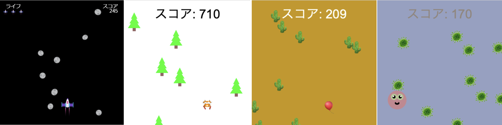
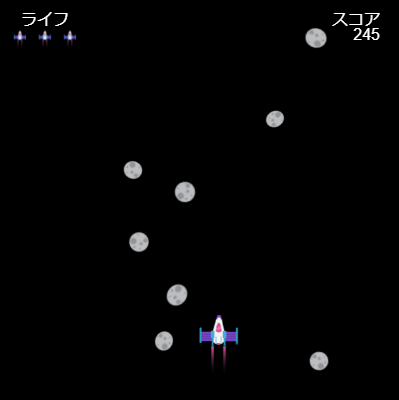
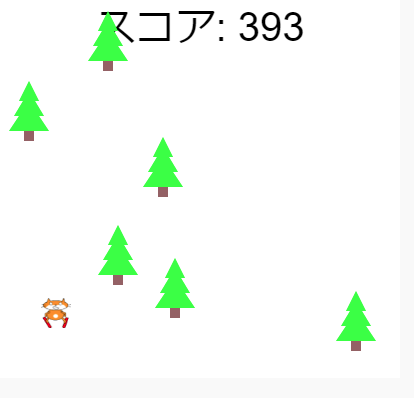
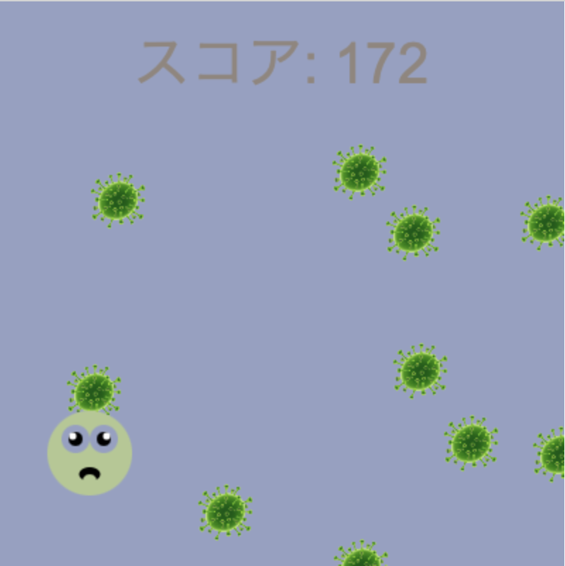
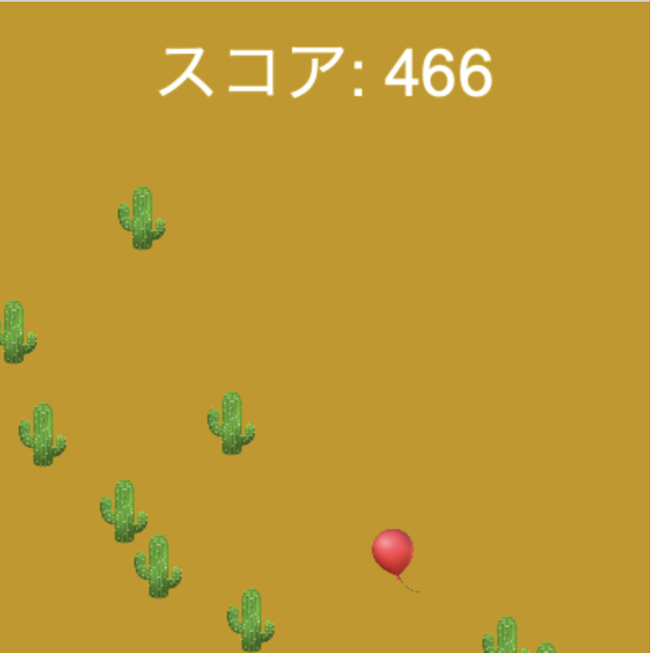
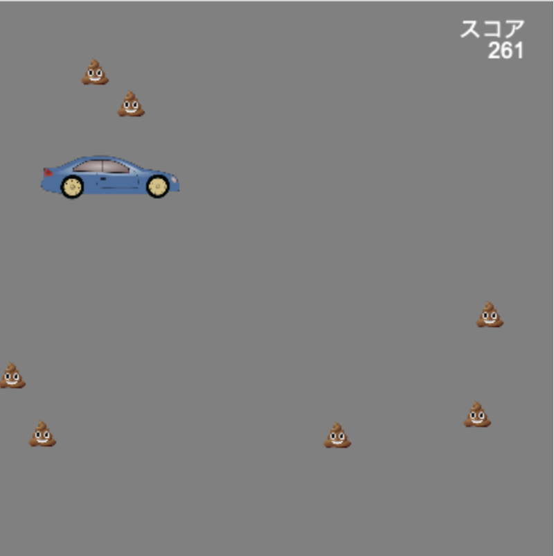

## You will make

キャラクターが障害物との衝突を避けて走り続けるエンドレス・ランナー・ゲームを作ります。

 
**エンドレスランナー** は、障害物を避け続け、障害物にぶつかるまで終わらないタイプのゲームです。 できるだけ長く生き続けることでポイントを獲得します。

次のことを行います。
+ 何が起こるかを制御するのにゲームの **条件** を使います
+ 手続き型生成と衝突検出について学びます
+ あなたの興味に合わせてゲームをパーソナライズします

### Get ideas 💭

作成するゲームの種類と、必要な効果を得るためにコードをどのように使うかについて、いくつかの設計上の決定を行います。

--- no-print ---

--- task ---

これらの例を見てください。 プレイヤーと障害物がどのように作られたかを考えてください。

障害物にぶつかるとどうなりますか？ ゲームが進むにつれて難しくなりますか？

  

**ネコのスキー**: [中を見る](https://trinket.io/python/76e628bff2){:target="_blank"}

<iframe src="https://trinket.io/embed/python/76e628bff2?outputOnly=true" width="100%" height="600" frameborder="0" marginwidth="0" marginheight="0" allowfullscreen></iframe>

**割れちゃダメ**: [中を見る](https://trinket.io/python/974800f4ef){:target="_blank"}

<iframe src="https://trinket.io/embed/python/974800f4ef?outputOnly=true" width="100%" height="600" frameborder="0" marginwidth="0" marginheight="0" allowfullscreen></iframe>

**バイキンを避けて**: [中を見る](https://trinket.io/python/88e108c819){:target="_blank"}

<iframe src="https://trinket.io/embed/python/88e108c819?outputOnly=true" width="100%" height="600" frameborder="0" marginwidth="0" marginheight="0" allowfullscreen></iframe>

**きれいなクルマ**: [中を見る](https://trinket.io/python/70da6c454d){:target="_blank"}

<iframe src="https://trinket.io/embed/python/70da6c454d?outputOnly=true" width="100%" height="600" frameborder="0" marginwidth="0" marginheight="0" allowfullscreen></iframe>

**小惑星を避けて**: [中を見る](https://trinket.io/python/d156014e67){:target="_blank"}

<iframe src="https://trinket.io/embed/python/d156014e67?outputOnly=true" width="100%" height="600" frameborder="0" marginwidth="0" marginheight="0" allowfullscreen></iframe>

--- /task ---

--- /no-print ---

--- print-only ---

作成するゲームの種類と、必要な効果を得るためにコードをどのように使うかについて、いくつかの設計上の決定を行います。

{:width="300px"}
{:width="300px"}
{:width="300px"}
{:width="300px"}
{:width="300px"}

--- /print-only ---
