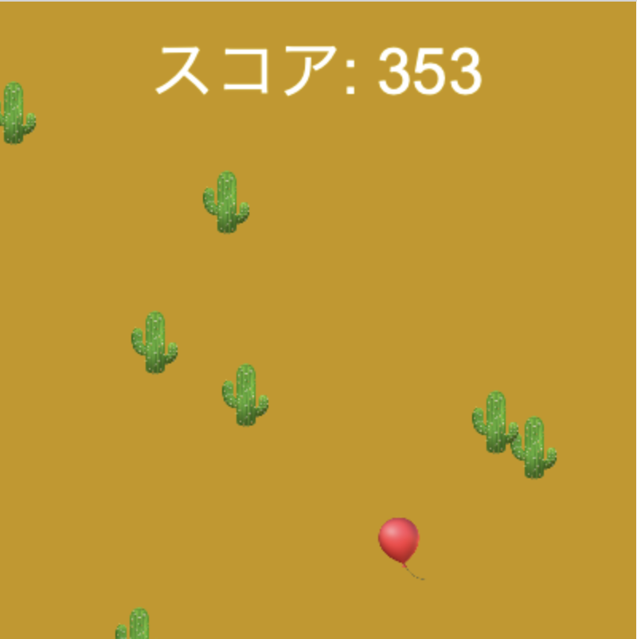

## スピードアップ！

<div style="display: flex; flex-wrap: wrap">
<div style="flex-basis: 200px; flex-grow: 1; margin-right: 15px;">
ほとんどのエンドレスランナーゲームは、プレーヤーが進むにつれてゲームが難しくなり、スコアが上がっていきます。
</div>
<div>

{:width="300px"}

</div>
</div>

### 難易度を付ける

はっきりした難易度を設けると、何が起こっているのかをプレーヤーが理解しやすくなります。

--- task ---

`leve` `グローバル`変数を作成して、プレーヤーの現在のレベルを確認します。 プレーヤーが新しいゲームを1レベルで始めるよう、その変数に`1` を設定します。

--- code ---
---
language: python filename: main.py line_numbers: true line_number_start: 6
line_highlights: 7
---

# グローバル変数をここに書く
level = 1

--- /code ---

--- /task ---

--- task ---

このコードは、 `height(高さ)` と `frame_count(フレーム数)` を使用して、プレーヤーが画面をクリアするたびに `level(レベル)` 変数を増やし、プレーヤーの新しいレベルを表示します。

**選択：** このコードはレベルを5までに制限しているので、ゲームをプレイするのが難しくなりすぎることはありません。 制限を5にしなければならない理由はありませんが、制限をつけた方がいいでしょう。 人間はそれほど速く動くことができません！

--- code ---
---
language: python
filename: main.py — draw_obstacles()
---

def draw_obstacles():

    if frame_count % height == height - 1 and level &#060; 5:
        level += 1
        print('レベル', level, ' になりました')

--- /code ---

--- /task ---

--- task ---

難易度を上げる方法は主に2つあります。 ゲームの動きを速くすることと、障害物の数を増やすことです。

--- collapse ---
---
title: ゲームをスピードアップする
---

ゲームのスピードは、障害物がプレイヤーに向かってどれくらいのスピードで移動しているように見えるかによって決まります。 このコードでは、障害物を出現させるときに障害物の `y` 座標に `frame_count * level` を加えることで障害物のスピードを上げています。

このコードでは、フレームごとに障害物を1ピクセルずつ動かすのではなく、`level` ピクセルずつ効果的に動かしています。

コードを見ると、毎回`level` ピクセル以上増加するように思われます。 たとえば、 `level` が増加する直前の時点では、 `frame_count` は `799` です。 なぜなら `level` は、 `frame_count` が `height`（ `400` ピクセルに設定）の倍数ちょうどになる1フレーム前に増加するからです。 そして、 `799 * 3`は`799 * 2`よりも著しく大きいです。 ですが、 `frame_count` 全体に大きな数値を掛けて作られたピクセル値のうちheightを超える部分は、 `ob_y %= height`によって隠されてしまいます。 これにより、ステップごとに `level` ピクセル分だけ増えていくのです。

--- code ---
---
language: python filename: main.py — draw_obstacles()
line_numbers: false
---

    for i in range(6):
        ob_x = randint(0, height)
        ob_y = randint(0, height) + (frame_count * level)
        ob_y %= height #下に外れたら上から出てくるように
        text('🌵', ob_x, ob_y)

--- /code ---

--- /collapse ---

--- collapse ---
---
title: 障害物を追加する
---

障害物を追加するには、障害物を作っている `for` ループの実行回数を増やすだけです。 これは、 `range()` 関数に渡す数値を `level`だけ増やすことで行えます。

**ヒント：**もちろん、ゲームを難しくしたければ、いつでも `level* 2`、またはそれ以上の何倍でも使うことができます。

--- /collapse ---

--- /task ---

### スコアを付ける

プレイヤーが障害物にぶつからずに長くプレイしているのは、ゲームを上手にプレイしているということです。 スコアを付けると、どれだけうまくやっているかを目で見ることができます。

--- task ---

プレーヤーのスコアを見続けるために、`score` グローバル変数を作成します。 得点なしから始めるよう、その変数に`0` を設定します。

--- code ---
---
language: python filename: main.py
line_numbers: false
---

# グローバル変数をここに書く
score = 0

--- /code ---

--- /task ---

--- task ---

`draw_player()`で衝突をチェックするときにスコアを上げることで、障害物とぶつからなかったフレームごとにプレーヤーのスコアを上げることができます。

**選択：** フレームごとのポイントは自由に決めることができますが、プレーヤーのスコアを `level` ポイント増やすようにすれば、より高い難しいレベルゲームを続けることに対するご褒美になります。

--- code ---
---
language: python
filename: main.py — draw_player()
---

    if collide == safe:
        text('🎈', mouse_x, player_y)
        score += level
      else:
        text('💥', mouse_x, player_y)

--- /code ---

--- /task ---

--- task ---

スコアはプレイヤーが見られるようにしなければなりません。 すごい速さでスコアが増えていくので、 `print()` を使ってもうまく行きません。 その代わりに、`draw()` 関数内でp5の `text()` 関数を使って、ゲーム画面上にテキストとして表示します。

[[[processing-python-text]]]

「スコア」や「得点」のような見出しを付けたい場合は、 `+` 演算子を使用して2つ以上の文字列をつなげることができます。 `score` 変数には数値が入っているため、別の文字列とつなぎ合わせる前に、文字列に変換しておく必要があります。 それには、`str()`を使います。

```python
message = 'Score: ' + str(score)
```
**ヒント：** `str()` は 'string'の略です—プログラマーはこのように文字を飛ばすことが多いです。

--- /task ---

### ゲームオーバー!

When a player has collided with an obstacle, the game should stop moving and their score should stop increasing.

--- task ---

`level` 変数を使って、「ゲームオーバー」を示すようにします。 変数の値を0（これは、他の方法では決して到達しない値です）に設定します。 これは、衝突検出コードの `else` ステップで行います。

--- /task ---

--- task ---

`draw()` 内に `if` ステートメントを作成します。 このステートメントで、 `background()`、`draw_obstacles()`、`draw_player()` などのゲームを進める関数を呼び出す前に `level > 0` かどうかをテストします。 これらの関数が呼び出されない場合、プログラムがまだ動き続けていても、ゲームが全て終わったように見えます。

--- /task ---

--- task ---

**デバッグ：** プロジェクトに修正が必要なバグが見つかる場合があります。 一般的なバグは次のとおりです。

--- collapse ---
---
title: スコアが表示されない
---

`draw()` 関数の適切な場所に、プレーヤーのスコアを表示させる `text()` 関数が置かれていることと、正しい値を渡していることを確認してください。

```python
text('表示するテキスト', x, y)
```

It should look something like this:

--- code ---
---
language: python
filename: main.py — draw()
---

    if level &#062; 0:
        background(safe) 
        fill(255)
        text('Score: ' + str(score), width/2, 20)
        draw_obstacles()
        draw_player()

--- /code ---

--- /collapse ---

--- collapse ---
---
title: 障害物にぶつかってもゲームが終わらない
---

ゲームが衝突をまったく検出していないと思われる場合は、最初に前のステップの「プレイヤーが障害物に達しても衝突が起きない」のデバッグ手順を試してください。

最後に、これらの両方が正しく動作している場合、衝突が発生したときにゲームが `level = 0` を正しく設定していない可能性があります。 例えばこのようにします:

--- code ---
---
language: python
filename: main.py — draw()
---

    if level &#062; 0:
        background(safe) 
        fill(255)
        text('Score: ' + str(score), width/2, 20)
        draw_obstacles()
        draw_player()

--- /code ---

ゲームが衝突を正しく検出している場合は、`if level > 0` ステートメントでゲーム画面を描くコードが適切にインデントされていることを確認してください。 例えばこのようにします:

--- code ---
---
language: python
filename: main.py — draw_player()
---

    if collide == safe:
        text('🎈', mouse_x, player_y)
        score += level
      else:
        text('💥', mouse_x, player_y)
        level = 0

--- /code ---

--- /collapse ---

--- collapse ---
---
title: ゲームが速くならない
---

まず、 `level` が正しく増えていることを確認します。 レベルが上がるたびに、メッセージが表示されます。 表示されない場合は、メッセージを表示するためのコードと、レベルを上げるためのコードの両方を確認してください。

レベルが正しく増えている場合は、 `draw_obstacles()` 関数を確認してください。 特に、`ob_y = randint(0, height) + (frame_count * level)`があることを確認してください。 こんな感じです。

--- code ---
---
language: python filename: main.py — draw_obstacles()
line_numbers: false
---

    for i in range(6 + level):
        ob_x = randint(0, height)
        ob_y = randint(0, height) + (frame_count * level)
        ob_y %= height #下に外れたら上から出てくるように
        text('🌵', ob_x, ob_y)

--- /code ---

--- /collapse ---

--- collapse ---
---
title: 新しい障害物が出てこない
---

これが発生する理由はいくつかあります。 そして、そうではないのに、そのように見える理由もいくつかあります。 まず、新しい 障害物は`level`に基づいて追加されるので、 `level` が正しく増えていることを確認します。 レベルが上がるたびに、メッセージが表示されます。 表示されない場合は、メッセージを表示するためのコードと、レベルを上げるためのコードの両方を確認してください。

レベルが正しく増えている場合は、 `draw_obstacles()` 関数をチェックして、障害物を描画する `for` ループの `range()` 関数で `level` が使われていることを確認します。 こんな感じです。

--- code ---
---
language: python filename: main.py — draw_obstacles()
line_numbers: false
---

    for i in range(6 + level):
        ob_x = randint(0, height)
        ob_y = randint(0, height) + (frame_count * level)
        ob_y %= height #下に外れたら上から出てくるように
        text('🌵', ob_x, ob_y)

--- /code ---

これらすべてのチェックを行っても、障害物の数が増えない場合は、障害物が増えているのに見えていない可能性があります。 これをテストするには、次の手順のいくつかを試す必要があります。
  - `setup()` 関数で `frame_rate()` を使ってゲームのスピードを落とし、障害物を数える時間を増やす

```python
run(frame_rate = 10)
```

You can alter the speed of the game by changing `10` to a higher or lower value.

  - 乱数に使用しているタネを変更する。 可能性は低いですが、いくつかの障害物がランダムに表示されるとき、他の障害物の上にちょうど重なり合っていることは考えられます
  - `draw_obstacles()` の `for` ループに `print()` を追加します。 これにより、ループ1回ごとに `i` の値が表示されるため、必要回数だけ実行されているか確認できます。
  - テストのためだけに、 `range(6 + level)` を `range(6 * level)` に変更します—増え方が大きいのですぐにわかります！

--- /collapse ---

--- /task ---

--- save ---
