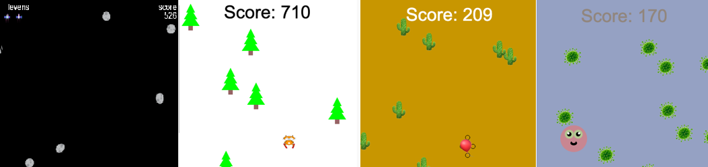
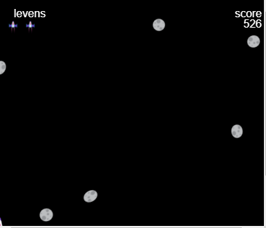

## Inleiding

Bouw een eindeloos rollend renspel waarin je personage obstakels moet ontwijken.

 
**Eindeloze renners** is een soort spel waarbij je obstakels moet ontwijken en het spel pas eindigt als je een obstakel raakt. Je scoort punten door zo lang mogelijk in leven te blijven.

Je gaat:
+ Spel-**voorwaarden** gebruiken om te bepalen wat er gebeurt
+ Leren over over procedureel genereren en botsingsdetectie
+ Een game naar jouw interesses personaliseren

### Doe inspiratie op

Je gaat een aantal ontwerpbeslissingen nemen over het soort spel dat je gaat maken en hoe je code gaat gebruiken om de gewenste effecten te krijgen.

--- no-print ---

--- task ---

Kijk naar deze voorbeelden. Denk na over hoe de spelers en obstakels zijn gemaakt.

Wat gebeurt er als je een obstakel raakt? Wordt het moeilijker terwijl je speelt?

  

**Skiënde kat**: [Bekijk van binnen](https://trinket.io/python/2a3aaa1379){:target="_blank"}

<iframe src="https://trinket.io/embed/python/2a3aaa1379?outputOnly=true" width="100%" height="600" frameborder="0" marginwidth="0" marginheight="0" allowfullscreen></iframe>

**Plof niet**: [Bekijk van binnen](https://trinket.io/python/301bea4d71){:target="_blank"}

<iframe src="https://trinket.io/embed/python/301bea4d71?outputOnly=true" width="100%" height="600" frameborder="0" marginwidth="0" marginheight="0" allowfullscreen></iframe>

**Vermijd de bacterieën**: [Bekijk van binnen](https://trinket.io/python/e65d1b3f9a){:target="_blank"}

<iframe src="https://trinket.io/embed/python/e65d1b3f9a?outputOnly=true" width="100%" height="600" frameborder="0" marginwidth="0" marginheight="0" allowfullscreen></iframe>

**Schone auot**: [Bekijk van binnen](https://trinket.io/python/8475dea0c2){:target="_blank"}

<iframe src="https://trinket.io/embed/python/8475dea0c2?outputOnly=true" width="100%" height="600" frameborder="0" marginwidth="0" marginheight="0" allowfullscreen></iframe>

**Vermijd asteroiden**: [Bekijk van binnen](https://trinket.io/python/ec572bfe38){:target="_blank"}

<iframe src="https://trinket.io/embed/python/ec572bfe38?outputOnly=true" width="100%" height="600" frameborder="0" marginwidth="0" marginheight="0" allowfullscreen></iframe>

--- /task ---

--- /no-print ---

--- print-only ---

Je gaat een aantal ontwerpbeslissingen nemen over het soort spel dat je gaat maken en hoe je code gaat gebruiken om de gewenste effecten te krijgen.

{:width="300px"}
{:width="300px"}
{:width="300px"}
{:width="300px"}
{:width="300px"}

--- /print-only ---
