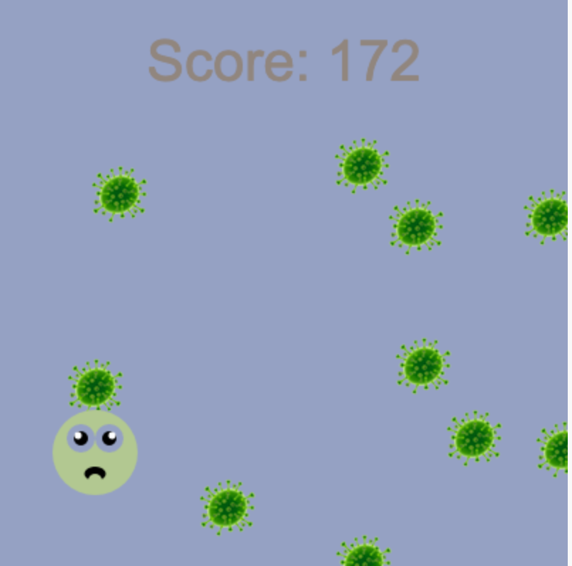

## Zrobisz to

Zbuduj przewijającą się niekończącą się grę dla biegaczy, w której twoja postać musi unikać przeszkód.

 
**Nieskończeni biegacze** to rodzaj gry, w której musisz unikać przeszkód, a gra kończy się tylko wtedy, gdy trafisz na przeszkodę. Zdobywasz punkty, pozostając przy życiu tak długo, jak to możliwe.

Co zrobisz:
+ Użyj warunków ** gry **, aby kontrolować, co się stanie
+ Dowiedz się więcej o generowaniu procedur i wykrywaniu kolizji
+ Dostosuj grę do swoich zainteresowań

### Masz pomysły?

Podejmiesz kilka decyzji projektowych dotyczących rodzaju gry, którą stworzysz i sposobu użycia kodu, aby uzyskać pożądane efekty.

--- no-print ---

--- task ---

Uruchom te przykłady. Pomyśl o tym, jak stworzono graczy i przeszkody.

Co się stanie, jeśli trafisz na przeszkodę? Czy gra staje się trudniejsza?

** Kot narciarski **:
<iframe src="https://editor.raspberrypi.org/en/embed/viewer/skiing-cat-example" width="600" height="700" frameborder="0" marginwidth="0" marginheight="0" allowfullscreen>
</iframe> Możesz znaleźć projekt Kot narciarski {:target="_blank"}

** Don't **:
<iframe src="https://editor.raspberrypi.org/en/embed/viewer/dont-pop-example" width="600" height="700" frameborder="0" marginwidth="0" marginheight="0" allowfullscreen>
</iframe> Możesz znaleźć projekt nie pop {:target="_blank"}

** Unikaj **:
<iframe src="https://editor.raspberrypi.org/en/embed/viewer/avoid-germs-example" width="600" height="700" frameborder="0" marginwidth="0" marginheight="0" allowfullscreen>
</iframe> Możesz znaleźć projekt Unikaj zarazków {:target="_blank"}

** Czyste **:
<iframe src="https://editor.raspberrypi.org/en/embed/viewer/clean-car-example" width="600" height="700" frameborder="0" marginwidth="0" marginheight="0" allowfullscreen>
</iframe> Możesz znaleźć projekt „Czysty samochód” {:target="_blank"}

** Dodge **:
<iframe src="https://editor.raspberrypi.org/en/embed/viewer/dodge-asteroids-example" width="600" height="700" frameborder="0" marginwidth="0" marginheight="0" allowfullscreen>
</iframe> Możesz znaleźć projekt asteroidy Dodge {:target="_blank"}

--- /task ---

--- /no-print ---

--- print-only ---

Podejmiesz kilka decyzji projektowych dotyczących rodzaju gry, którą stworzysz i sposobu użycia kodu, aby uzyskać pożądane efekty.

{:width="300px"}
Projekt Kot narciarski znajdziesz tutaj https://editor.raspberrypi.org/en/projects/repeated-patterns-example {:width="300px"}
Możesz znaleźć projekt nie pop tutaj https://editor.raspberrypi.org/en/projects/repeated-patterns-example {:width="300px"}
możesz znaleźć projekt Unikaj zarazków tutaj https://editor.raspberrypi.org/en/projects/repeated-patterns-example {:width="300px"}
Projekt Czysty samochód znajdziesz tutaj https://editor.raspberrypi.org/en/projects/clean-car-example {:width="300px"}
Projekt asteroidy Dodge znajdziesz tutaj https://editor.raspberrypi.org/en/projects/dodge-asteroids-example

--- /print-only ---
