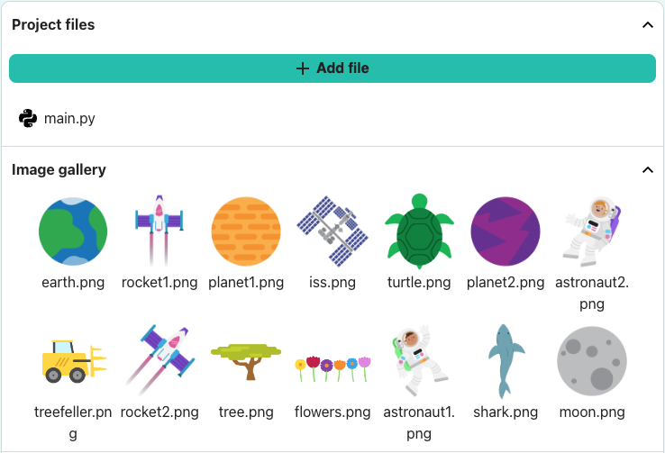

## Ustaw motyw

<div style="display: flex; flex-wrap: wrap">
<div style="flex-basis: 200px; flex-grow: 1; margin-right: 15px;">
Ustaw motyw swojej gry i utwórz postać gracza, która podąża za wskaźnikiem myszy.

</div>
<div>

{:width="300px"}

</div>
</div>

Jaki jest motyw Twojej gry? Oto kilka pomysłów:
- Sport
- Hobby
- Nauka
- Przyroda

--- task ---

Otwórz [ nie zderzaj się! projekt startowy ](https://editor.raspberrypi.org/en/projects/dont-collide-starter){:target="_blank"}. Edytor kodu otworzy się w innej karcie przeglądarki.

Jeśli masz konto Raspberry Pi, możesz kliknąć przycisk ** Saved ** , aby zapisać kopię w swoich projektach ** **.

--- /task ---

--- task ---

** Wybierz:** Ustaw rozmiar swojego płótna.

--- code ---
---
language: python filename: main.py - setup() line_numbers: true line_number_start: 9
line_highlights: 10
---

def setup(): size(400, 400)

--- /code ---

--- /task ---

--- task ---

Utwórz zmienną o nazwie ` `, aby przechowywać kolor tła w oparciu o motyw, który chcesz dla swojej gry.

Jest to kolor, który jest bezpieczny dla gracza, aby być włączony i użyjesz tej zmiennej ponownie później.

--- code ---
---
language: python filename: main.py - draw() line_numbers: true line_number_start: 13
line_highlights: 14, 15, 16
---

def draw(): global safe safe = Color(200, 100, 0)  # Add the colour of your theme background(safe)

--- /code ---

[[[generic-theory-simple-colours]]]

--- /task ---

--- task ---

** Test:** Uruchom swój kod, aby zobaczyć kolor tła. Zmień go, aż będziesz zadowolony z koloru i rozmiaru ekranu.

--- /task ---

Teraz wybierz postać, która gra w grę i omija przeszkody. Czy jest to przedmiot, osoba, zwierzę, czy coś innego?

Gracz pojawi się w stałej pozycji `.` i tej samej pozycji ` ` co wskaźnik myszy, który jest przechowywany w zmiennej ` ` `_`.

--- task ---

Dobrym pomysłem jest zorganizowanie kodu do rysowania postaci gracza do funkcji.

Zdefiniuj funkcję ` draw_player()` i utwórz pozycję `_` dla stałej pozycji `.` gracza:

--- code ---
---
language: python filename: main.py - draw_player() line_numbers: true line_number_start: 12
line_highlights: 12-14
---

def draw_player(): player_y = int(height * 0.8)  # Positioned towards the screen bottom

--- /code ---

Dodaj kod do ` draw()`, aby wywołać ` draw_player()` każdą klatkę.

--- code ---
---
language: python filename: main.py - draw() line_numbers: true line_number_start: 15
line_highlights: 19
---

def draw(): global safe safe = Color(200, 100, 0)  # Your chosen colour background(safe) draw_player()

--- /code ---

--- /task ---

Następnie dodasz kod do funkcji ` draw_player()`, aby narysować swój kształt. Może być również konieczne dodanie kodu ` setup()`.

--- task ---

** Wybierz:** jak wygląda Twój gracz? Twój gracz może być:
+ Obraz dostarczony w projekcie startowym
+ Emoji? lub tekst
+ Narysowany przy użyciu serii kształtów

--- collapse ---
---
Title: Użyj obrazu startowego
---

Obrazy zawarte w projekcie startowym zostaną pokazane w galerii obrazów `.`.



Zanotuj nazwę obrazu, którego chcesz użyć.

Załaduj obraz do funkcji ` setup()`

--- code ---
---
language: python filename: main.py - setup() line_numbers: true line_number_start: 9
line_highlights: 11-12
---

def setup(): size(400, 400) global player player = load_image('turtle.png')  # Load your image

--- /code ---

Wywołaj ` image()` i ustaw go jako globalny w funkcji ` draw_player()` .

--- code ---
---
language: python filename: main.py - draw_player() line_numbers: true line_number_start: 14
line_highlights: 16
---

def draw_player(): player_y = int(height * 0.8)  # Positioned towards the screen bottom image(player, mouse_x, player_y, 30, 30)

--- /code ---

--- /collapse ---

--- collapse ---
---
Title: Użyj znaków emoji
---

Możesz użyć znaków emoji w funkcji p5 ` text()`, aby użyć emoji do reprezentowania twojego gracza.

Oto przykład:

--- code ---
---
language: python filename: main.py - setup() line_numbers: true line_number_start: 9
line_highlights: 11-13
---

def setup(): size(400, 400) text_size(40)  # Controls the size of the emoji text_align(CENTER, TOP)  # Position around the centre

--- /code ---

Wywołaj ` text()` i ustaw go jako globalny w funkcji ` draw_player()` .

--- code ---
---
language: python filename: main.py - draw_player() line_numbers: true line_number_start: 14
line_highlights: 16-17
---

def draw_player(): player_y = int(height * 0.8) text('🎈', mouse_x, player_y)

--- /code ---

--- /collapse ---

[[[processing-python-text]]]

[[[generic-theory-simple-colours]]]

[[[processing-python-ellipse]]]

[[[processing-python-rect]]]

[[[processing-python-triangle]]]

[[[processing-tint]]]

[[[processing-stroke]]]

** Wskazówka:** Możesz użyć kilku prostych kształtów w tej samej funkcji, aby stworzyć bardziej złożonego gracza.

--- collapse ---
---
Title: Narysuj gracza za pomocą wielu kształtów
---


--- code ---
---
language: python
filename: main.py - draw_player()
---

def draw_player(): player_y = int(height * 0.8) noStroke() # Face fill(0, 200, 100) ellipse(mouse_x, player_y, 60, 60)

    # Eyes
    fill(0, 100, 200)
    ellipse(mouse_x - 10, player_y - 10, 20, 20)
    ellipse(mouse_x + 10, player_y - 10, 20, 20)
    fill(0)
    ellipse(mouse_x - 10, player_y - 10, 10, 10)
    ellipse(mouse_x + 10, player_y - 10, 10, 10)
    fill(255)
    ellipse(mouse_x - 12, player_y - 12, 5, 5)
    ellipse(mouse_x + 12, player_y - 12, 5, 5)

--- /code ---

--- /collapse ---

--- /task ---

--- task ---

Test **:** Uruchom swój kod i przesuń myszą, aby kontrolować gracza.

Czy porusza się tak, jak się spodziewasz?

--- /task ---

** Debug:** Możesz znaleźć kilka błędów w swoim projekcie, które musisz naprawić. Oto kilka typowych robaków.

--- task ---

--- collapse ---
---
Title: Nie widzę gracza
---

Spróbuj przełączyć się na pełny ekran. Sprawdź również współrzędne ` ` i ` `, których użyłeś do narysowania gracza — upewnij się, że znajdują się one wewnątrz płótna utworzonego za pomocą ` size()`.

--- /collapse ---

--- collapse ---
---
Title: Obraz nie jest ładowany
---

Najpierw sprawdź, czy obraz znajduje się w galerii obrazów `.`. Następnie sprawdź nazwę pliku bardzo dokładnie — pamiętaj, że duże litery różnią się od małych liter, a interpunkcja jest ważna.

--- /collapse ---

--- collapse ---
---
Title: Obraz ma niewłaściwy rozmiar
---

Sprawdź wejścia, które kontrolują szerokość i wysokość obrazu:

```python
image(image_file, x_coord, y_coord, width, height)
```

--- /collapse ---

--- collapse ---
---
Title: Emoji to niewłaściwy rozmiar
---

Jeśli Twoje emoji są zbyt duże lub zbyt małe, zmień wartość w ` text_size()`.

--- /collapse ---

--- /task ---

--- save ---
