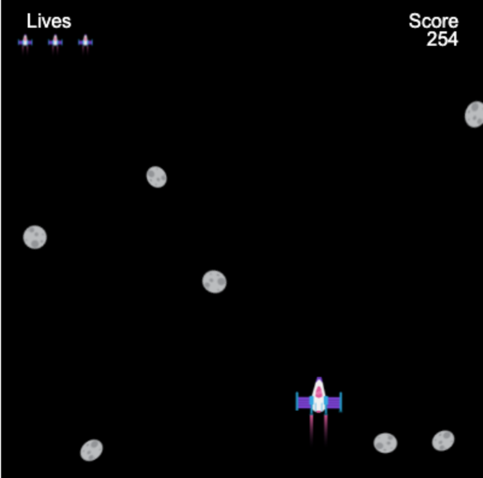

## O que você vai fazer

Construir um jogo de corrida sem fim onde seu personagem tem que evitar obstáculos.

 
Corridas Infinitas **Endless runners** é um tipo de jogo onde você tem que evitar obstáculos e o jogo só termina quando você atinge um obstáculo. Você ganha pontos permanecendo vivo o máximo que puder.

Você deve:
+ Usar as **condições** do jogo para controlar o que acontece
+ Aprender sobre geração procedural e detecção de colisão
+ Personalizar um jogo de acordo com seus interesses

### Obtenha ideias 💭

Você tomará algumas decisões de modelagem sobre o tipo de jogo que fará e como usará o código para obter os efeitos desejados.

--- no-print ---

--- task ---

Execute estes exemplos. Pense em como os jogadores e os obstáculos foram feitos.

O que acontece se você bater em um obstáculo? Fica mais difícil conforme você joga?

**Gato esquiador**:
<iframe src="https://editor.raspberrypi.org/en/embed/viewer/skiing-cat-example" width="600" height="700" frameborder="0" marginwidth="0" marginheight="0" allowfullscreen>
</iframe> Você pode encontrar o projeto Gato esquiador [aqui](https://editor.raspberrypi.org/en/projects/skiing-cat-example){:target="_blank"}

**Não estoure**:
<iframe src="https://editor.raspberrypi.org/en/embed/viewer/dont-pop-example" width="600" height="700" frameborder="0" marginwidth="0" marginheight="0" allowfullscreen>
</iframe> Você pode encontrar o projeto Não estoure [aqui](https://editor.raspberrypi.org/en/projects/dont-pop-example){:target="_blank"}

**Evite os germes**:
<iframe src="https://editor.raspberrypi.org/en/embed/viewer/avoid-germs-example" width="600" height="700" frameborder="0" marginwidth="0" marginheight="0" allowfullscreen>
</iframe> Você pode encontrar o projeto Evite os germes [aqui](https://editor.raspberrypi.org/en/projects/avoid-germs-example){:target="_blank"}

**Carro limpo**:
<iframe src="https://editor.raspberrypi.org/en/embed/viewer/clean-car-example" width="600" height="700" frameborder="0" marginwidth="0" marginheight="0" allowfullscreen>
</iframe> Você pode encontrar o projeto Carro limpo [aqui](https://editor.raspberrypi.org/en/projects/clean-car-example){:target="_blank"}

**Desvie de asteroides**:
<iframe src="https://editor.raspberrypi.org/en/embed/viewer/dodge-asteroids-example" width="600" height="700" frameborder="0" marginwidth="0" marginheight="0" allowfullscreen>
</iframe> Você pode encontrar o projeto Desvie de asteroides [aqui](https://editor.raspberrypi.org/en/projects/dodge-asteroids-example){:target="_blank"}

--- /task ---

--- /no-print ---

--- print-only ---

Você tomará algumas decisões de design sobre o tipo de jogo que fará e como usará o código para obter os efeitos desejados.

{:width="300px"}
Você pode encontrar o projeto Gato esquiador aqui https://editor.raspberrypi.org/pt-br/projects/repeated-patterns-example {:width="300px"}
Você pode encontrar o projeto Não estoure aqui https://editor.raspberrypi.org/pt-br/projects/repeated-patterns-example {:width="300px"}
Você pode encontrar o projeto Evite os germes aqui https://editor.raspberrypi.org/pt-br/projects/repeated-patterns-example {:width="300px"}
Você pode encontrar o projeto Carro limpo aqui https://editor.raspberrypi.org/pt-br/projects/clean-car-example {:width="300px"}
Você pode encontrar o projeto Desvie de asteroides aqui https://editor.raspberrypi.org/pt-br/projects/dodge-asteroids-example

--- /print-only ---
