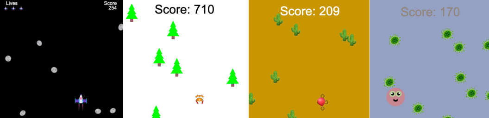

## Você vai fazer

Construir um jogo de corrida sem fim onde seu personagem tem que evitar obstáculos.

 
**Corredores sem fim** é um tipo de jogo onde você tem que evitar obstáculos e o jogo só termina quando você atinge um obstáculo. Você ganha pontos permanecendo vivo o máximo que puder.

Você irá:
+ Usar as condições do jogo **** para controlar o que acontece
+ Saber mais sobre geração procedural e detecção de colisão
+ Personalizar um jogo de acordo com seus interesses

### Ter ideias

Você tomará algumas decisões de design sobre o tipo de jogo que fará e como usará o código para obter os efeitos desejados.

--- no-print ---

--- task ---

Veja estes exemplos. Pense em como os jogadores e os obstáculos foram feitos.

O que acontece se você bater em um obstáculo? Fica mais difícil conforme você joga?

  

**Skiing cat**: [Veja](https://trinket.io/python/76e628bff2){:target="_blank"}

<iframe src="https://trinket.io/embed/python/76e628bff2?outputOnly=true" width="100%" height="600" frameborder="0" marginwidth="0" marginheight="0" allowfullscreen></iframe>

**Não estoure**: [ Veja](https://trinket.io/python/974800f4ef){:target="_blank"}

<iframe src="https://trinket.io/embed/python/974800f4ef?outputOnly=true" width="100%" height="600" frameborder="0" marginwidth="0" marginheight="0" allowfullscreen></iframe>

**Evite os germes**: [Veja](https://trinket.io/python/88e108c819){:target="_blank"}

<iframe src="https://trinket.io/embed/python/88e108c819?outputOnly=true" width="100%" height="600" frameborder="0" marginwidth="0" marginheight="0" allowfullscreen></iframe>

**Carro limpo**: [Veja](https://trinket.io/python/70da6c454d){:target ="_blank"}

<iframe src="https://trinket.io/embed/python/70da6c454d?outputOnly=true" width="100%" height="600" frameborder="0" marginwidth="0" marginheight="0" allowfullscreen></iframe>

**Evite asteroides**: [Veja](https://trinket.io/python/d156014e67){:target="_blank"}

<iframe src="https://trinket.io/embed/python/d156014e67?outputOnly=true" width="100%" height="600" frameborder="0" marginwidth="0" marginheight="0" allowfullscreen></iframe>

--- /task ---

--- /no-print ---

--- print-only ---

Você tomará algumas decisões de design sobre o tipo de jogo que fará e como usará o código para obter os efeitos desejados.

{:width="300px"}
{:width="300px"}
{:width="300px"}
{:width="300px"}
{:width="300px"}

--- /print-only ---
