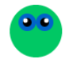

## Defina o tema

<div style="display: flex; flex-wrap: wrap">
<div style="flex-basis: 200px; flex-grow: 1; margin-right: 15px;">
Defina o tema do seu jogo e crie um personagem de jogador que siga o ponteiro do mouse.

</div>
<div>

{:width="300px"}

</div>
</div>

Qual é o tema do seu jogo? Here are some ideas:
- Sports
- Hobbies
- Science
- Nature

--- task ---

Open the [Don't Collide! starter project](https://editor.raspberrypi.org/en/projects/dont-collide-starter){:target="_blank"} project. The code editor will open in another browser tab.

If you have a Raspberry Pi account, you can click on the **Save** button to save a copy to your **Projects**.

--- /task ---

--- task ---

**Choose:** Set the size of your canvas.

--- code ---
---
language: python filename: main.py - setup() line_numbers: true line_number_start: 9
line_highlights: 10
---

def setup(): size(400, 400)

--- /code ---

--- /task ---

--- task ---

Create a variable called `safe` to store the background colour based on the theme you want for your game.

This is the colour that it is safe for the player to be on and you will use this variable again later.

--- code ---
---
language: python filename: main.py - draw() line_numbers: true line_number_start: 13
line_highlights: 14, 15, 16
---

def draw(): global safe safe = Color(200, 100, 0)  # Add the colour of your theme background(safe)

--- /code ---

[[[generic-theory-simple-colours]]]

--- /task ---

--- task ---

**Test:** Run your code to see the background colour. Change it until you are happy with the colour and the size of the screen.

--- /task ---

Now choose the character that is playing the game and avoiding the obstacles. Is it an object, person, animal, or something else?

The player will appear at a fixed `y` position and same `x` position as the mouse pointer, which is stored in the `p5` variable `mouse_x`.

--- task ---

It's a good idea to organise the code for drawing the player character into a function.

Define a `draw_player()` function and create a `player_y` position for the fixed `y` position of the player:

--- code ---
---
language: python filename: main.py - draw_player() line_numbers: true line_number_start: 12
line_highlights: 12-14
---

def draw_player(): player_y = int(height * 0.8)  # Positioned towards the screen bottom

--- /code ---

Add code to `draw()` to call `draw_player()` each frame.

--- code ---
---
language: python filename: main.py - draw() line_numbers: true line_number_start: 15
line_highlights: 19
---

def draw(): global safe safe = Color(200, 100, 0)  # Your chosen colour background(safe) draw_player()

--- /code ---

--- /task ---

Next you will add code to the `draw_player()` function to draw your shape. You may also need to add `setup()` code.

--- task ---

**Choose:** What does your player look like? Your player could be:
+ Uma imagem fornecida no projeto inicial
+ Um emoji 🎈 ou texto
+ Desenhado usando uma série de formas

--- collapse ---
---
title: Use uma imagem inicial
---

Images included in the starter project will be shown in the `Image gallery`.


Make a note of the name of the image you want to use.

Load the image into the `setup()` function

--- code ---
---
language: python filename: main.py - setup() line_numbers: true line_number_start: 9
line_highlights: 11-12
---

def setup(): size(400, 400) global player player = load_image('turtle.png')  # Load your image

--- /code ---

Call the `image()` and set it as global in the `draw_player()` function.

--- code ---
---
language: python filename: main.py - draw_player() line_numbers: true line_number_start: 14
line_highlights: 16
---

def draw_player(): player_y = int(height * 0.8)  # Positioned towards the screen bottom image(player, mouse_x, player_y, 30, 30)

--- /code ---

--- /collapse ---

--- collapse ---
---
título: Use caracteres emoji
---

You can use emoji characters in the p5 `text()` function to use an emoji to represent your player.

Here's an example:

--- code ---
---
language: python filename: main.py - setup() line_numbers: true line_number_start: 9
line_highlights: 11-13
---

def setup(): size(400, 400) text_size(40)  # Controls the size of the emoji text_align(CENTER, TOP)  # Position around the centre

--- /code ---

Call the `text()` and set it as global in the `draw_player()` function.

--- code ---
---
language: python filename: main.py - draw_player() line_numbers: true line_number_start: 14
line_highlights: 16-17
---

def draw_player(): player_y = int(height * 0.8) text('🎈', mouse_x, player_y)

--- /code ---

--- /collapse ---

[[[processing-python-text]]]

[[[generic-theory-simple-colours]]]

[[[processing-python-ellipse]]]

[[[processing-python-rect]]]

[[[processing-python-triangle]]]

[[[processing-tint]]]

[[[processing-stroke]]]

**Tip:** You can use several simple shapes in the same function to create a more complex player.

--- collapse ---
---
title: Desenhe um jogador usando várias formas
---



--- code ---
---
language: python
filename: main.py - draw_player()
---

def draw_player(): player_y = int(height * 0.8) noStroke() # Face fill(0, 200, 100) ellipse(mouse_x, player_y, 60, 60)

    # Eyes
    fill(0, 100, 200)
    ellipse(mouse_x - 10, player_y - 10, 20, 20)
    ellipse(mouse_x + 10, player_y - 10, 20, 20)
    fill(0)
    ellipse(mouse_x - 10, player_y - 10, 10, 10)
    ellipse(mouse_x + 10, player_y - 10, 10, 10)
    fill(255)
    ellipse(mouse_x - 12, player_y - 12, 5, 5)
    ellipse(mouse_x + 12, player_y - 12, 5, 5)

--- /code ---

--- /collapse ---

--- /task ---

--- task ---

**Test:** Run your code and move the mouse to control the player.

Does it move like you expect?

--- /task ---

**Debug:** You might find some bugs in your project that you need to fix. Here are some common bugs.

--- task ---

--- collapse ---
---
título: não vejo o jogador
---

Try switching to full screen. Also, check the `x` and `y` coordinates that you used to draw the player — make sure they are inside the canvas you created with `size()`.

--- /collapse ---

--- collapse ---
---
title: Uma imagem não está carregando
---

First, check that the image is in the `Image gallery`. Then, check the filename really carefully — remember capital letters are different to lower case letters and punctuation is important.

--- /collapse ---

--- collapse ---
---
title: Uma imagem tem o tamanho errado
---

Check the inputs that control the width and height of the image:

```python
image(image_file, x_coord, y_coord, width, height)
```

--- /collapse ---

--- collapse ---
---
title: Uma imagem tem o tamanho errado
---

If your emoji is too big or too small, change the value in `text_size()`.

--- /collapse ---

--- /task ---

--- save ---
