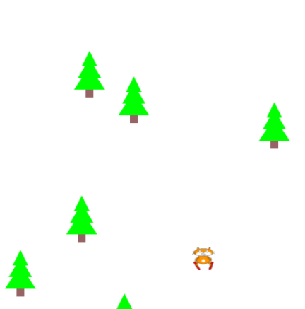

## Crie obstáculos

<div style="display: flex; flex-wrap: wrap">
<div style="flex-basis: 200px; flex-grow: 1; margin-right: 15px;">
Crie obstáculos que você terá que evitar para continuar jogando.
</div>
<div>

{:width="300px"}

</div>
</div>

### Comece com um obstáculo

Você pode criar obstáculos da mesma forma que criou o seu jogador. Como os obstáculos se encaixam no seu tema?

Você vai usar uma iteração `for` para fazer muitas cópias, então você só precisa fazer ou escolher um obstáculo.

--- task ---

Defina uma função `desenhar_obstaculos()`:

--- code ---
---
language: python filename: main.py - desenhar_obstaculos() line_numbers: false line_number_start:
line_highlights: 4
---

def draw_obstacles(): ob_x = width/2 ob_y = height/2 text('🌵', ob_x, ob_y)  # Replace with your obstacle

--- /code ---

Adicione o código à funcão `draw()` para chamar `desenhar_obstaculos()` em cada quadro.

--- code ---
---
language: python filename: main.py - draw() line_numbers: false line_number_start:
line_highlights: 5
---

def draw(): global safe safe = Color(200, 100, 0)  # Add the colour of your theme background(safe) draw_obstacles()  # Before drawing the player draw_player()

--- /code ---

--- /task ---

--- task ---

**Escolha:** Qual é a aparência do seu obstáculo? Seu obstáculo pode ser:
+ Uma imagem fornecida no projeto inicial
+ Um emoji 🎈 ou texto
+ Desenhe usando uma série de formas

--- collapse ---
---
título: Use uma imagem inicial
---

As imagens incluídas no projeto inicial serão mostradas na `Galeria de imagens`.


Anote o nome da imagem que deseja usar.

Carregue a imagem na função `setup()`

--- code ---
---
language: python filename: main.py - setup() line_numbers: true line_number_start: 9
line_highlights: 12
---

def setup(): size(400, 400) global player player = load_image('turtle.png')  # Load your player image obstacle = load_image('shark.png')  # Load your obstacle image

--- /code ---

Encontre a linha `# Mantenha isto para executar seu código`. Antes dessa linha, defina uma nova função `desenhar_obstaculos()`, chame `obstaculo` como uma variável global e use-a na chamada para `imagem()`.

--- code ---
---
language: python
filename: main.py - draw_obstacles()
---

def draw_obstacles(): ob_x = width/2 ob_y = height/2

    global obstacle
    
    image(obstacle, ob_x, ob_y, 30, 30)  # Resize to fit your theme

--- /code ---

--- /collapse ---

--- collapse ---
---
título: Use caracteres emoji
---

Você pode usar caracteres emoji na função p5 `text()` para representar seus obstáculos.

Aqui está um exemplo:

--- code ---
---
language: python
filename: main.py - setup()
---

def setup(): size(400, 400) text_size(40)  # Controls the size of the emoji text_align(CENTER, TOP)  # Position around the centre

--- /code ---

Encontre a linha `# Mantenha isto para executar seu código`. Antes dessa linha, defina uma nova função `desenhar_obstaculos()`.

--- code ---
---
language: python
filename: main.py - draw_obstacles()
---

def draw_obstacles(): ob_x = width/2 ob_y = height/2 text('🌵', ob_x, ob_y)

--- /code ---

--- /collapse ---

[[[processing-python-text]]]

[[[generic-theory-simple-colours]]]

[[[processing-python-ellipse]]]

[[[processing-python-rect]]]

[[[processing-python-triangle]]]

[[[processing-tint]]]

[[[processing-stroke]]]

**Dica:** Você pode usar várias formas simples na mesma função para criar um obstáculo mais complexo.

--- collapse ---
---
título: Desenhe um obstáculo usando várias formas
---


--- code ---
---
language: python
filename: main.py - draw_obstacles()
---

def draw_obstacles(): ob_x = width/2 ob_y = height/2 # Draw a fir tree no_stroke() fill(0,255,0)  # Green for needles triangle(ob_x + 20, ob_y + 20, ob_x + 10, ob_y + 40, ob_x + 30, ob_y + 40) triangle(ob_x + 20, ob_y + 30, ob_x + 5, ob_y + 55, ob_x + 35, ob_y + 55) triangle(ob_x + 20, ob_y + 40, ob_x + 0, ob_y + 70, ob_x + 40, ob_y + 70) fill(150,100,100)  # Brown for trunk rect(ob_x + 15, ob_y + 70, 10, 10)

--- /code ---

--- /collapse ---

--- /task ---

### Mova o seu obstáculo

--- task ---

Agora adicione o código para aumentar a posição `y` do obstáculo em cada quadro e faça-o voltar quando chegar ao fundo para criar o efeito de outro obstáculo.

A variável p5 `frame_count` começa a contar os quadros quando você clica em executar.

`ob_y %= altura` define a posição `y` para o restante quando dividido pela `altura`. Com uma `altura` de '400', isso transformará `401` em `1` então, quando os obstáculos desaparecerem na parte inferior da tela, ele reaparece na parte superior.

--- code ---
---
language: python
filename: main.py - draw_obstacles()
---

def draw_obstacles(): ob_x = width/2 ob_y = height/2 + frame_count  # Increases each frame ob_y %= height  # Wrap around text('🌵', ob_x, ob_y)  # Replace with your obstacle

--- /code ---

--- /task ---

### Muitos obstáculos

Você poderia desenhar muitas cópias do seu obstáculo em diferentes locais de partida, mas isso dá muito trabalho. Vamos usar um atalho.

<p style="border-left: solid; border-width:10px; border-color: #0faeb0; background-color: aliceblue; padding: 10px;"> 
<span style="color: #0faeb0">**Geração procedural**</span> é usada na criação de mundos de jogos, obstáculos e cenas de filmes para criar aleatoriedade, mas com certas regras aplicadas. Uma <span style="color: #0faeb0">semente (seed)</span> significa que você pode gerar os mesmos resultados sempre que usar a mesma semente.</p>

--- task ---

Este código usa um laço `for` com `randint()` para escolher as posições dos obstáculos para você. Chamar a função `seed()` primeiro significa que você sempre obterá os mesmos números aleatórios. Isso significa que os obstáculos não saltarão a cada quadro e você poderá alterar a semente até obter uma que posicione os obstáculos de maneira justa.

--- code ---
---
language: python
filename: main.py - draw_obstacles()
---

def draw_obstacles(): seed(12345678)  # Any number is fine

    for i in range(6):  
        ob_x = randint(0, height)
        ob_y = randint(0, height) + frame_count
        ob_y %= height
        text('🌵', ob_x, ob_y)  # Replace with your obstacle

--- /code ---

Informação útil:

[[[using-seed-in-python]]]

[[[generic-python-for-loop-repeat]]]

--- /task ---

--- collapse ---
---
título: Alerta de epilepsia
---

Testar seu programa tem o potencial de induzir convulsões em pessoas com epilepsia fotossensível. Se você tem epilepsia fotossensível ou sente que pode ser suscetível a uma convulsão, não execute o programa. Em vez disso, você pode:
- Certificar-se de ter adicionado a linha de código `seed()` para garantir que seus obstáculos não pulem
- Pedir a alguém para executá-lo para você
- Seguir em frente e concluir o projeto, pedindo a alguém para executá-lo no final para você depurar
- Diminuir a velocidade do jogo usando `frame_rate = 10` em sua chamada `run()` assim:

```python
run(frame_rate = 10)
```
Você pode alterar a velocidade do jogo alterando `10` para um valor maior ou menor.

--- /collapse ---

--- task ---

**Teste:** Execute seu programa e você deverá ver vários objetos na tela, retornando ao topo quando chegam ao fundo.

Mude seu código até ficar satisfeito com os obstáculos que você tem. Você pode:

+ Mudar a semente para obter obstáculos em diferentes posições iniciais
+ Alterar o número de vezes para repetir a iteração para obter um número diferente de obstáculos
+ Ajustar o tamanho dos obstáculos

**Dica:** Certifique-se de que é possível evitar seus obstáculos, mas que não há um caminho fácil no jogo.

--- /task ---

--- task ---

**Depurar:** Talvez você encontre alguns bugs em seu projeto que precisam de correção. Aqui estão alguns bugs comuns.

--- collapse ---
---
título: Apenas um obstáculo está sendo desenhado
---

Verifique sua função que desenha vários obstáculos:
 + Certifique-se de usar um laço `for` para chamar a função de desenho de obstáculo mais de uma vez
 + Certifique-se de usar `randint()` para alterar as coordenadas (x, y) que está passando para a função de desenho de obstáculo
 + Verifique se você usou `ob_x` e `ob_y` como coordenadas para o seu obstáculo

Por exemplo:

--- code ---
---
language: python
filename: main.py — draw_obstacles()
---

def draw_obstacles(): seed(12345678)

    for i in range(6):  
        ob_x = randint(0, height)
        ob_y = randint(0, height) + frame_count
        ob_y %= height
        text('🌵', ob_x, ob_y)  # Replace with your obstacle

--- /code ---

--- /collapse ---

--- collapse ---
---
título: Os obstáculos mudam de posição toda vez que um quadro é desenhado
---

Certifique-se de ter usado `seed()` dentro da função que desenha vários obstáculos.

--- /collapse ---

--- /task ---

<p style="border-left: solid; border-width:10px; border-color: #0faeb0; background-color: aliceblue; padding: 10px;"> 
Os programadores usam muitos truques interessantes, como usar o operador `%` para fazer os objetos ciclarem na tela e a função `seed()` para gerar os mesmos números aleatórios. Quanto mais codificação você fizer, mais truques interessantes aprenderá.</p>

--- save ---
