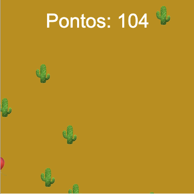

## Acelere!

<div style="display: flex; flex-wrap: wrap">
<div style="flex-basis: 200px; flex-grow: 1; margin-right: 15px;">
A maioria dos jogos de corrida sem fim aumenta a dificuldade do jogo à medida que o jogador avança e dá-lhes uma pontuação.
</div>
<div>

{:width="300px"}

</div>
</div>

### Adicione níveis de dificuldade

Criar níveis de dificuldade claros tornará mais fácil para o jogador entender o que está acontecendo.

--- task ---

Crie uma variável `global` `nivel` para rastrear o nível em que o jogador está atualmente. Defina-a como `1` para que os jogadores comecem um novo jogo no primeiro nível.

--- code ---
---
language: python
filename: main.py
line_numbers: true
line_number_start: 6
line_highlights: 7
---

# Inclua variáveis globais aqui
nivel = 1

--- /code ---

--- /task ---

--- task ---

Este código usa `altura` e `frame_count` para aumentar a variável `nivel` toda vez que o jogador termina uma tela e, em seguida, imprime o novo nível para o jogador.

**Escolha:** Este código limita os níveis para cinco, para que não fique muito difícil de jogar. Não há razão para seu jogo usar cinco, mas você deve escolher um limite. Humanos não se movem tão rápido!

--- code ---
---
language: python
filename: main.py — desenhar_obstaculos()
---

def desenhar_obstaculos():
    global nivel  # Use o nível global

    if frame_count % height == height - 1 and nivel < 5:
        nivel += 1
        print('Você atingiu o nível', nivel)

--- /code ---

--- /task ---

--- task ---

As duas principais opções para aumentar a dificuldade são tornar o jogo mais rápido e aumentar o número de obstáculos.

--- collapse ---
---
title: Acelere seu jogo
---

A velocidade do jogo é controlada pela rapidez com que os obstáculos parecem se mover em direção ao jogador. Este código acelera isso adicionando `frame_count * nivel` à coordenada `y` durante a geração de obstáculos.

Em vez de mover seus obstáculos em um píxel em cada quadro, esse código efetivamente os move em píxeis de `nivel`.

Olhando para o código, você pode esperar que a velocidade aumente mais do que os píxeis de `nivel`. Por exemplo, no ponto imediatamente antes de seu `nivel` aumentar, o `frame_count` é `799` - quando o `nivel` aumenta, um quadro antes do `frame_count` é um múltiplo par de `altura` (definido em `400` píxels) — e `799 * 3` é notavelmente maior que `799 * 2`. No entanto, os píxeis extras criados pela multiplicação de `frame_count` inteiro por um número maior são ocultados por `ob_y %= altura`. Isso deixa apenas os píxeis extras de `nivel` em cada etapa.

--- code ---
---
language: python
filename: main.py — desenhar_obstaculos()
line_numbers: false
---

    for i in range(6):
        ob_x = randint(0, height)
        ob_y = randint(0, height) + (frame_count * nivel)
        ob_y %= height  # Dar a volta
        text('🌵', ob_x, ob_y)

--- /code ---

--- /collapse ---

--- collapse ---
---
title: Adicione mais obstáculos
---

Adicionar obstáculos extras é apenas uma questão de aumentar o número de vezes que o laço `for` que os cria é executado. Você pode fazer isso aumentando o número passado para a função `range()` em `nivel`.

**Dica:** Claro, você sempre pode usar `level * 2`, ou múltiplos ainda maiores, se quiser tornar seu jogo mais difícil.

--- /collapse ---

--- /task ---

### Mantendo a pontuação

Quanto mais tempo um jogador durar sem colidir com um obstáculo, melhor ele é jogando o seu jogo. Adicionar uma pontuação permitirá que eles vejam como estão se saindo.

--- task ---

Crie uma variável global `pontos` para rastrear a pontuação do jogador. Defina-o como `0` para que os jogadores comecem um novo jogo sem nenhum ponto.

--- code ---
---
language: python
filename: main.py
line_numbers: false
---

# Inclua variáveis globais aqui
pontos = 0

--- /code ---

--- /task ---

--- task ---

Você pode aumentar a pontuação do seu jogador para cada quadro em que ele não colidiu com um obstáculo, aumentando sua pontuação ao verificar a colisão em `desenhar_jogador()`.

**Escolha:** Você pode decidir quantos pontos cada quadro vale, mas aumentar a pontuação do jogador em `nivel` recompensa os jogadores que podem sobreviver em níveis de dificuldade mais altos.

--- code ---
---
language: python
filename: main.py — desenhar_jogador()
---

    global pontos
    
    if colide == seguro.hex:
        text('🎈', mouse_x, jogador_y)
        pontos += level
    else:
        text('💥', mouse_x, jogador_y)

--- /code ---

--- /task ---

--- task ---

Os jogadores devem conseguir ver suas pontuações. Como ela aumenta tão rapidamente, usar `print()` não funcionaria muito bem. Use a função p5 `text()` dentro de sua função `draw()` para exibi-la como texto na tela do jogo.

[[[processing-python-text]]]

Você pode usar o operador `+` para combinar dois ou mais textos se quiser dar um título como 'pontuação' ou 'pontos'. Como `pontos` é um número, você precisará convertê-lo em um texto antes de uni-lo a outro texto. Você pode fazer isso com `str()`:

```python
mensagem = 'Pontos: ' + str(pontos)
```
**Dica:** `str()` é a abreviação de 'string' — os programadores geralmente removem letras dessa forma, assim não precisam digitar tanto!

--- /task ---

### Fim do jogo!

Quando um jogador colide com um obstáculo, o jogo deve parar de se mover e sua pontuação deve parar de aumentar.

--- task ---

Você pode usar a variável `nivel` para sinalizar 'Fim de jogo' definindo-a como 0 — um valor que nunca alcançará de outra maneira. Faça isso na etapa `else` do seu código de detecção de colisão.

--- /task ---

--- task ---

Crie uma instrução `if` em `draw()` que testa se `nivel > 0` antes de chamar qualquer uma das funções — como `background()`, `desenhar_obstaculos()`e `desenhar_jogador()` — que atualizam o jogo. Como essas funções não são chamadas, o jogo inteiro parece terminar, mesmo que o programa ainda esteja em execução.

--- /task ---

--- task ---

**Depurar:** Talvez você encontre alguns bugs em seu projeto que precisam de correção. Aqui estão alguns bugs comuns.

--- collapse ---
---
title: A pontuação não é exibida
---

Certifique-se de incluir a função `text()` que desenha a pontuação do jogador no ponto apropriado em sua função `draw()`, e que você passou os valores corretos:

```python
text('Texto a ser exibido', x, y)`
```

Deve ficar parecido com isso:

--- code ---
---
language: python
filename: main.py — draw()
---

    if nivel > 0:
        background(seguro) 
        fill(255)
        text('Score: ' + str(pontos), width/2, 20)
        desenhar_obstaculos()
        desenhar_jogador()

--- /code ---

--- /collapse ---

--- collapse ---
---
title: O jogo não para após uma colisão
---

Se você acha que seu jogo pode não estar detectando colisões corretamente, primeiro tente as instruções de depuração da etapa anterior, em 'Não há colisão quando o jogador atinge um obstáculo'.

Se o seu jogo estiver detectando colisões corretamente, verifique se você recuou corretamente o código que desenha seu jogo dentro da instrução `if nivel > 0`, para ter certeza de que ele só será executado se essa afirmação é verdadeira. Por exemplo:

--- code ---
---
language: python
filename: main.py — draw()
---

    if level > 0:
        background(seguro)
        fill(255)
        text('Pontos: ' + str(pontos), width/2, 20)
        desenhar_obstaculos()
        desenhar_jogador()

--- /code ---

Por fim, se ambos estiverem funcionando corretamente, seu jogo pode não estar definindo `nivel = 0` corretamente quando ocorrer uma colisão. Por exemplo:

--- code ---
---
language: python
filename: main.py — desenhar_jogador()
---

    if colide == seguro.hex:
        text('🎈', mouse_x, jogador_y)
        pontos += nivel
    else:
        text('💥', mouse_x, jogador_y)
        nivel = 0

--- /code ---

--- /collapse ---

--- collapse ---
---
title: O jogo não fica mais rápido
---

Primeiro, verifique se o `nivel` está aumentando corretamente. Você deverá ver uma mensagem impressa toda vez que ele aumentar. Se isso não estiver acontecendo, verifique o código para imprimir a mensagem e o código para aumentar o nível.

Se o nível estiver aumentando corretamente, verifique sua função `desenhar_obstaculos()`. Em particular, verifique se você tem `ob_y = randint(0, altura) + (frame_count * nivel)`. Deve ficar parecido com isso:

--- code ---
---
language: python
filename: main.py — desenhar_obstaculos()
line_numbers: false
---

    for i in range(6 + nivel):
        ob_x = randint(0, height)
        ob_y = randint(0, height) + (frame_count * nivel)
        ob_y %= height  # Dar a volta
        text('🌵', ob_x, ob_y)

--- /code ---

--- /collapse ---

--- collapse ---
---
title: Novos obstáculos não aparecem
---

Existem algumas razões pelas quais isso pode estar acontecendo. E há mais algumas razões pelas quais isso pode parecer estar acontecendo, quando não está. Primeiro, porque novos obstáculos são adicionados com base no `nivel`, verifique se o `nivel` está aumentando corretamente. Você deverá ver uma mensagem impressa toda vez que ele aumentar. Se isso não estiver acontecendo, verifique o código para imprimir a mensagem e o código para aumentar o nível.

Se o nível estiver aumentando corretamente, verifique sua função `desenhar_obstaculos()` para garantir que você tenha `nivel` usado na função `range()` da iteração `for` que desenha os obstáculos. Deve ficar parecido com isso:

--- code ---
---
language: python
filename: main.py — desenhar_obstaculos()
line_numbers: false
---

    for i in range(6 + nivel):
        ob_x = randint(0, height)
        ob_y = randint(0, height) + (frame_count * nivel)
        ob_y %= height  # Dar a volta
        text('🌵', ob_x, ob_y)

--- /code ---

Se você fez todas essas verificações e ainda não parece que o número de obstáculos está aumentando, é possível que estejam, mas você não está vendo. Você deve tentar algumas destas etapas para testar isso:
  - Desacelere o jogo usando `frame_rate = 10` em sua chamada `run()` para ter mais tempo para contar:

```python
run(frame_rate = 10)
```

Você pode alterar a velocidade do jogo alterando `10` para um valor maior ou menor.

  - Altere a semente que você está usando para seus números aleatórios. É improvável, mas é possível que alguns obstáculos apareçam aleatoriamente uns sobre os outros
  - Adicione um `print()` no laço `for` em `desenhar_obstaculos()` que imprime o valor de `i` em cada passagem da iteração, para que você possa verificar se está executando o número de vezes que deveria
  - Apenas para fins de teste, altere `range(6 + nivel)` para `range(6 * nivel)` — esse aumento deve ser mais fácil de detectar!

--- /collapse ---

--- /task ---

--- save ---
