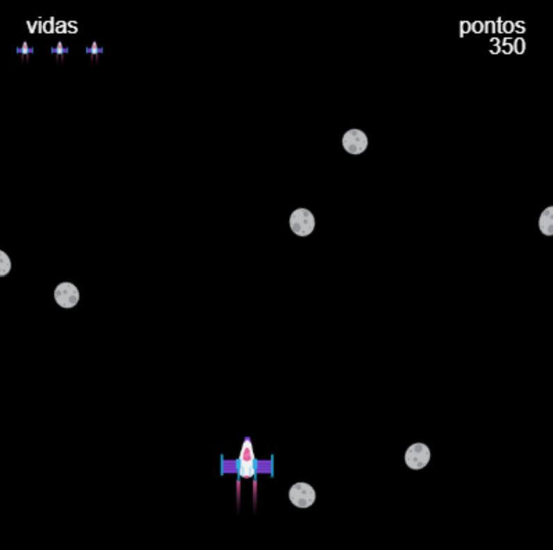

## Melhore o seu projeto

Se você tiver tempo, você pode melhorar o seu projeto.

{:width="300px"}

Aqui estão algumas ideias que você pode tentar:

### Inclua uma variedade de obstáculos
Você pode adicionar variedade aos seus obstáculos de algumas maneiras:
 - Escolha aleatoriamente entre várias imagens, emojis ou funções de desenho de obstáculos
 - Ajuste aleatoriamente a cor, forma ou tamanho dos obstáculos alterando os parâmetros que os desenham
 - Anime o obstáculo adicionando rotação, mudança de cor ou alguma outra diferença visual controlada por `frame_count`

### Adicionar uma condição de vitória
Você pode fazer com que os jogadores ganhem o jogo de algumas maneiras:
 - Alcançar uma pontuação vencedora
 - Atingir um certo nível do jogo

Assim que eles ganharem, você deve dizer a eles de alguma forma - talvez usando `print()` ou `text()` e então pare o jogo.

### Dê aos jogadores mais de uma vida
Adicione vidas ao seu jogo, para permitir que os jogadores sobrevivam a algumas colisões. Isso é um pouco mais complicado do que apenas fazer `vidas -= 1` toda vez que eles colidem com algo:
 - O jogador pode gastar vários quadros em contato com um objeto e, portanto, perder mais de uma vida por uma única colisão - você precisará evitar que isso aconteça
 - Você também precisará de uma maneira de os jogadores saberem quantas vidas ainda restam e talvez algum tipo de aviso que diga a eles quando estão em sua última vida
 - Você pode adicionar um objeto que, quando o jogador colidir com ele, dê a ele uma vida extra. Lembre-se de que você precisará modificar seu código de colisão regular para que ele não subtraia uma vida ao mesmo tempo!

Cada exemplo de projeto na Introdução permite que você observe o código, tenha ideias e veja como elas funcionam.

O projeto "Desvie dos Asteroides" abaixo possui todos esses recursos:

**Desvie dos asteroides**:
<iframe src="https://editor.raspberrypi.org/en/embed/viewer/dodge-asteroids-example" width="600" height="700" frameborder="0" marginwidth="0" marginheight="0" allowfullscreen>
</iframe>

Você pode encontrar o projeto Desvie dos asteroides [aqui](https://editor.raspberrypi.org/en/projects/dodge-asteroids-example){:target="_blank"}

Dê uma olhada em alguns projetos Não colida criados por membros da comunidade na Raspberry Pi Foundation’s [Não colida - Biblioteca comunitária da ](https://wke.lt/w/s/KobNfx){:target="_blank"}.

--- save ---
