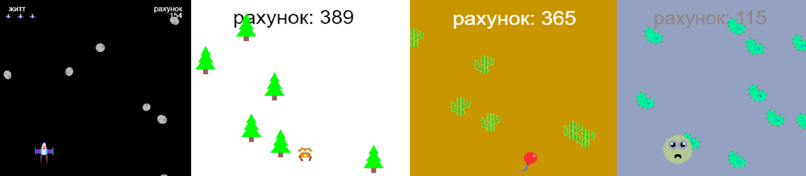
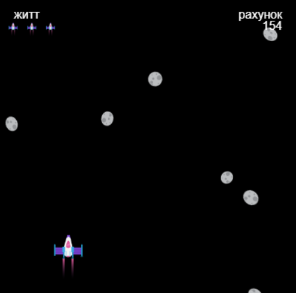
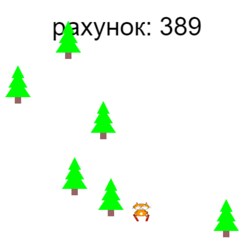
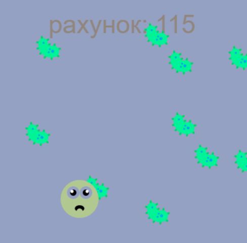
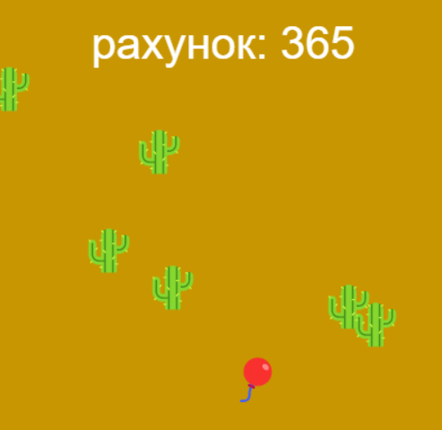
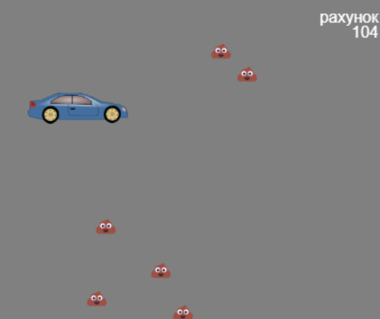

## Ти зробиш

Створиш нескінченну гру-раннер, де твій персонаж повинен уникати перешкод.

 
**Нескінченний раннер** це тип гри, де тобі належить уникати перешкоди, а гра закінчується лише тоді, коли ти натрапиш на перешкоду. Ти набираєш очки, залишаючись в живих якомога довше.

Зможеш:
+ Використовувати ігрові **умови**, щоб контролювати процеси у твоїй грі
+ Дізнатися про процедурну генерацію та виявлення зіткнень
+ Персоналізувати гру під власні інтереси

### Отримай ідеї 💭

Тобі доведеться приймати деякі дизайнерські рішення стосовно того, яку гру ти будеш створювати та як ти будеш використовувати код для отримання потрібних тобі результатів.

--- no-print ---

--- task ---

Зверни увагу на ці приклади. Подумай, як в цих проєктах були створені персонажі та перешкоди.

Що станеться, якщо потрапити на перешкоду? Чи буде твоя гра ставати все складнішою?

  

**Кіт на лижах**: [Подивитись код](https://trinket.io/python/76e628bff2){:target="_blank"}

<iframe src="https://trinket.io/embed/python/76e628bff2?outputOnly=true" width="100%" height="600" frameborder="0" marginwidth="0" marginheight="0" allowfullscreen></iframe>

**Не лопни**: [Подивитись код](https://trinket.io/python/974800f4ef){:target="_blank"}

<iframe src="https://trinket.io/embed/python/974800f4ef?outputOnly=true" width="100%" height="600" frameborder="0" marginwidth="0" marginheight="0" allowfullscreen></iframe>

**Уникай мікробів**: [Подивитись код](https://trinket.io/python/88e108c819){:target="_blank"}

<iframe src="https://trinket.io/embed/python/88e108c819?outputOnly=true" width="100%" height="600" frameborder="0" marginwidth="0" marginheight="0" allowfullscreen></iframe>

**Чистий автомобіль**: [Подивитись код](https://trinket.io/python/70da6c454d){:target="_blank"}

<iframe src="https://trinket.io/embed/python/70da6c454d?outputOnly=true" width="100%" height="600" frameborder="0" marginwidth="0" marginheight="0" allowfullscreen></iframe>

**Ухиляйся від астероїдів**: [Подивитись код](https://trinket.io/python/d156014e67){:target="_blank"}

<iframe src="https://trinket.io/embed/python/d156014e67?outputOnly=true" width="100%" height="600" frameborder="0" marginwidth="0" marginheight="0" allowfullscreen></iframe>

--- /task ---

--- /no-print ---

--- print-only ---

Тобі доведеться приймати деякі дизайнерські рішення стосовно того, яку гру ти будеш створювати та як ти будеш використовувати код для отримання потрібних тобі результатів.

{:width="300px"}
{:width="300px"}
{:width="300px"}
{:width="300px"}
{:width="300px"}

--- /print-only ---
